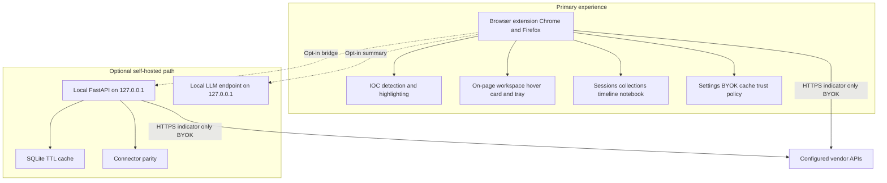
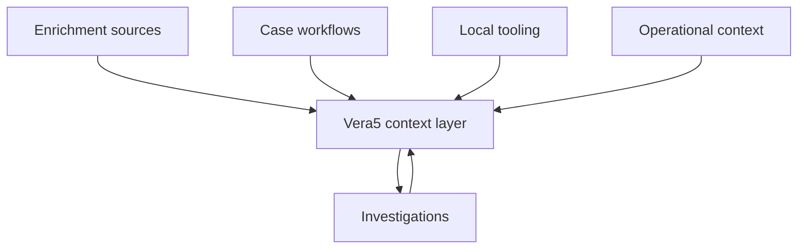

# Vera5 Product Vision

## Overview

Vera5 is an open-source browser-based IOC enrichment platform for SOC analysts, CTI researchers, DFIR operators, malware analysts, email-security and phishing specialists, MDR operators, and threat hunters.

The platform detects indicators of compromise directly on webpages and enriches them with attributed, privacy-conscious threat intelligence—without forcing analysts to leave their workflow.

Vera5 is built around a simple philosophy:

> Context should appear where investigations already happen.

Rather than replacing SIEMs, EDRs, CTI platforms, or analyst judgment, Vera5 acts as a lightweight **analyst context layer** that reduces friction during investigations.

---

# Core Mission

Modern investigations are fragmented.

Analysts constantly pivot between SIEM dashboards, threat-intelligence portals, browser tabs, tickets, case notes, sandbox reports, spreadsheets, OSINT pages, and exported logs.

Vera5 reduces that operational friction by bringing enrichment directly into the analyst workflow.

The objective is simple:

- faster pivots
- less repetitive lookup work
- cleaner investigations
- improved analyst context
- privacy-conscious enrichment
- local-first operation wherever possible

---

# Design Philosophy

## Analyst-First

Vera5 is designed for real operational workflows, not demo environments.

Every feature should answer:

- Does this reduce investigation friction?
- Does this improve analyst context?
- Does this help operators move faster without sacrificing clarity?

Investigation Mode ties detection, enrichment, scoring, export, sessions, collections, and operator tooling into one coherent path: **scan → triage → enrich → score → export → remember**.

---

## Local-First Operation

Vera5 prioritizes local processing whenever possible.

The platform:

- avoids unnecessary cloud dependency
- avoids hidden telemetry
- avoids centralized data collection
- avoids silent uploads
- minimizes operational exposure

Analysts remain in control of API sources, enrichment behavior, caching, IOC handling, and query destinations.

All investigation memory—sessions, collections, history, timelines, notebook fragments, correlation clusters, and relationship edges—stays in **local browser storage** unless the analyst explicitly exports it.

---

## BYOK / BYOA (Bring Your Own Keys / Bring Your Own API)

Vera5 is permanently BYOK/BYOA.

Vera5 does not:

- host shared API keys
- proxy enrichment traffic through maintainer infrastructure by default
- pool vendor quotas
- resell API access
- require Vera5-managed accounts

All enrichment credentials are user-owned, user-controlled, and locally stored (extension storage or an optional self-hosted `.env` on localhost).

This model improves privacy, transparency, operational trust, portability, and analyst control.

---

## Open Source From Day One

Vera5 is designed as an open-source project from inception.

The goals of open sourcing include transparency, trust, extensibility, community contribution, analyst customization, educational value, and operational credibility.

The project remains understandable, modular, and contributor-friendly—with a formal connector registry, versioned storage migrations, and documented onboarding for third-party connectors.

---

# Primary Use Cases

## SOC Alert Triage

Analysts reviewing alerts inside Splunk, Elastic/Kibana, Security Onion, LimaCharlie, Microsoft Sentinel, Defender XDR, Jira, TheHive, or browser-based dashboards can immediately enrich IPv4 addresses, domains, URLs, hashes, and CVEs without leaving the page.

The IOC tray, command palette, and workspace sidebar support dense alert pages with jump-to-highlight navigation and bulk queue workflows.

---

## CTI Research

Threat researchers reviewing threat reports, OSINT blogs, infrastructure reports, GitHub repositories, malware tracking pages, and leaked infrastructure notes can pivot indicators directly into enrichment sources from within the browser.

Page-context awareness adjusts IOC priority hints, tray layout, and default export templates for CTI-heavy pages.

---

## DFIR Investigations

During forensic review, Vera5 assists analysts working with logs, timelines, CSV exports, HTML reports, browser artifacts, command output, sandbox reports, and process trees by providing fast contextual enrichment for suspicious indicators.

Investigation timelines, replay playback, workspace snapshots, and structured notebook fragments support training handoffs and case documentation.

---

## Malware Analysis

Malware analysts can quickly pivot extracted domains, IPs, URLs, hashes, and infrastructure references into enrichment sources without repeatedly opening new tabs or manually copying indicators.

Operator macros automate repeatable playbooks (for example CTI deep-check or DFIR triage sequences).

---

## Email Security, Phishing, and MDR

Analysts reviewing headers, bodies, embedded URLs, domains, IPs, and file hashes in webmail or case queues benefit from domain policy gates, manual-only enrichment defaults, pre-query disclosure, and investigation sessions with per-type IOC rollups.

Phase 2 indicator types include email addresses for header and body workflows.

---

# Supported Indicator Types

## Core Types

Vera5 detects and surfaces enrichment workflows for:

- IPv4 addresses
- domain names
- URLs
- MD5, SHA1, and SHA256 hashes
- CVE identifiers

## Extended Types

Vera5 also supports Phase 2 indicator types with conservative false-positive controls:

- email addresses
- autonomous system numbers (ASN)
- CIDR ranges
- conservative file paths
- onion domains

Per-type enable toggles, connector gating, attributed pivots, and export schema support apply to each type. Connectors skip unsupported types with explicit UI messaging rather than silent failure.

Types without live connector support still receive detection, highlighting, pivots, and honest empty states.

---

# Enrichment Philosophy

Vera5 aggregates contextual information from analyst-configured enrichment providers.

## Live Connectors

Live BYOK connectors include:

- **AbuseIPDB** — IPv4 reputation
- **AlienVault OTX** — multi-type pulse context
- **URLScan.io** — URL and domain scan context
- **GreyNoise (community)** — IPv4 internet noise and RIOT context
- **VirusTotal** — multi-type object lookups
- **Shodan** — IPv4 host and domain DNS context
- **Censys** — IPv4 host visibility
- **RDAP/WHOIS** — domain registration context (public RDAP where applicable)

Additional sources ship as pivot-only or registry entries (for example ThreatFox, MalwareBazaar, URLhaus, Google Safe Browsing, Pulsedive) with attributed deep links when live API integration is not enabled.

## Connector Registry

A formal connector registry defines capability metadata—supported IOC types, rate-limit policy, live vs pivot-only class, freshness and reliability tiers—so enrichment dispatch, settings packs, and threat profiles share one contract.

## Optional Local Backend

An optional user-operated FastAPI aggregator on `127.0.0.1` provides centralized caching, rate limiting, and connector parity for operators who prefer keys in a local `.env`. The extension works fully without it.

Vera5 does not attempt to replace vendor platforms. It accelerates analyst access to them with source attribution, raw inspect, cached vs live labels, and honest error states.

---

# Security and Privacy

Security and operational trust are core design priorities.

## Vera5 Must Never

- silently upload browsing history
- transmit full page contents by default
- expose stored API keys
- hide enrichment destinations
- proxy analyst traffic without consent
- perform hidden analytics collection
- require unnecessary cloud dependencies

## Core Security Principles

- API keys remain local
- enrichment actions are transparent
- analysts can disable sources
- manual-only mode is supported
- quiet mode blocks outbound vendor calls while preserving local detection and pivots
- caching behavior is visible
- source attribution is always shown
- raw data access remains available
- source disagreement is never hidden
- domain policy and internal asset lists gate live enrichment before vendor calls
- pre-query disclosure names enabled vendors before the first fetch

See [docs/security-model.md](docs/security-model.md) for permission rationale, trust gates, and outbound network boundaries.

---

# Privacy Model

Vera5 is intentionally privacy-conscious.

The default stance is:

> The analyst owns the data.

Vera5 never silently collects browsing history, organization data, page contents, analyst identity, credentials, cookies, tokens, or internal case notes.

Only indicator values the analyst triggers for enrichment are sent externally—to vendors the analyst configured, not to Vera5-operated infrastructure.

Local personalization (noise rules, known-good lists, relationship memory) uses explicit analyst actions and inspectable local rules—never opaque cloud learning or telemetry training.

---

# Architecture

**Extension-first, backend-optional**

Runtime detail: [docs/local-mode.md](docs/local-mode.md).

## Browser Extension

The primary Vera5 experience is a Manifest V3 browser extension for Chromium and Firefox.

Core extension responsibilities:

- IOC detection and highlighting
- on-page workspace (hover card, sidebar, command palette)
- context-menu and palette-driven enrich actions
- investigation sessions, collections, history, and timelines
- settings, trust policy, and source operations
- local caching and export templates
- operator macros and replay playback

## Optional Local Backend

The optional self-hosted backend supports centralized enrichment normalization, local API key management, SQLite caching, advanced rate limiting, and an optional `/summarize` route for localhost LLM bridges.

The backend is local-first, self-hosted, default-off, and never required for core extension operation.

---

# Investigation and Operator Workflows

Vera5 ships a complete local investigation surface:

| Capability | Purpose |
|------------|---------|
| **IOC tray** | Alert-wide view with filters, jump-to-highlight, subset export |
| **Command palette** | Keyboard-driven scan, enrich, history, source health, quiet mode, macros |
| **Investigation sessions** | Named case memory with IOC rollups and Markdown/JSON/CSV export |
| **IOC collections** | Persistent named groupings across sessions for hunts and campaigns |
| **Investigation history** | Recent enriched IOCs with reopen-to-card |
| **Source operations** | Per-source status, errors, cooldowns, cache counts, quota hints |
| **Export templates** | Jira, TheHive, Obsidian, analyst-update, and ticket-ready formats |
| **Pivot recipes** | Attributed next-step links per IOC type |
| **Composite score** | Local risk band with explain chain and source basis |
| **Page context** | Local page-type classification for layout and export defaults |
| **Operator macros** | Local programmable playbooks from palette and tray |
| **Investigation replay** | Step-through playback and markdown transcript export |
| **Timeline** | Ordered session events with filter and export |
| **Co-occurrence** | Same-page “appeared alongside” navigation |
| **Correlation packs** | Cross-session IOC cluster export with causation disclaimers |
| **Quiet mode** | Block outbound vendor calls; keep pivots and cached enrich |
| **Threat profiles** | Portable workflow bundles without API keys |
| **Known-good intelligence** | Local benign/internal labels and optional skip-enrich |
| **Analyst notebook** | Typed fragments attached to IOCs, sessions, or pages |
| **Relationship memory** | Cross-session entity co-seen rollup without a global graph |

All of the above operate without Vera5 cloud sync or team workspaces.

---

# AI Philosophy

AI features in Vera5 are optional and operationally grounded.

The objective is not magical automation, black-box scoring, or hallucinated intelligence.

The objective is structured summaries, analyst assistance, and context consolidation.

The **local AI summary** capability sends normalized enrichment JSON only to a user-operated `http://127.0.0.1` endpoint. It is default-off, labeled **AI summary (local, unverified)**, and separate from the composite score and explain chain.

Guardrails reject summary claims not present in input JSON. Full page content, API keys, and raw vendor secrets are forbidden inputs.

See [docs/ai-summary.md](docs/ai-summary.md).

---

# Non-Goals

Vera5 is not intended to become:

- a SIEM, SOAR platform, or EDR
- a malware sandbox or vulnerability scanner
- a dark web crawler
- a replacement for MISP, OpenCTI, VirusTotal, or analyst judgment
- a hosted SaaS with accounts, billing, or team workspaces
- a black-box AI risk engine that hides source disagreement
- a global threat graph or cross-user intelligence cloud

The mission remains intentionally focused:

> Deliver fast, contextual IOC enrichment directly inside analyst workflows—with local memory, transparent trust gates, and analyst-owned credentials.

---

# Product Capabilities Summary

Vera5 delivers:

- **Detection** — regex-driven IOC engine with false-positive controls, optional auto-scan, and opt-in attribute/href extraction
- **Enrichment** — multi-source parallel fetch with cache, rate limits, partial success, and connector confidence metadata
- **Trust** — manual-only mode, pre-query disclosure, domain policy, internal asset lists, quiet mode, sensitive-site presets
- **Scoring** — composite risk with visible source basis and disagreement handling
- **Export** — markdown, JSON, CSV, ticket templates, workspace snapshots, correlation packs, replay transcripts
- **Memory** — sessions, collections, history, timelines, notebook, co-occurrence, correlation, relationship edges
- **Operators** — palette, context menu, macros, replay, source health, page context, threat profiles
- **Platforms** — Chrome/Chromium and Firefox MV3 builds; optional localhost backend and LLM
- **Quality** — unit tests, browser E2E smokes, security verification, secret scan, and reproducible builds

---

# Long-Term Vision

The long-term vision for Vera5 is an analyst productivity layer that sits between investigations, enrichment sources, case workflows, local tooling, and operational context—and reduces the friction analysts experience every day.

**Analyst productivity layer**

Vera5 connects investigations, enrichment, and tooling without replacing SIEMs, EDRs, or analyst judgment.

Vera5 aims to remain lightweight, transparent, extensible, privacy-conscious, operationally useful, and community-driven—while helping analysts investigate faster with better context and fewer interruptions.
