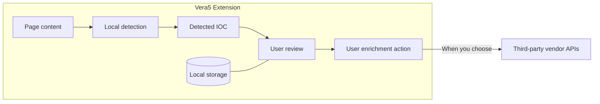

# Security Policy

Vera5 is a local-first browser extension for indicator detection and threat-intelligence enrichment. This document describes the security and privacy model for the extension as shipped in the repository: on-page detection, settings and key storage, cache controls, and static pivot links. Live vendor API enrichment uses the rules below when connectors are enabled; Vera5 does not operate a required cloud enrichment service.

For permission rationale and manifest details, see [docs/security-model.md](docs/security-model.md). For codebase layout and connector scope, see [docs/architecture.md](docs/architecture.md).

## Scope

Vera5 runs in your browser on pages you open. It may read visible page text to detect indicators of compromise (IOCs). Enrichment and pivots use **your** threat-intelligence API keys and **your** choice of sources (bring-your-own keys / bring-your-own API). Requests to vendors go directly from the extension over TLS—not through Vera5-operated infrastructure.

**Privacy and enrichment invariants (unchanged in the MVP):**

- **Bring-your-own keys / bring-your-own API (BYOK/BYOA)** — You create and control vendor API keys in local extension storage. Vera5 does not supply shared maintainer keys or require routing enrichment through Vera5-hosted infrastructure.
- **IOC-only enrichment queries** — Live enrichment sends the **indicator value** (and API fields each vendor requires) to sources **you** enable—not full page HTML, browsing history, or bulk content to Vera5-operated services (there is no Vera5 enrichment cloud in the MVP).
- **No telemetry by default** — Vera5 does not collect maintainer usage analytics, crash telemetry, or browsing history by default. See [Telemetry and analytics](#telemetry-and-analytics).

## Threat model

| Risk | Mitigation |
|------|------------|
| Extension access to page DOM | Scan visible text for IOC detection; skip `script`, `style`, `textarea`, and metadata subtrees by default; do not scan attributes. Highlighting and cards operate on detected values only. |
| API key exposure | Keys stored in `chrome.storage.local` on your profile; masked in the options UI after save; excluded from settings export by default; never committed to the repository. |
| IOC disclosure to third parties | Only indicator values you enrich (or open via pivot links) reach vendors you choose—not full page HTML to Vera5 infrastructure. Per-source toggles and manual-only mode limit automatic requests. |
| Sensitive internal IOCs leaving the org | You control which sources are enabled, whether auto-fetch runs, and when to click enrich or pivot links. |
| Malicious or confusing page content | Conservative regex matching, overlap deduplication, and documented false-positive suppressions reduce noise. |
| Analyst misinterpretation | Source attribution on enrichment results; static pivots open vendor sites in a new tab under your browser session. |

## IOC leakage

Understanding what stays on your machine versus what can leave the browser is central to using Vera5 safely in SOC, CTI, and DFIR workflows.

**IOC and data boundary**

Page text and detection stay in the browser. Only the **indicator value** may reach third-party vendor APIs you enable, and only when you review and trigger enrichment (or allow automatic fetch when manual-only is off). Settings and cache remain in local storage. Vera5 does not operate a required enrichment cloud or page-upload service.

Runtime component layout: [docs/local-mode.md](docs/local-mode.md). Enrichment message path: [docs/contributors/enrichment-connectors.md](docs/contributors/enrichment-connectors.md).

### Stays local (does not go to Vera5)

| Data | Handling |
|------|----------|
| Full page HTML and DOM | Processed in the browser for detection only. Not uploaded to Vera5-operated servers (there is no Vera5 enrichment cloud). |
| Browsing history and tab URLs | Not collected or transmitted to Vera5 maintainers. |
| Tickets, email bodies, session tokens | Not extracted or uploaded as bulk content; only text nodes walked for indicator patterns. |
| Scan results before you act | Match counts in the popup and on-page highlights remain local until you open a card or follow a link. |

### May leave the browser (your choice)

| Action | What is transmitted | Destination |
|--------|---------------------|-------------|
| **Live enrichment** (when a connector is enabled and you trigger or allow fetch) | The **indicator value** and request fields required by that vendor’s API (for example IP, hash, or domain in URL or JSON body). | Directly to the third-party API you configured, using your API key. |
| **Static pivot links** | The indicator value embedded in the vendor URL you click (for example a VirusTotal or AbuseIPDB lookup URL). | The vendor site, via normal browser navigation in a new tab. Vera5 does not proxy pivot traffic. |
| **Settings export** | Preferences you export as JSON. API keys are **omitted unless you explicitly choose to include them**. | A file you save locally; Vera5 does not receive the export. |

### Controls that reduce unintended leakage

- **Manual-only enrichment** (default on): Threat-intelligence fetch runs only when you use the enrich control, not automatically when a hover card opens.
- **Per-source enable flags**: Disabled sources are not queried and are omitted from automatic enrichment paths.
- **Supported IOC types (current release)**: Options exposes per-type detection toggles (IPv4, domain, URL, MD5, SHA1, SHA256, CVE). Disabled types are omitted from page scans; defaults enable all MVP types.
- **Private-space IPv4**: Omitted from detection by default (RFC1918, loopback, link-local). Options includes a checkbox to include them when needed for lab or internal pages.
- **Auto-scan off by default**: Page rescans on DOM changes run only when you enable auto-scan; otherwise you scan explicitly from the popup or keyboard shortcut.

### What Vera5 never sends to its own infrastructure

Vera5 does not operate a default enrichment proxy, telemetry ingest, or page-content upload service. Maintainer-hosted servers are not part of the MVP privacy model.

## Third-party APIs

### Bring-your-own keys / bring-your-own API

You create API keys in each vendor’s portal and enter them in the Vera5 options page. Keys are stored locally in extension storage. Vera5 does not supply shared maintainer keys or require routing enrichment through a Vera5-hosted backend.

### Supported enrichment sources (MVP scope)

When live connectors are enabled, the initial release targets these sources in fixed product order: **AbuseIPDB**, **OTX**, **URLScan.io**, and **GreyNoise**. Options toggles and storage slots align with that list.

### How vendor requests work

1. You enable a source and provide a valid API key (where required).
2. You scan a page or open an indicator card and request enrichment (manually or, if manual-only is off, automatically on card open when connectors are wired).
3. The extension’s background worker sends an HTTPS request **directly** to the vendor endpoint, including only the indicator and parameters the API requires.
4. Responses are normalized for display, attributed to the source, and may be cached locally (see below).

### Static pivots versus live enrichment

| Mechanism | Network from Vera5 extension | Your responsibility |
|-----------|------------------------------|---------------------|
| **Static pivot links** | No API call from the extension; your browser opens a vendor URL. | You choose when to click; the URL contains the indicator. |
| **Live enrichment** | HTTPS API call with your key and the indicator value. | You enable the source, trust the vendor’s terms, and understand quota and retention policies. |

### Your responsibilities when using third-party APIs

- Choose which vendors to enable and which keys to store.
- Read each vendor’s privacy policy, data retention, subprocessors, and jurisdictional terms.
- Avoid sending highly sensitive or classified indicators to vendors your organization has not approved.
- Monitor API quota, rate limits, and audit logs on the vendor side where available.

Vera5 surfaces source attribution on enrichment results so you can see which connector produced each field.

## Data retained locally

All Vera5-controlled persistence uses the browser’s **local extension storage** (`chrome.storage.local` or equivalent on Chromium derivatives). Data is bound to your browser profile and is removed when you uninstall the extension or clear extension site data for Vera5.

### Settings and preferences

| Storage key (concept) | Contents | Default / notes |
|-----------------------|----------|-----------------|
| Extension enabled | Whether Vera5 runs on pages. | On. |
| Highlight enabled | Whether detected indicators are underlined after scan. | On. |
| Auto-scan enabled | Whether DOM changes trigger rescans. | Off. |
| Manual-only mode | When on, enrichment fetch requires explicit user action. | On. |
| Include private IPv4 | Whether private-space IPv4 literals are detected. | Off (default). Options checkbox persists the flag; the scan path reads it on each scan. |
| Enrichment source enabled | Per-vendor on/off (AbuseIPDB, OTX, URLScan.io, GreyNoise). | All off until you enable. |
| IOC type enabled | Per-type detection toggles (IPv4, domain, URL, hashes, CVE). | Defaults all MVP types **on**. Options checkboxes persist flags; the scan path omits disabled types. |
| Enrichment cache TTL | Seconds cached responses remain valid (used when cache is populated). | Default 3600. Options exposes a global seconds field and optional per-source overrides. |
| Settings schema version | Migration marker for stored preferences. | Managed by the extension. |

### API keys

| Storage key (concept) | Contents | Notes |
|-----------------------|----------|-------|
| API keys | Vendor credentials you enter (AbuseIPDB, OTX, etc.). | Plaintext in local storage (browser sandbox); masked in the UI after save; never logged by Vera5 build checks; excluded from export unless you opt in. |

### Enrichment cache

| Storage key (concept) | Contents | Notes |
|-----------------------|----------|-------|
| Enrichment cache | Cached vendor JSON responses keyed by indicator and source, with fetch timestamp. | Populated when live enrichment runs; clearable from options; does not include full page content—only normalized enrichment payloads for indicators you queried. |

### Settings backup files

Export produces a JSON file on your machine. By default it contains preferences and toggles **without** API keys. Import merges preferences and preserves existing keys unless the file explicitly included keys and you imported that file.

### What is not retained by Vera5

- No maintainer telemetry or crash reports by default.
- No cloud sync of settings or keys to Vera5 servers.
- No copy of page HTML or browsing history in extension storage.

### Clearing retained data

| Goal | Action |
|------|--------|
| Remove cached enrichment responses | **Clear cache** on the options page. |
| Remove API keys | Delete keys in the options UI or clear extension storage. |
| Remove all Vera5 local data | Uninstall the extension or clear its storage in browser settings. |

## Telemetry and analytics

**Default stance: no telemetry.**

Vera5 is not designed to collect usage analytics, crash telemetry, or browsing history for the maintainers. If optional diagnostics are ever offered, they must be explicit, documented, and off by default.

## Secrets and repository hygiene

- Do not commit API keys, `.env` files, or credential exports.
- Use the project `.gitignore` and local secret storage only.
- Do not paste keys into screenshots, issues, or public discussions.
- CI runs secret scanning (Gitleaks) on the repository; treat any leaked key as compromised and rotate it at the vendor.

## Local-first and optional backend

The extension is intended to work without a Vera5-hosted backend. An optional **localhost / self-hosted** backend may be used in future releases to keep keys off the extension surface; that mode remains under your control and is not required for the extension-only MVP.

## Reporting a vulnerability

If you believe you have found a security issue in Vera5:

1. **Do not** open a public issue with exploit details or live secrets.
2. Report privately to the repository maintainers (contact method listed in [README.md](README.md) when published).
3. Include reproduction steps, affected version, and impact assessment.

We aim to acknowledge reports in a reasonable timeframe and coordinate fixes before public disclosure when appropriate.

## Related documents

- [docs/security-model.md](docs/security-model.md) — manifest permissions and host access
- [docs/architecture.md](docs/architecture.md) — IOC types, connector order, data boundaries
- [README.md](README.md) — install, development, and capability summary
