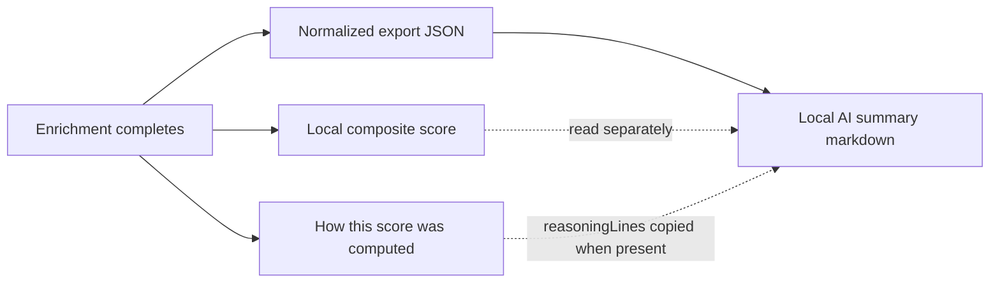

# Local AI summary (optional)

Vera5 may offer an **opt-in, localhost-only** narrative summary: normalized enrichment JSON in, analyst-readable markdown out. The summary helps triage handoffs; it **does not** replace the local composite risk score, the deterministic **How this score was computed** explain chain, or per-source vendor rows on the hover card.

**Default posture:** Off until the operator enables it in settings. No cloud LLM provider is bundled or required. Vera5 does not operate, host, or proxy the model.

## What the feature does

| Aspect | Behavior |
|--------|----------|
| **Input** | A single normalized enrichment export document (JSON) for one indicator |
| **Output** | Markdown prose for paste into tickets, wikis, or case notes |
| **Runtime** | User-operated model on `http://127.0.0.1` (direct extension call or optional localhost backend bridge) |
| **Scope** | Summarizes fields already present on the enrichment card—never full page content |

**Out of scope for this capability:** cloud LLM as default; LLM-generated risk bands replacing composite score; sending raw vendor HTTP bodies, API keys, or page DOM to the model.

## Input contract

The summary service accepts **only** the JSON document produced by `buildEnrichmentExportDocument()` in `extension/src/lib/enrichmentExport.ts`—the same artifact as **Copy JSON** on the hover card and the contract in [export-artifacts.md](export-artifacts.md).

### Required properties

| Rule | Detail |
|------|--------|
| **Schema** | `schemaVersion` must be **`1`** (current `ENRICHMENT_EXPORT_SCHEMA_VERSION`). Reject unknown versions. |
| **Shape** | Top-level object only—no wrapper arrays, no `{ "documents": [...] }` batch envelope unless a future schema version defines one. |
| **Fields** | Required and optional fields match [JSON document contract (schema version 1)](export-artifacts.md#json-document-contract-schema-version-1): `exportedAt`, `ioc`, `iocType`, `iocTypeLabel`, `enrichmentState`, `tags`, `sources`, `disabledSources`, `score`, `disagreement`, `pivots`, optional `summary`, `disagreementNotice`, `analystNotes`. |
| **Source rows** | Each `sources[]` entry uses normalized fields only (`sourceId`, `name`, `status`, `summary`, `tags`, optional cache metadata, `badgeText`). |
| **Score block** | Use the exported `score` object (`mode`: `available`, `insufficient`, `unavailable`, or `none`) with its documented subfields—especially `summaryText`, `reasoningLines`, and `insufficientDetail` when present. |

### Recommended input state

| `enrichmentState` | Summary behavior |
|-------------------|------------------|
| `ready` | Primary path—per-source rows and score block are populated from completed enrichment. |
| `loading` | Do not call the model; wait until enrichment finishes. |
| `empty` / `error` | Do not call the model; show overlay error or empty state instead. |

### Example input (abbreviated)

Full field reference: [export-artifacts.md — Example JSON](export-artifacts.md#example-json-schema-version-1).

```json
{
  "schemaVersion": 1,
  "exportedAt": "2026-06-28T15:00:00.000Z",
  "ioc": "8.8.8.8",
  "iocType": "ipv4",
  "iocTypeLabel": "IPv4 address",
  "enrichmentState": "ready",
  "summary": "84 abuse confidence",
  "tags": ["US"],
  "sources": [
    {
      "sourceId": "abuseipdb",
      "name": "AbuseIPDB",
      "status": "ok",
      "summary": "84 abuse confidence",
      "tags": ["US"],
      "badgeText": "Live"
    }
  ],
  "disabledSources": [],
  "score": {
    "mode": "insufficient",
    "label": "unknown",
    "summaryText": "Unknown risk",
    "compositeSignal": null,
    "reasoningLines": [],
    "insufficientDetail": "Blended scoring needs at least two parseable OK source signals."
  },
  "disagreement": false,
  "pivots": []
}
```

## Forbidden inputs — keys, page content, and credentials

Local AI summary requests must contain **only** the normalized enrichment export JSON described above. The categories below are **forbidden** in the HTTP body, prompt text, or template expansion— even when the same data exists elsewhere in the browser profile, optional localhost backend, or vendor responses.

Prompt template mirror: `extension/prompts/enrichment-summary.v1.json` lists the same prohibitions in `forbiddenPromptContent`. The only permitted template placeholder is `{{ENRICHMENT_EXPORT_JSON}}`.

### Design rule

| Allowed | Forbidden |
|---------|-----------|
| One `EnrichmentExportDocument` (`schemaVersion` **1**) built by `buildEnrichmentExportDocument()` | Any other payload shape, batch arrays, or ad-hoc JSON invented at request time |
| Normalized `sources[].summary` strings already on the hover card | Raw vendor HTTP bodies, cache entries, or re-fetched connector responses |
| The single indicator value in the export `ioc` field | Full page text, DOM trees, or multi-indicator scan dumps |
| Operator `analystNotes` when present on the export record | API keys, tokens, or connector credential pairs |

Implementations **fail closed**: reject the request before calling the model when forbidden material is detected in the prompt wrapper or inside non-export JSON fields.

### API keys and connector credentials (forbidden)

BYOK credentials stay in `chrome.storage.local` (`apiKeys` and related settings) or in an optional operator-run backend `.env`. They must **never** appear in summary prompts.

| Forbidden artifact | Typical location | Why it must not reach the model |
|--------------------|------------------|----------------------------------|
| Vendor API keys (AbuseIPDB, OTX, URLScan, GreyNoise, Shodan, VirusTotal, etc.) | Options → `apiKeys` in extension storage | Secrets; unrelated to narrative summary; high exfiltration risk if the model or endpoint logs prompts. |
| Censys API ID and secret pair | Options → `apiKeys.censys` (ID + secret) | Same as vendor keys; pair required for live Censys auth. |
| Backend aggregator credentials | Operator `backend/.env` when localhost backend is enabled | Same BYOK boundary; backend proxies enrichment, not page or key export to the LLM. |
| OAuth or session tokens | Vendor dashboards (never stored by Vera5 in export JSON) | Out of scope; must not be concatenated into prompts manually. |
| LLM provider API keys | Operator LLM runtime config (Ollama, llama.cpp, local OpenAI-compatible server) | Authenticate to **`http://127.0.0.1`** via the operator’s server config or HTTP headers—not by embedding keys inside the Vera5 prompt body. |

The enrichment export schema intentionally **omits** an `apiKeys` field. Summary code must not read `chrome.storage.local` for credentials when building the model request—only the export document for the active indicator.

### Full page DOM and selection text (forbidden)

Detection reads visible page text locally; enrichment sends **indicator values** to vendors you enable. The LLM summary path inherits the same boundary: **no bulk page upload**.

| Forbidden content | Examples | Allowed alternative |
|-------------------|----------|---------------------|
| Full page HTML or DOM serialization | `document.documentElement.outerHTML`, saved ticket HTML files | None—do not send. |
| Full visible text dump | Concatenated text nodes from scan, clipboard page copy, “copy outer text” | Use only fields inside the export JSON. |
| Scan-selection payloads | Raw selection strings from **Scan selection** beyond what is already normalized into the export `ioc` | Run enrichment first; summarize the resulting export JSON only. |
| Non-visible subtrees | Content inside `script`, `style`, `textarea`, and metadata nodes (same skips as the detector walker) | Never included—walker already skips these for detection. |
| Adjacent page context | Surrounding paragraphs, email thread bodies, ticket headers unrelated to the export record | May appear indirectly in operator-authored `analystNotes` if the analyst typed them—still not an excuse to attach DOM. |
| Multiple indicators from the tab | Tray subset arrays, investigation session exports, collection CSV rows | One summary request per `EnrichmentExportDocument`; batch summaries require a future schema. |

The export `ioc` field may contain a value that originated on the page (for example an IPv4 in a ticket). That single normalized indicator string is in scope because it is part of the enrichment export—not because the model receives the surrounding DOM.

### Credentials and secret-bearing artifacts (forbidden)

Beyond explicit API keys, these artifacts can embed secrets or unrelated PII and must stay out of prompts:

| Forbidden artifact | Why |
|--------------------|-----|
| Full settings export JSON (`settingsExport.ts` output) | May include toggles and metadata operators expect to stay local; not shaped for summary input. |
| Connector profile export | Designed to exclude keys on import, but still not the enrichment export contract. |
| Raw vendor HTTP responses (`rawVendorJson` on hover-card entries) | May contain auth echoes, internal IDs, or fields not shown in normalized `sources[].summary`. |
| Enrichment cache blobs | Cached vendor payloads; use normalized export rows instead. |
| `chrome.storage.local` dumps | Includes `apiKeys` and session state. |
| Investigation session or collection export files | Multi-IOC case artifacts—not single-indicator export JSON. |
| Cloud LLM request forwarding through Vera5 | No Vera5-operated relay; operator runs localhost inference only. |

### Additional prohibitions

| Forbidden | Why |
|-----------|-----|
| Multiple unrelated IOC documents in one prompt | One summary maps to one indicator export. |
| Re-fetching vendors inside the summary service | Composite score inputs must come from the JSON `score` block only. |
| User PII placeholders in prompt templates | No `{{operator_name}}`, `{{user_email}}`, or similar—only `{{ENRICHMENT_EXPORT_JSON}}`. |
| Raw vendor responses containing secrets | Out of scope for summary input—vendor bodies may embed credentials or hidden fields. |

### Validation checklist (implementers)

Before calling the local model:

1. Confirm input parses as `EnrichmentExportDocument` with `schemaVersion === 1`.
2. Reject top-level keys not defined in [export-artifacts.md](export-artifacts.md) (for example `apiKeys`, `rawVendorJson`, `html`, `dom`, `pageText`, `storage`).
3. Reject prompt wrappers that include strings outside the export JSON except the versioned system/user template text.
4. Confirm `enrichmentState === "ready"` unless a future schema defines otherwise.
5. Serialize **only** the validated export object into `{{ENRICHMENT_EXPORT_JSON}}`.
6. Send HTTP to **`http://127.0.0.1`** (or operator-configured localhost path)—never to Vera5-operated cloud inference.

On validation failure, surface an operator-visible error on the hover card; do not call the model with partial or augmented input.

## Output format

The model returns **markdown only** (no JSON wrapper). The extension displays it in a panel labeled **AI summary (local, unverified)**—separate from **Risk score** and **How this score was computed**.

### Required sections (in order)

1. **Title line** — `# IOC summary: {ioc}` using the input `ioc` value verbatim.
2. **Type line** — `**Type:** {iocTypeLabel}` from input.
3. **Overview** — One short paragraph describing what the enabled sources reported, using only `summary`, `tags`, and `sources[].summary` / `sources[].tags`. Do not introduce new threat names or counts.
4. **Per-source notes** — Bullet list, one bullet per `sources[]` row with `status: ok`, `error`, or `skipped`. Format: `**{name}** ({badgeText}): {summary}`. For `skipped`, quote the skip reason from `summary` without implying live vendor data exists.
5. **Risk score (from enrichment JSON)** — Single line: `**Risk score:** {score.summaryText}` when `score.mode` is `available` or `insufficient`; use `score.headline` / `score.detail` when `mode` is `unavailable` or `none`. **Do not** invent a `/100` value when `compositeSignal` is `null`.
6. **Explain chain (when present)** — If `score.reasoningLines` is non-empty, subheading `### How this score was computed` followed by a numbered list copying those strings verbatim (same content as the overlay explain chain).
7. **Disagreement (when present)** — If `disagreement` is `true`, include `disagreementNotice` verbatim in a block quote or bold callout.
8. **Analyst notes (when present)** — If `analystNotes` is set, section `### Analyst notes (local)` with the text unchanged; label it as operator-authored, not model-generated.
9. **Footer disclaimers** — Always append the [fixed disclaimer block](#fixed-disclaimers) below the body.

### Output constraints (guardrails)

| Constraint | Requirement |
|------------|-------------|
| **Grounding** | Every factual claim must trace to a field in the input JSON. |
| **No new IOCs** | Do not list indicators, URLs, or hashes not present in `ioc`, `pivots`, or source summaries. |
| **No severity override** | Do not upgrade or downgrade the band beyond `score.summaryText` / `score.label`. |
| **No verdict language** | Avoid “confirmed malicious/benign”; prefer “sources report …” aligned with vendor summaries. |
| **Skipped sources** | Do not fabricate live results for `status: skipped` rows. |
| **Length** | Target 120–250 words for the overview and per-source sections combined unless the operator configures a higher limit locally. |

### Example output (illustrative)

```markdown
# IOC summary: 8.8.8.8

**Type:** IPv4 address

AbuseIPDB returned a live result with 84 abuse confidence and a US tag. OTX did not contribute parseable OK data in this export.

- **AbuseIPDB** (Live): 84 abuse confidence

**Risk score:** Unknown risk

> Blended scoring needs at least two parseable OK source signals.

---

**AI summary (local, unverified)** — Generated on your machine from enrichment JSON only. Not a risk verdict. Verify per-source rows, pivots, and the local composite score before acting.
```

## Fixed disclaimers

Use these strings in the UI panel and at the end of every generated markdown artifact.

### Panel heading (UI)

```text
AI summary (local, unverified)
```

### Panel body disclaimer (UI, above generated text)

```text
This narrative is generated by a model you run on localhost from normalized enrichment JSON only. It is not a risk verdict and does not replace the local composite score or per-source vendor rows. Verify all claims against the enrichment card before acting.
```

### Output footer (markdown, required)

```markdown
---

**AI summary (local, unverified)** — Generated on your machine from enrichment JSON only. Vera5 does not operate the model or store prompts. Not a risk verdict. Verify per-source rows, pivots, and the local composite score before acting.
```

### Operator-facing expectations

| Topic | Copy |
|-------|------|
| **Local-only** | Requests go to `http://127.0.0.1` (or an optional user-run backend on the same host)—never to Vera5-operated infrastructure. |
| **Opt-in** | Global setting default **off**; per-enrichment **Generate summary** action when enabled. |
| **No key exfiltration** | API keys and vendor credentials never enter the prompt. |
| **No page upload** | Page text and DOM are never sent—only the export JSON for the selected indicator. |

## Relationship to other enrichment surfaces



| Surface | Role | LLM summary interaction |
|---------|------|-------------------------|
| **Composite risk score** | Deterministic local blend from parseable vendor summaries | Summary **quotes** `score.summaryText`; must not replace or override the band. |
| **How this score was computed** | Ordered per-source reasoning lines | Summary may **copy** `score.reasoningLines` verbatim; must not invent alternate math. |
| **Per-source rows** | Live / Cached / Error / Skipped badges | Summary describes each row; must not imply Live data for Skipped rows. |
| **Copy JSON export** | Same input artifact | Summary input must byte-match the export contract, not an ad-hoc subset. |

## Implementation notes (for contributors)

- **Module home (planned):** `extension/src/lib/aiSummaryService.ts` and `extension/src/lib/aiSummaryPrompt.ts`; optional `/summarize` route on the localhost backend when enabled.
- **Prompt templates:** [extension/prompts/enrichment-summary.v1.json](../extension/prompts/enrichment-summary.v1.json) (`promptTemplateVersion` **1**); templates reference JSON field paths, not live page context.
- **Safety tests (planned):** reject outputs that cite vendor counts or IOCs absent from fixture input; reject service invocation when the global toggle is off.

See [export-artifacts.md](export-artifacts.md) for the authoritative JSON schema and [analyst-workflows.md](analyst-workflows.md) for score and explain-chain operator guidance.

## Related documentation

- [Export artifacts](export-artifacts.md) — normalized enrichment JSON schema (summary input)
- [Analyst workflows](analyst-workflows.md) — composite score, disagreement, and explain chain
- [Local mode](local-mode.md) — extension-only posture and optional localhost backend
- [Scoring system (contributors)](contributors/scoring-system.md) — band math and insufficient-data rules
