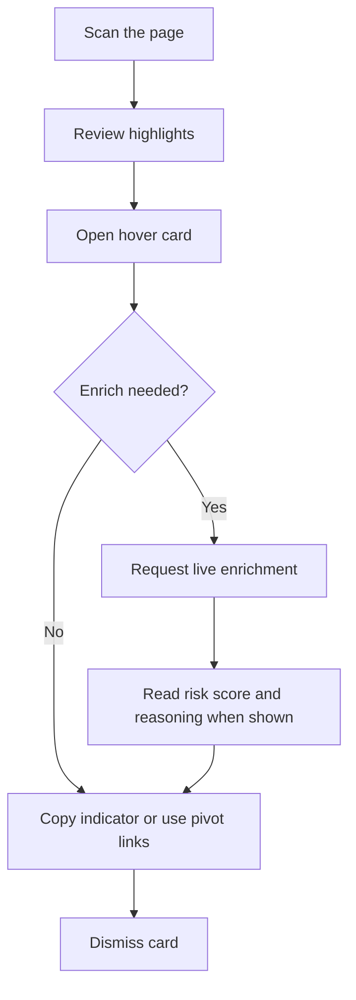

# Analyst workflows

Practical guidance for using Vera5 during alert triage, blog review, and case-note research. Vera5 runs locally in your browser; you supply API keys for live sources. Indicator values—not full page content—are sent only to vendors you enable.

For install steps, see [README.md](../README.md). For quotas, HTTP 429 handling, and vendor limits, see [api-integrations.md](api-integrations.md).

## Operator surfaces

Everything below assumes the **production on-page overlay** (content script on the tab you are reviewing). That overlay is the primary operator surface for highlights, enrichment, cache labels, and manual refresh.

| Surface | When you use it |
|---------|-----------------|
| **On-page overlay** | After **Scan page**, click a highlight to open the hover card, enrich with **›**, read Live/Cached badges, copy values, and follow pivot links. |
| **Toolbar popup** | Turn the extension and highlights on or off, run **Scan page**, and read the match count (popup scan only). |
| **Settings (options) page** | Configure API keys, enable sources, set manual-only and auto-scan, clear the enrichment cache, export or import settings. |
| **React hover card** | Unit tests and `npm run dev` only. It is **not** shown on live page tabs. It exercises the same local scoring rules as the overlay; unit tests may also show per-source contribution chips the overlay does not render. |

The keyboard shortcut runs the same scan as **Scan page** but does not update the popup match count unless you scan from the popup.

## Before you start

1. Load the extension and open **Vera5 Settings**.
2. Save API keys for **AbuseIPDB** and/or **OTX** if you need live enrichment.
3. Enable only the sources you intend to use under **Enrichment sources**.
4. Leave **Manual-only enrichment** on (default) when working sensitive cases or when you want tight control over API usage. Turn it off only when you are comfortable with automatic fetches each time you open a hover card.

URLScan.io and GreyNoise toggles store preferences and provide pivot links; they do not perform live API enrichment in the current release.

## Typical triage flow

All steps use the **on-page overlay** on the tab under review unless noted.

1. **Scan the page** from the toolbar popup (**Scan page**) or the keyboard shortcut (`Ctrl+Shift+Y` / `Cmd+Shift+Y`).
2. **Review highlights** on indicators Vera5 detected in visible page text.
3. **Open the hover card** by clicking a highlighted value (or focus it and press Enter).
4. **Enrich when needed:**
   - With **manual-only** on, click the **›** icon on the highlight to request live threat intelligence.
   - With manual-only off, opening the card schedules enrichment automatically (see [Rapid clicks and quota protection](#rapid-clicks-and-quota-protection)).
5. **Copy** the indicator or use **pivot links** to open VirusTotal, OTX, AbuseIPDB, or URLScan in a new tab for deeper review.
6. **Dismiss** the card with Escape or by clicking outside it.

Use [examples/sample-blog.html](../examples/sample-blog.html) or [examples/sample-alert.html](../examples/sample-alert.html) for local practice after a build.

## Local enrichment cache

Vera5 keeps recent successful vendor responses in **local extension storage** so repeat lookups on the same indicator and source do not always call the API again.

| Concept | What it means for you |
|---------|------------------------|
| **Cache key** | One entry per indicator value **and** per source (for example, `8.8.8.8` from AbuseIPDB is separate from `8.8.8.8` from OTX). |
| **Time to live** | Entries expire after a default window (about one hour). After expiry, the next enrichment issues a fresh vendor request if you trigger enrichment again. |
| **Clear cache** | On the options page, **Clear cache** removes all stored responses. Settings and API keys stay in place. Use this after key rotation, when vendor data may have changed, or when you want to force fresh results without using manual refresh on each indicator. |

Cached data never leaves your machine except when you explicitly enrich or open a pivot link.

## Cached vs live on the hover card

When enrichment succeeds, the hover card shows whether data came from cache or a new API call:

| UI signal | Meaning |
|-----------|---------|
| **Live** badge (multi-source list) | That source returned a fresh response for this open. |
| **Cached** badge (multi-source list) | That source’s result was served from the local cache within the TTL window. |
| **Last updated: …** | When the cached or live response was recorded (single-source layout shows one line; multi-source shows per row). |
| **Source: … · live** or **· cached** (footer) | Single-source attribution for the primary summary. |

If one source is cached and another is live, read each row independently—partial cache use is normal when you have multiple sources enabled.

## Forcing a fresh lookup (manual refresh)

To bypass the cache for one indicator, click the **›** enrich control on the highlight (or use the same control while the hover card is open). Manual refresh:

- Skips cached responses for that indicator.
- Removes cached entries for that indicator before fetching.
- Bypasses the **global rate-limit cooldown** so you can retry deliberately (the vendor may still return 429).

Use manual refresh when case notes must reflect “as of now,” after you cleared the cache, or when cached summary looks stale.

## Rapid clicks and quota protection

Vera5 reduces accidental API churn in two ways:

1. **Debounced auto enrichment** — When manual-only mode is off, rapid opens of different highlights coalesce into one background fetch for the **last** indicator you opened (about 400 ms wait). Clicking through a list quickly should not fire a vendor request per click.
2. **Global cooldown after HTTP 429** — If a vendor returns **429 Too Many Requests**, Vera5 starts a short **global** backoff before further **automatic** enrichment runs. While cooldown is active, opening a card without manual-only (or waiting for debounced auto-fetch) shows a shared message (“Threat intelligence rate limit reached…”) and a **Retry after N seconds** hint instead of calling vendors again. **›** manual refresh bypasses that gate when you choose to retry. For a visual summary of automatic gating versus manual refresh during cooldown, see [Global enrichment cooldown](api-integrations.md#global-enrichment-cooldown) in [api-integrations.md](api-integrations.md).

Per-source rate-limit errors can still appear when only one vendor is throttled but others succeed; see [api-integrations.md](api-integrations.md).

## Multi-source review

With AbuseIPDB and OTX both enabled for IPv4:

- Vera5 queries each enabled source **in parallel**.
- The card summary prefers a successful primary source; failed sources remain visible with **Error** or **Skipped** badges.
- Expand **Raw response** on a source row to inspect redacted vendor JSON when you need audit detail.

Disable sources you do not need for a case to save quota and simplify the card.

## Composite risk score on the hover card

When enrichment returns per-source results, the on-page overlay shows a **Risk score** section. Vera5 computes the label **on your machine** from normalized vendor summaries (AbuseIPDB abuse-confidence text, OTX pulse counts, report-count summaries, and similar parseable OK lines). It is **not** an LLM verdict and does not call Vera5-operated infrastructure.

## Explain-this-IOC chain vs composite score

The hover card shows **two related outputs**. They answer different questions; neither is an AI judgment.

| Output | UI label | What it answers | How it is built |
|--------|----------|-----------------|-----------------|
| **Composite risk label** | **Risk score: …** (headline band, optional **(N/100)**) | “What advisory band should I consider for prioritization?” | Weighted blend of at least **two** parseable per-source numeric signals on your machine. |
| **Explain-this-IOC chain** | **How this score was computed** (ordered list below the headline) | “Which sources contributed what evidence for this indicator?” | One deterministic line per enabled source with a parseable OK summary—source name, mapped band, numeric signal, and weight. Same rules in the production overlay and shared card logic. |

**How to read them together**

1. Read per-source enrichment rows (**Live** / **Cached**, summary text, optional **Raw response**) for vendor context.
2. Read the **Risk score** headline for the blended advisory band when blending is possible.
3. Open **How this score was computed** for the explain-this-IOC chain—each line is traceable to normalized vendor text, not a narrative summary.
4. If **Sources disagree** appears, treat the headline band as non-consensus; use the chain and pivots before acting.

When fewer than two sources return parseable OK signals, Vera5 may show **Unknown risk**, an insufficient-data notice, and an empty reasoning note instead of a blended **/100** label. That is expected—not a hidden AI fallback.

### What Vera5 does not do (forbidden framing)

Vera5 is **not** marketed or implemented as “AI says this IOC is bad.” Do not describe Vera5 scores that way in runbooks, tickets, or training.

| Vera5 does **not** | Vera5 **does** |
|--------------------|----------------|
| Call an LLM or cloud model to score or explain an IOC | Parse vendor summaries locally with fixed rules |
| Generate free-text “because AI thinks…” narratives | Show ordered per-source lines under **How this score was computed** |
| Autoblock, autoremediate, or replace analyst judgment | Show advisory bands and source attribution for **your** decision |
| Hide which vendor supplied which signal | Keep per-source badges, reasoning lines, and pivot links visible |

Footer disclaimers on the card reinforce this: enrichment sends only the indicator value to vendors you enable; the risk label is **advisory** and computed locally—review each source before acting.

### What you see

| UI element | Meaning |
|--------------|---------|
| **Risk score: …** | Advisory band (**Unknown**, **Low**, **Suspicious**, **High**, or **Critical**). When at least two enabled sources return parseable OK signals, the label may include **(N/100)**—a weighted blend of per-source numeric signals. |
| **How this score was computed** | Heading for the explain-this-IOC panel. |
| Ordered per-source lines | Each enabled source with a parseable OK summary gets one line (source name, band, numeric signal, and weight). Lines follow connector order (AbuseIPDB, OTX, URLScan.io, GreyNoise). |
| Empty reasoning note | Shown instead of a numbered list when a blended composite cannot be built—for example, only one source returned parseable data. The notice explains that blended steps need at least two parseable sources. |
| **Sources disagree: …** | Appears only when a blended score exists **and** sources materially diverge (see below). |
| **Risk score unavailable** | All enrichment sources are disabled in settings. The card still shows guidance to enable at least one source; there is no numeric label. |
| Insufficient-data notice (above reasoning) | At least one source responded, but fewer than two parseable OK signals exist for blending. The label may read **Unknown risk**; read per-source rows and vendor pivots before acting. |
| Footer disclaimers | **Enrichment** reminds you that only the indicator value is sent to vendors you enable. **Risk score** reminds you the label is advisory and computed locally. The risk disclaimer appears when a scored result is shown, not when the score is unavailable. |

If enrichment is still loading, failed for every source, or no source results are attached to the card, the **Risk score** section is omitted entirely.

### Interpreting the band label

| Label | How to read it |
|-------|----------------|
| **Low** / **Suspicious** / **High** / **Critical** (with **/100**) | Weighted blend of at least two parseable per-source signals. Treat as a **hint** for prioritization, not a block/allow decision. |
| **Unknown risk** (no **/100**) | Not enough parseable evidence to blend—often one OK source, errors on others, or summaries Vera5 cannot map to a numeric signal. Use per-source badges, raw JSON, and pivot links. |
| **Risk score unavailable** | Every configured enrichment source is toggled off. Enable at least one source in settings if you want a local score. |

Numeric signals are derived only from recognized summary patterns (for example `84 abuse confidence`, `4 threat pulses`, `9 reports`). Unrecognized OK text still appears in enrichment rows but does not contribute a weighted line.

## When sources disagree

The **Sources disagree** callout means Vera5 detected **material** divergence among sources that contributed to the blended score. It does **not** mean the composite label is wrong; it means you should not treat the single headline band as unanimous vendor consensus.

Disagreement is raised when **both** are true:

1. At least two sources supplied parseable OK signals (so a blended **/100** label exists).
2. Either the numeric signals differ by **35 points or more**, **or** their mapped bands sit **two or more steps apart** on the Low → Suspicious → High → Critical scale.

| Situation | Typical overlay behavior |
|-----------|---------------------------|
| Two sources, similar severity (for example both High) | No disagreement callout; reasoning list still shows each source’s line. |
| High abuse confidence vs low pulse count (wide numeric gap) | Disagreement callout; compare each line in **How this score was computed**. |
| High vs Suspicious bands with moderate numeric gap | Disagreement callout when bands are two steps apart. |
| Only one parseable source | No blended **/100** label; empty reasoning note instead of disagreement. |
| All sources disabled | **Risk score unavailable**; no disagreement logic runs. |

**How to respond when you see disagreement**

1. Read every line under **How this score was computed**—each reflects that vendor’s normalized summary, not the blend alone.
2. Open **Raw response** or pivot links for sources on opposite sides of the callout.
3. Prefer case policy and corroboration over the headline band when sources conflict.
4. Do not cite the composite label in notes as if all vendors agreed.

When disagreement is absent, sources still may differ slightly; Vera5 only surfaces the callout when divergence crosses the thresholds above.

## Operational checklist

| Goal | Suggested approach |
|------|-------------------|
| Minimize API usage | Manual-only on; avoid repeated **›** on the same IOC; rely on cache for repeat hovers. |
| Fresh data for one IOC | **›** manual refresh or clear cache then enrich. |
| Fresh data everywhere | **Clear cache** on the options page, then re-enrich indicators you care about. |
| Hit a rate limit | Read the retry hint; wait for cooldown; check vendor usage dashboards listed in [api-integrations.md](api-integrations.md). |
| Conflicting risk signals | Read **How this score was computed**; follow pivots for diverging sources; do not treat the headline band as consensus when **Sources disagree** is shown. |
| Single live source only | Expect **Unknown risk** and an empty reasoning note until a second source returns parseable OK data. |
| Sensitive / classified work | Manual-only on; enable only approved sources; do not export settings with keys unless policy allows. |

## Troubleshooting

| Symptom | Likely cause | What to try |
|---------|--------------|-------------|
| No enrichment, only pivots | Source disabled or no API key | Enable source and save key in settings. |
| “Add your … API key” | Missing key for that source | Open settings from the card action. |
| Cached summary but you need live data | Valid cache entry | Use **›** manual refresh. |
| All sources show rate-limit backoff | Global cooldown after 429 | Wait for the countdown hint; reduce hover churn. |
| AbuseIPDB works, OTX errors | Partial success | Read per-source badge and message; fix OTX key or quota. |
| **Unknown risk** with one Live source | Only one parseable OK signal | Enable a second source or accept advisory unknown until another source succeeds. |
| **Sources disagree** on a high-profile IOC | Material band or numeric spread between sources | Compare reasoning lines and vendor pivots; do not rely on the headline band alone. |
| Highlights missing | Extension off, highlight off, or scan not run | Enable extension and highlighting; scan the page. |

## Related documentation

- [api-integrations.md](api-integrations.md) — per-source limits, 429 headers, and monitoring links
- [local-mode.md](local-mode.md) — what stays on your machine vs what reaches vendors
- [security-model.md](security-model.md) — permissions and host access
- [architecture.md](architecture.md) — supported indicator types and connector scope
