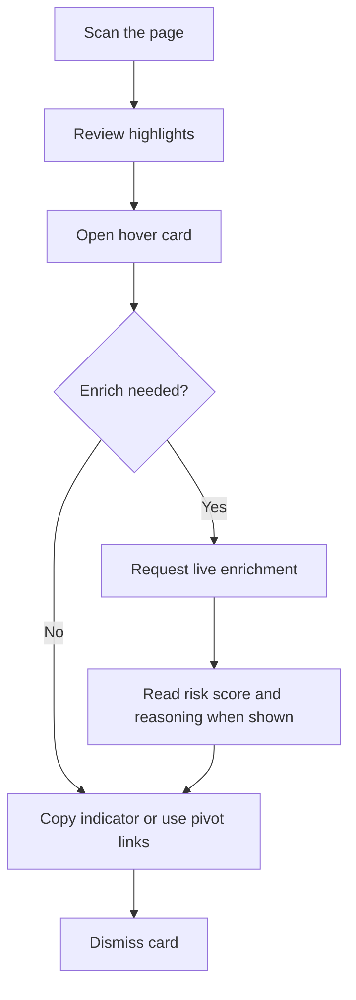
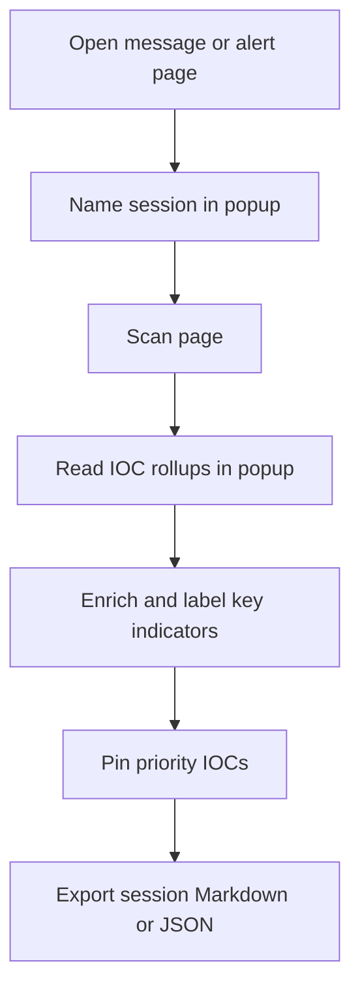

# Analyst workflows

Practical guidance for using Vera5 during alert triage, blog review, and case-note research. Vera5 runs locally in your browser; you supply API keys for live sources. Indicator values—not full page content—are sent only to vendors you enable.

For install steps, see [README.md](../README.md). For quotas, HTTP 429 handling, and vendor limits, see [api-integrations.md](api-integrations.md).

## Operator surfaces

Everything below assumes the **production on-page overlay** (content script on the tab you are reviewing). That overlay is the primary operator surface for highlights, enrichment, cache labels, and manual refresh.

| Surface | When you use it |
|---------|-----------------|
| **On-page overlay** | After **Scan page**, click a highlight to open the hover card, enrich with **›**, read Live/Cached badges, copy values, and follow pivot links. Assign **Label**, **Pin**, and read **Session timeline** on the card when an investigation session is active. Use **Save to collection…** to add an indicator to a persistent collection. |
| **Command palette** | Keyboard-driven actions on the active tab: scan, enrich selection, open history, source health, tray export, clear highlights, and settings. See [Operator UX: command palette and quick actions](#operator-ux-command-palette-and-quick-actions). |
| **Toolbar popup** | Turn the extension and highlights on or off, run **Scan page** / **Scan selection** / **Enrich selection**, manage the **Investigation session** (title, rollups, export, recent sessions, **Promote session to collection…**), review **Investigation history**, **Detected indicators** (**Save to collection…**, **Add filtered to collection…**), manage **IOC collections**, and read **Source operations** (cache, cooldown, per-source status, vendor quota hints). |
| **Workspace sidebar** | Optional on-page tray from **Open sidebar** in the popup: filter indicators, **Save to collection…**, **Add filtered to collection…**, **Run macro…** on a row, **Run macro on filtered…** for the active type filter, copy subsets, and export templates while staying on the alert page. Pinned session indicators sort to the top. |
| **Context menu** | Right-click selected text → **Enrich selection with Vera5** when the selection contains a detectable indicator. Uses the same trust gates and enrich pipeline as palette **Enrich selection**. |
| **Settings (options) page** | Configure API keys, enable sources, set manual-only and auto-scan, clear the enrichment cache, export or import settings. Source health details live in the popup **Source operations** section—not a duplicate panel here. |
| **React hover card** | Unit tests and `npm run dev` only. It is **not** shown on live page tabs. It exercises the same local scoring rules as the overlay; unit tests may also show per-source contribution chips the overlay does not render. |

## Operator UX: command palette and quick actions

Power-user flows stay on the investigation tab: open the **command palette**, use manifest keyboard shortcuts, or enrich from the browser context menu without opening the toolbar popup for every action.

### Keyboard shortcuts

| Shortcut | Action |
|----------|--------|
| `Ctrl+Shift+Y` / `Cmd+Shift+Y` | **Scan page** — same detection pass as the popup **Scan page** button. Does not update the popup match count unless you scan from the popup. |
| `Ctrl+Shift+K` / `Cmd+Shift+K` | **Open command palette** on the active tab. |

Inside the palette: **type to filter** commands, **↑↓** to move selection, **Enter** to run, **Esc** to close.

### Command palette actions

Open the palette with `Ctrl+Shift+K` / `Cmd+Shift+K`, or run **Open command palette** from the manifest shortcut only (there is no separate popup button for the palette today).

| Command | What it does | Notes |
|---------|--------------|-------|
| **Scan page** | Detect indicators in visible page text on the active tab. | Same as `Ctrl+Shift+Y` / popup **Scan page**. |
| **Enrich selection** | Detect an indicator in the current text selection and open the hover card enrich pipeline. | Available only when text is selected and the selection contains a detectable indicator. Respects manual-only mode, domain policy, internal asset lists, and pre-query disclosure like other enrich paths. |
| **Open history** | Opens the extension popup focused on **Investigation history**. | Use when the popup was closed but you want recent enriched IOCs without hunting through popup sections manually. |
| **Source health** | Opens the extension popup focused on **Source operations**. | Per-source last status, last error, 429 cooldown, cache row counts, and vendor quota orientation strings. |
| **Copy filtered Markdown** | Copies the workspace tray’s **filtered** indicator list as Markdown to the clipboard. | Uses the active tray filter on the page. No-op when the filtered list is empty. Records an export event on the active investigation session when one exists. |
| **Export tray subset** | Downloads the filtered tray list as a Markdown file. | Same filtered subset as **Copy filtered Markdown**. |
| **Clear highlights** | Removes all indicator highlights on the current page. | Does not clear enrichment cache or investigation history. |
| **Toggle quiet mode** | Turns quiet mode on or off for this browser profile. | When on, blocks live vendor enrichment while preserving detection, cache display, and pivot links. See [Quiet mode](#quiet-mode). |
| **Open options** | Opens **Vera5 Settings**. | API keys, sources, trust policy, cache controls. |
| **Operator macros** (by name) | Runs a stored local playbook (built-in or custom) through the same command registry. | Macros with the command-palette trigger enabled appear alongside core commands. Search by macro name, id, tags, or the keyword **macro**. Selecting a result runs the playbook steps in order (enrich, export, open pivots, note template, queue related IOCs). |

Tray export commands read the on-page workspace filter state. Open the **workspace sidebar** and set a type filter before running **Copy filtered Markdown** or **Export tray subset** if you need a subset rather than every detected IOC.

### Context menu enrich

1. Select text that contains an indicator (for example an IPv4 address or domain in alert prose).
2. Right-click the selection.
3. Choose **Enrich selection with Vera5**.

Vera5 validates the selection, applies the same domain and internal-asset gates as hover enrich, and opens the hover card when allowed. On denylisted hosts, the card shows the domain-policy blocked message and does not call vendors—matching palette **Enrich selection** behavior.

### Popup quick actions (without the palette)

| Control | Location | Effect |
|---------|----------|--------|
| **Enrich selection** | Popup action row | Same pipeline as palette **Enrich selection**; disabled when no valid indicator is selected in the tab. |
| **Scan selection** | Popup action row | Scan only the current text selection for indicators. |
| **Investigation history** | Collapsible popup section | Lists up to **50** recent enriched indicators (value, page origin, timestamp). Click a row to reopen: scroll to the highlight and open the card when the IOC is on the **same tab origin** and still highlighted after scan. |
| **Source operations** | Collapsible popup section | Global cooldown timer, last cache clear, total cache entries, per-source status, scoped **Clear cache** actions, and **Vendor quota** hints from vendor documentation. |

When an **Investigation session** is active, history rows linked to that session show **Linked to this session** in the popup list.

### Investigation history reopen

History helps you return to a prior enrich without retyping the indicator:

1. Complete at least one live enrich (history records after successful enrichment).
2. Open **Investigation history** in the popup, or run palette **Open history**.
3. Click the row for the IOC you need.

**Reopen** works when you are on the same site where the enrich happened and the indicator is still highlighted (scan first if needed). If the tab origin differs, Vera5 shows guidance to open the original site and scan again—history does not silently enrich on the wrong page.

Use **Clear history** in the popup (with confirmation) to remove all locally stored history entries on this browser profile.

### Source health from the palette

Palette **Source health** is a fast path to the popup **Source operations** panel when you need cooldown or quota context mid-triage:

- **Global rate-limit cooldown** — shared backoff after HTTP 429 from any live source.
- **Per-source last status** — ok, error, rate-limited, or skipped with actionable copy.
- **Cache entry counts** — rows stored per source; **Clear cache** scoped to one source or all sources.
- **Vendor quota** — orientation strings pointing to vendor documentation (not fabricated limits).

For HTTP 429 behavior and vendor-specific quotas, see [api-integrations.md](api-integrations.md).

### Operator checklist

| Goal | Suggested approach |
|------|-------------------|
| Scan without leaving the keyboard | `Ctrl+Shift+Y` or palette **Scan page**. |
| Enrich prose you highlighted in a ticket | Context menu **Enrich selection with Vera5** or palette **Enrich selection**. |
| Return to yesterday’s enrich on this alert page | Popup or palette **Open history** → click row → rescan if highlight missing. |
| Check AbuseIPDB cooldown before bulk enrich | Palette **Source health** or expand **Source operations** in the popup. |
| Export filtered tray IOCs to a ticket | Set sidebar filter → palette **Copy filtered Markdown**. |
| CTI blog or report: enrich + export + pivots in one pass | Select the indicator → **CTI Deep Check** built-in playbook (see [Built-in playbooks](#built-in-playbooks)). |
| Alert triage: enrich + related IOCs + case-note scaffold | Select the indicator, **Scan page** to populate the tray → **DFIR Triage** built-in playbook. |
| Reset page highlights only | Palette **Clear highlights**. |
| Sensitive environment: cache + pivots only | Palette **Toggle quiet mode** or **Trust & consent → Quiet mode**; use **Cached** rows and pivot links; expect **›** enrich to block until quiet mode is off. |

All enrich paths honor **Trust & consent** settings: manual-only mode, domain denylist, internal asset lists, and pre-query disclosure when enabled. See [security-model.md](security-model.md#trust-gates-stacked).

## Macro step hooks (operator macros)

Vera5 exposes **stable action identifiers** so programmable **operator macros** (local-only step sequences registered in the command palette, tray, or context menu) can reuse the same flows as the palette, context menu, and popup—without a second command registry or parallel enrich pipeline.

Macros are stored locally in extension storage. They do not sync through Vera5 cloud infrastructure. Each macro step invokes an existing operator action; trust gates (manual-only mode, domain policy, internal asset lists, pre-query disclosure, and quiet mode) apply on every **enrich** step the same way they do for manual use.

### Shipped hook: enrich from selection

The context-menu enrich action is registered under a macro-reusable step type so a future macro runner can trigger the same path as **Enrich selection with Vera5**:

| Macro step type | Stable step id | Invokes | Context menu id |
|-----------------|----------------|---------|-----------------|
| Open from selection | `openFromSelection` | Selection → IOC detect → hover card (same pipeline as palette **Enrich selection**) | `enrich-with-vera5` |

When you right-click selected text today, the menu item uses id `enrich-with-vera5`. Programmable macros that include an `openFromSelection` step will resolve to that same id and send the enrich-selection message to the active tab.

Additional context-menu step types register in the macro step hook map as operator macro support expands.

### Command palette command ids (macro-invokable)

Core palette commands use stable string ids. A macro runner invokes these through the same command registry the palette uses when you press Enter:

| Command id | Palette label | Typical macro use |
|------------|---------------|-------------------|
| `scan-page` | Scan page | Start a playbook with detection on the active tab. |
| `enrich-selection` | Enrich selection | Enrich the current text selection (requires a detectable indicator in the selection). |
| `open-history` | Open history | Focus the popup on **Investigation history**. |
| `source-health` | Source health | Focus the popup on **Source operations**. |
| `copy-filtered-markdown` | Copy filtered Markdown | Export the filtered tray subset to the clipboard. |
| `export-tray-subset` | Export tray subset | Download the filtered tray subset as Markdown. |
| `clear-highlights` | Clear highlights | Reset page highlights without clearing cache or history. |
| `open-options` | Open options | Open **Vera5 Settings**. |

Macros should call these ids rather than reimplementing scan, enrich, or export logic. Steps that need a filtered tray export should run after the analyst sets a workspace sidebar filter (see [Operator UX](#operator-ux-command-palette-and-quick-actions)).

### Popup panel focus tokens

Steps that open the toolbar popup to a specific section use session-scoped focus tokens (not persisted across browser restarts):

| Focus token | Popup section expanded |
|-------------|------------------------|
| `investigation-history` | **Investigation history** |
| `source-operations` | **Source operations** |

Palette **Open history** and **Source health** already set these tokens before opening the popup. Macro steps that mirror those commands should use the same tokens so the popup lands on the correct panel.

### Macro step catalog (v1)

Operator macros compose the hooks above with step types that map to existing export, pivot, and tray behaviors. Import validation rejects unknown step types.

| Step type id | Intended behavior | Integration note |
|--------------|-------------------|------------------|
| `openFromSelection` | Enrich indicator in current selection | Shipped; context menu id `enrich-with-vera5`. |
| `enrich` | Enrich the selected indicator or active hover-card target | Shipped; same trust gates and enrich pipeline as manual **›** enrich and palette **Enrich selection**. |
| `exportMarkdown` | Export using normalized enrichment export builders | Shipped; uses the export template engine; see [export-artifacts.md](export-artifacts.md). |
| `openPivot` | Open attributed pivot links for the active indicator | Shipped; navigation only—no live vendor `fetch` from the macro runner. |
| `applyNoteTemplate` | Apply an analyst note template to the active IOC | Shipped; extends per-IOC notes on the hover card. |
| `queueRelatedIocs` | Queue related IOCs from the tray scan | Shipped; respects per-run queue limits. |

Each configurable step type accepts a small, validated parameter set. Unknown step types and out-of-range values are rejected or clamped on import so a shared macro can never widen scope beyond these options:

| Step type | Configurable parameters (allowed values, default) |
|-----------|---------------------------------------------------|
| `enrich` | `scope`: `selection` or `activeIoc` (default `selection`; `trayFiltered` falls back to `selection`). `forceRefresh`: re-query even when a cached result exists (default off). |
| `exportMarkdown` | `templateId`: any export template id (see [export-artifacts.md](export-artifacts.md); required—no default). `destination`: `clipboard` or `download` (default `clipboard`). `scope`: `selection`, `activeIoc`, or `trayFiltered` (default `selection`). |
| `openPivot` | `providers`: ordered subset of enrichment source ids to emphasize (empty opens all attributed pivots; capped at 13, duplicates removed). `openMode`: `first` (one tab) or `all` (default `first`). |
| `applyNoteTemplate` | `templateText`: note body, up to 4000 characters (required). `mode`: `append` or `replace` (default `append`). `scope`: `selection` or `activeIoc`. |
| `queueRelatedIocs` | `source`: `trayScan` (current page tray snapshot) or `appearedAlongside` (default `appearedAlongside`; built-in **DFIR Triage** uses `trayScan`). `limit`: 1–64 related indicators (default 8). |

User-defined macros are editable in **Vera5 Settings → Operator Macros**, exportable and importable as JSON without API keys, and runnable from the command palette or IOC tray alongside built-in playbooks.

### Built-in playbooks

Vera5 ships two predefined operator macros in **local extension storage** only. They hydrate when the extension loads or updates. If you save a custom macro with the same id, your copy is kept; canonical built-in definitions refresh only when the stored entry is still marked built-in.

| Macro id | Name | Intended use |
|----------|------|--------------|
| `cti-deep-check` | **CTI Deep Check** | Research a single indicator from blogs, reports, or intel pages: enrich, copy a Markdown enrichment report, and open the CTI research pivot set. |
| `dfir-triage` | **DFIR Triage** | Start endpoint or case triage on one indicator: enrich, queue related IOCs from the current tray scan, and append a structured DFIR checklist to the active IOC note. |

Page classification can **suggest** these playbooks for matching page types (CTI platforms and malware blogs → CTI Deep Check; sandbox reports → DFIR Triage). Suggestions are defaults only and never auto-run. When you store a per-site page-profile override, the suggestion is skipped—see [Page-type → preset → export template matrix](#page-type--preset--export-template-matrix).

#### CTI Deep Check (`cti-deep-check`)

**When to use:** You have selected a single IOC (in prose or on a page highlight) and want a portable research artifact plus attributed pivots without repeating export and pivot clicks.

| Step | Type | What it does |
|------|------|--------------|
| 1 | `enrich` | Enrich the **selected** indicator. Uses cached enrichment when available. Domain policy, internal asset lists, pre-query disclosure, and quiet mode apply before any live vendor call—the same stacked gates as manual enrich. |
| 2 | `exportMarkdown` | Copy a **markdown-report** export (the default template for the **CTI research** analyst preset) for the selected indicator to the clipboard. |
| 3 | `openPivot` | Open all attributed pivot links in **CTI research** pivot emphasis order (community-intel and sandbox destinations such as OTX, VirusTotal, Pulsedive, ThreatFox, URLScan.io, MalwareBazaar, AbuseIPDB, URLhaus, and GreyNoise). Opens links in your browser only; this step does not issue additional live vendor API calls. |

**Palette, tray, and context menu:** Registered for command palette and tray run surfaces. In the IOC tray, open **Run macro…** on a row (or **Run macro on filtered…** for the active type filter) and choose the playbook—the page runner seeds that indicator (or each filtered indicator in turn). With the **Context menu** trigger enabled on a macro in settings, right-click selected text and choose **Run macro on selection** → the playbook name; that path uses the same on-page runner as the palette (not a separate enrich pipeline). **Enrich selection with Vera5** remains the one-step enrich action.

#### DFIR Triage (`dfir-triage`)

**When to use:** You are triaging an alert or case ticket and need enrichment, related IOCs from the page tray, and a repeatable case-note scaffold on the active indicator.

| Step | Type | What it does |
|------|------|--------------|
| 1 | `enrich` | Same trust-gated enrich path as CTI Deep Check for the **selected** indicator. |
| 2 | `queueRelatedIocs` | Queue up to **8** related indicators from the **tray scan** snapshot. Run **Scan page** first so the workspace tray is populated. |
| 3 | `applyNoteTemplate` | **Append** a DFIR triage checklist to the **active IOC** note on the hover card. The template prompts you to confirm enrichment and queued related IOCs, collect endpoint telemetry and timeline scope, and document containment, escalation, and next investigative actions. |

**Palette, tray, and context menu:** Registered for command palette and tray run surfaces. Use the same tray **Run macro…** / **Run macro on filtered…** actions as CTI Deep Check. Enable the **Context menu** trigger in settings to run the playbook from **Run macro on selection** on highlighted text.

### Running macros from the IOC tray

After **Scan page**, the toolbar popup (and side panel) tray exposes:

| Action | Scope | Behavior |
|--------|-------|----------|
| **Run macro…** | One tray row | Lists macros with the tray trigger enabled. Choosing a playbook navigates to that indicator on the page and runs the steps for it. |
| **Run macro on filtered…** | Current type filter (All or a type chip) | Runs the chosen playbook once per filtered indicator, in list order. Empty filters disable the action. |

Only macros with the tray trigger enabled appear. Palette-only macros stay in the command palette. Runs use the same content-script runner and trust gates as palette invocation—no separate enrich pipeline.

### Trust behavior for macro runs

Macro runs must not bypass analyst consent or hostname policy:

- **`enrich`** and **`openFromSelection`** steps abort the remaining playbook steps with clear UI when domain policy blocks the page, internal asset lists block the indicator, quiet mode blocks outbound vendor calls, or pre-query disclosure is declined. The hover card shows the gate reason (for example domain policy, quiet mode, or a disclosure-declined abort message). Tray **Run macro…** returns that same message instead of a success status.
- Later steps do not continue after an enrich trust abort for that run.
- Live enrichments per macro run are capped (default **8** attempts across `enrich` steps and `queueRelatedIocs` queue items, including tray **Run macro on filtered…**). When the cap is hit, the hover card and tray show a **quota warning** and remaining enrich work for that run is skipped—no unbounded vendor fan-out.

Built-in and custom macros register in the command palette alongside core commands rather than replacing the palette registry.

### Macros vs single-action commands

Palette- and tray-triggered macros **supersede** running fixed, single-action operator commands one at a time whenever you have a repeatable flow. Instead of separately invoking **Enrich selection**, then an export command, then opening pivots, then adding a note for each indicator, a macro runs that whole ordered sequence from one palette result or one tray **Run macro…** action. The individual commands (**Scan page**, **Enrich selection**, **Copy filtered Markdown**, **Export tray subset**, context-menu **Enrich selection with Vera5**, and the rest) stay available for one-off actions—macros do not remove them. Both paths share the same command registry, on-page runner, and trust gates, so a macro never becomes a parallel or less-restricted way to enrich.

## Before you start

1. Load the extension and open **Vera5 Settings**.
2. Save API keys for **AbuseIPDB**, **OTX**, **URLScan.io**, and/or **GreyNoise** when you need live enrichment.
3. Enable only the sources you intend to use under **Enrichment sources**.
4. Leave **Manual-only enrichment** on (default) when working sensitive cases or when you want tight control over API usage. Turn it off only when you are comfortable with automatic fetches each time you open a hover card.
5. Domain policy ships **allow by default** with a **default sensitive webmail denylist** (see [security-model.md](security-model.md#default-sensitive-webmail-denylist)). SOC and vendor sites stay open; common webmail hosts are blocked for auto-scan and live enrich unless you remove those denylist rows. Apply the **Sensitive sites denylist** preset for banking, health, and HR patterns, or add entries manually. The domain enrich gate (default on) blocks live vendor calls on denylisted hosts before pre-query disclosure.
6. Optional: under **Trust & consent**, apply an **Analyst workflow preset** (**SOC triage**, **CTI research**, or **DFIR investigation**) to set default enrichment toggles, the default export template, and recommended pivot ordering for your role.

**AbuseIPDB**, **OTX**, **URLScan.io** (domain and URL), and **GreyNoise (community)** (IPv4) perform live HTTPS enrichment when enabled with a saved API key. Other registry sources provide pivot links and settings slots only.

## Page context and default export templates

Vera5 classifies the active tab locally (URL and bounded DOM signals only) into analyst-native page types. When the classified page type changes, Vera5 can apply the matching analyst workflow preset and default export template unless you have set a per-site mode override in **Trust & consent → Treat this site as …**.

The popup IOC tray shows the active page profile badge (for example **SOC dashboard** or **Generic page**). When a site override is active, the badge shows **Override** with **Reset to auto-detect**; otherwise it shows **Auto-detected**. Generic pages keep your saved profile default and do not force a page-type export template.

### Classifier vs site override precedence

| Step | Source | Wins when |
|------|--------|-----------|
| 1 | Local classifier (URL + bounded DOM heuristics) | No stored override exists for the page hostname |
| 2 | Per-site override (`pageContextSiteModeOverrides`) | You saved **Treat this site as …** for that hostname in **Trust & consent** |

When an override exists, it replaces the classifier’s page type for **effective** behavior: popup badge, IOC tray priority hints, default export template selection, and session-stored tab page context. The classifier still runs locally on each scan; its signals are not uploaded. Overrides persist in extension local storage until you **Reset to auto-detect** or **Clear all overrides**.

Automatic analyst workflow preset application on page-type change is **skipped** while a site override is stored for that origin—your chosen page type stays in control without preset churn.

### Trust gates and page context overrides

Page context—including per-site overrides—does **not** bypass **Trust & consent** gates:

| Trust gate | Page context / override behavior |
|------------|----------------------------------|
| **Domain denylist / allowlist** | Live enrichment and auto-scan still follow domain policy on every page. A site override may change tray layout and export defaults, but it cannot enable vendor calls on a blocked host. Automatic analyst preset application on page-type change is skipped when the page origin is blocked by domain policy. |
| **Quiet mode** | Live vendor enrichment remains blocked while quiet mode is on. Overrides do not turn quiet mode off. Automatic analyst preset application on page-type change is skipped while quiet mode is active so a classified SOC or CTI page cannot silently disable quiet mode. |

Site overrides never call vendor APIs, upload page content, or change domain policy. They adjust local defaults only. All enrich paths still run through the same stacked trust gates documented in [security-model.md](security-model.md#trust-gates-stacked).

### Page-type → preset → export template matrix

When the classified page type **changes** on a tab (after **Scan page** or auto-scan), Vera5 may auto-apply the **Analyst workflow preset** for that type—unless a per-site override is stored, the origin is blocked by domain policy, or **Quiet mode** is on (see [Trust gates and page context overrides](#trust-gates-and-page-context-overrides)). Preset application updates enrichment defaults, recommended pivot ordering, and related trust settings (for example **DFIR investigation** enables **Quiet mode** and private-space IPv4). The **Default export template** column is the template Vera5 selects on the overlay **Template** row for that page type; it matches the preset’s own default export template on mapped rows.

| Page type ID | Operator label | Auto-applied analyst preset | Default export template | Suggested operator macro | Typical use |
|--------------|----------------|----------------------------|-------------------------|--------------------------|-------------|
| `soc_dashboard` | SOC dashboard | **SOC triage** (`soc`) | **Jira comment** (`jira-comment`) | *(none)* | Splunk, Sentinel, Elastic, Security Onion-style alert dashboards |
| `case_ticket` | Case / ticket | **SOC triage** (`soc`) | **Jira comment** (`jira-comment`) | *(none)* | Jira issues, GitHub issues, ticket workflows |
| `cti_platform` | CTI platform | **CTI research** (`cti`) | **Markdown report** (`markdown-report`) | **CTI Deep Check** (`cti-deep-check`) | OTX, MISP, OpenCTI, TheHive case views |
| `malware_blog` | Malware blog | **CTI research** (`cti`) | **Markdown report** (`markdown-report`) | **CTI Deep Check** (`cti-deep-check`) | Threat research posts and IOC write-ups |
| `sandbox_report` | Sandbox report | **DFIR investigation** (`dfir`) | **TheHive case note** (`thehive-case-note`) | **DFIR Triage** (`dfir-triage`) | VirusTotal GUI, Hybrid Analysis, Any.Run-style reports |
| `generic` | Generic page | *(none — no automatic preset apply)* | *(profile default; factory install default **Analyst update**, `analyst-update`)* | *(none)* | Unclassified pages; tray sort baseline; no page-type template swap |

Template IDs match the export template engine in [export-artifacts.md](export-artifacts.md). Hover card **Template**, tray **Export template**, and **Copy template** actions use the effective default unless you pick another template for that export. On **Generic page**, the effective export template is whatever you saved under **Trust & consent** (or the factory default above)—not a page-type mapping.

**Suggested operator macros** are optional defaults only. Vera5 does **not** auto-run a macro when the page type changes. When a per-site **Treat this site as …** override is stored for the origin, the page-type macro suggestion is skipped—the same way automatic analyst preset application is skipped—so your chosen page profile stays in control without a playbook nudge.

### Relationship to risk score and explain-this-IOC chain

Page context adjusts **defaults**—export template, analyst preset (when auto-applied), and IOC tray type sort hints. It does **not** change how Vera5 computes the composite **Risk score** or the **How this score was computed** explain-this-IOC chain.

| Page context influence | Scoring and explain chain |
|------------------------|---------------------------|
| Default export template and ticket-oriented layouts on SOC or case pages | Unchanged: bands, weights, and reasoning lines come from parseable vendor summaries via the local scoring engine |
| Analyst preset pivot ordering when a preset auto-applies | Does not add, remove, or rewrite reasoning lines—see [Explain-this-IOC chain vs composite score](#explain-this-ioc-chain-vs-composite-score) |
| Connector confidence metadata chips on multi-source rows | Still informational only; chips never appear in the explain chain (see [Interpreting connector confidence metadata](#interpreting-connector-confidence-metadata)) |

When enriching an indicator on any classified page, read per-source rows, the **Risk score** headline, and **How this score was computed** using the same rules as on a generic page.

## Typical triage flow

All steps use the **on-page overlay** on the tab under review unless noted.


```mermaid
flowchart TD
  Scan[Scan the page]
  Review[Review highlights]
  Open[Open hover card]
  Enrich{Enrich needed?}
  Fetch[Request live enrichment]
  Score[Read risk score and reasoning when shown]
  Pivot[Copy indicator or use pivot links]
  Dismiss[Dismiss card]
  Scan --> Review
  Review --> Open
  Open --> Enrich
  Enrich -->|Yes| Fetch
  Enrich -->|No| Pivot
  Fetch --> Score
  Score --> Pivot
  Pivot --> Dismiss
```

1. **Scan the page** from the toolbar popup (**Scan page**) or the keyboard shortcut (`Ctrl+Shift+Y` / `Cmd+Shift+Y`).
2. **Review highlights** on indicators Vera5 detected in visible page text. With a highlight focused (or the page focused after scan), use **ArrowDown** / **ArrowUp** to move to the next or previous indicator in document order for rapid triage.
3. **Open the hover card** by clicking a highlighted value, or use **Tab** to focus a highlight and press **Enter** or **Space**. Keyboard opens move focus into the card (starting at the first focusable control—**Copy Indicator**, **Copy defanged** when shown, or session controls such as **Pin** when a session is active) so you can reach buttons, pivot links, and analyst notes without the mouse.
4. **Enrich when needed:**
   - With **manual-only** on, click the **›** icon on the highlight to request live threat intelligence.
   - With manual-only off, opening the card schedules enrichment automatically (see [Rapid clicks and quota protection](#rapid-clicks-and-quota-protection)).
5. **Copy** the indicator or use **pivot links** on the hover card (**Recommended next pivots**) to open vendor search or indicator pages in a new tab. Core types commonly pivot to VirusTotal, OTX, AbuseIPDB, or URLScan.io; email addresses, ASN, IPv4 CIDR, file paths, and onion domains have type-specific pivot rows (see [Recommended next pivots for extended indicator types](#recommended-next-pivots-for-extended-indicator-types)).
6. **Dismiss** the card with Escape or by clicking outside it. After a keyboard-opened card, **Escape** also returns focus to the highlight you opened from.

Use [examples/sample-blog.html](../examples/sample-blog.html) or [examples/sample-alert.html](../examples/sample-alert.html) for local practice after a build. For Splunk-export and Security Onion-style dashboard pages, see [soc-validation-fixtures.md](soc-validation-fixtures.md).

## Recommended next pivots for extended indicator types

Vera5 detects **email addresses**, **ASN**, **IPv4 CIDR**, **conservative file paths**, and **Tor v3 onion domains** in visible page text when those types are enabled under **Scanning → Indicator types** in settings. Grammar, overlap rules, and negative fixtures are documented in [phase2-ioc-detector-spec.md](phase2-ioc-detector-spec.md).

On the hover card, **Recommended next pivots** lists **attributed static links**: each row names the vendor, opens that vendor’s search or indicator page in a new tab, and includes short workflow guidance. Guidance describes what to review on the vendor site—it does **not** echo live enrichment scores, vendor ratios, or cache state.

**Live enrichment** is not available for these indicator types in the current release. When you click **›** or open auto-enrichment, enabled live connectors return an explicit skipped row such as `{Vendor} does not support this indicator type.` Pivot links remain available regardless of enrichment API keys.

**Composite risk score:** These types cannot produce a blended **/100** label today because live connectors do not return parseable OK summaries. After enrichment, expect **Unknown risk** with an insufficient-data notice—not a fabricated severity band. See [Indicator types without enrichment-backed scores](#indicator-types-without-enrichment-backed-scores).

| Indicator type | Recommended pivot sources | Workflow focus |
|----------------|---------------------------|----------------|
| **Email address** | VirusTotal, OTX, Pulsedive, ThreatFox | Search multi-vendor reports; review OTX pulses for the address; explore shared campaign context. |
| **ASN** | VirusTotal, Shodan, Pulsedive, ThreatFox | Search vendor coverage for the autonomous system; review Shodan hosts and services announced by the ASN. |
| **IPv4 CIDR** | VirusTotal, Shodan, Pulsedive | Search vendor coverage for the network block; use Shodan to find exposed hosts within the range. |
| **File path** | VirusTotal, Pulsedive, ThreatFox | Search for files or reports referencing the path string; explore related threat context for the token (path text only—Vera5 never uploads file contents). |
| **Onion domain** | VirusTotal, OTX, URLScan.io, Pulsedive, ThreatFox | Review domain reputation for the v3 onion host; check OTX passive DNS and pulses; find URLScan.io scans referencing the hostname. |

Pivot URLs are built locally from the indicator value you clicked—no Vera5-operated relay. Disabled enrichment sources still show pivot links when the vendor supports that type; analyst workflow presets may reorder emphasized vendors without changing the link set.

For phishing and MDR triage, prioritize **email address** and **URL** pivots on sender and landing-page indicators; use **IPv4 CIDR** or **ASN** pivots when routing or infrastructure context appears in alert prose.

## Investigation Session (local case workspace)

An **Investigation session** is a named, local workspace for one review—for example **Phishing Investigation** or **MDR-48291**. Vera5 stores sessions in **extension local storage** on your machine. There is no Vera5 cloud sync, shared team session, or hosted case platform in the current release.

Sessions track:

| Field | What it gives you |
|-------|-------------------|
| **Title** | Human-readable case name (editable in the popup). |
| **IOC rollups** | Total indicator count and per-type breakdown (domains, IPv4, URLs, hashes, CVEs, and so on). |
| **Activity counts** | How many enrich and export actions ran while the session was active. |
| **Per-IOC memory** | Optional **Label**, **Pin**, and **Session timeline** (first seen, enrich events, export events) on the hover card. |
| **Session export** | One-click **Markdown**, **JSON**, or **CSV** case artifacts with enrichment snippets and source attribution. |

### Starting and naming a session

1. Open the toolbar **popup**.
2. Under **Investigation session**, edit **Session title** or click **New session** before you scan.
3. Alternatively, run **Scan page** with no active session—Vera5 **auto-creates** a session on the first scan and ties rollups to that page.

The default title is **Investigation**; after a scan it may include the page hostname. Rename anytime; the title field saves when you leave the field.

### Phishing and email triage workflow

Typical path when reviewing a phish report, webmail thread, or `.eml` rendered in the browser:


```mermaid
flowchart TD
  Open[Open message or alert page]
  Name[Name session in popup]
  Scan[Scan page]
  Rollup[Read IOC rollups in popup]
  Triage[Enrich and label key indicators]
  Pin[Pin priority IOCs]
  Export[Export session Markdown or JSON]
  Open --> Name
  Name --> Scan
  Scan --> Rollup
  Rollup --> Triage
  Triage --> Pin
  Pin --> Export
```

1. **Open the message or alert** in a tab Vera5 is allowed to read. If the site is on the default sensitive webmail denylist, adjust domain policy in settings before live enrich (see [Before you start](#before-you-start)).
2. **Name the session** (for example **Phishing Investigation — vendor impersonation**).
3. **Scan the page** from the popup or keyboard shortcut. Expect domains, URLs, IPv4 addresses, email addresses, and file hashes from links, headers, and body text.
4. **Read rollups** in the popup: total indicators and lines such as **8 domains · 4 IPs · 2 emails · 2 hashes · 9 URLs**. Use **Detected indicators** filters to focus on URLs, domains, or email addresses first.
5. **Open the workspace sidebar** (**Open sidebar**) if you want a persistent on-page list while scrolling a long thread.
6. **Enrich** high-value IOCs (landing domains, redirect URLs, sender-related IPs, attachment hashes) using **›** on highlights or the hover card.
7. **Label** indicators on the hover card (**Benign**, **Internal**, **Suppress false positive**, **Case important**) to record triage decisions locally. For Benign / Internal / Suppress false positive, confirm the learn dialog when offered if you want a lasting local **noise rule** (see [Noise rule lifecycle](#noise-rule-lifecycle)).
8. **Pin** priority IOCs with the **Pin** control on the hover card; pinned rows rise to the top of the workspace sidebar list.
9. **Export the session** (**Copy Markdown**, **Copy JSON**, **Download CSV**, and so on) for case notes, handoff, or ticket paste. Exports redact API keys and raw vendor secrets; they include session summary, indicator rows, enrichment snippets, and source attribution.

Practice locally with [examples/sample-alert.html](../examples/sample-alert.html), which mixes IPv4, domain, URL, hash, and CVE-style indicators in alert prose.

### MDR and alert-dashboard workflow

Use the same session model when pivoting from an alert queue page, SOC dashboard export, or ticket with embedded indicators:

1. **Name the session** after the alert or ticket ID so **Recent sessions** stays searchable after browser restarts.
2. **Scan the visible alert body** (not the entire mailbox). Rollups show what Vera5 extracted from on-screen text—useful for quick type counts before deep enrichment.
3. **Prioritize by type** using popup filters: URLs, domains, and email addresses for phish/MDR pivots; IPv4 for C2 or scanning noise; ASN and IPv4 CIDR when routing context appears; hashes for malware family checks.
4. **Record activity** as you enrich and export—popup **Activity** lines reflect enrich/export counts tied to the session.
5. **Reopen** a saved session from **Recent sessions** after closing the browser; rollups and timelines persist locally.
6. For dashboard-style validation pages (Splunk export layouts, Security Onion views), see fixture guidance in [soc-validation-fixtures.md](soc-validation-fixtures.md).

### Session management in the popup

| Action | Where | Effect |
|--------|-------|--------|
| **New session** | Investigation session | Creates a fresh active session with your title; scan rollups attach to it. |
| **Session title** | Text field | Updates the active session name (saved on blur). |
| **Reopen** | Recent sessions | Makes a saved session active again. |
| **Rename** | Recent sessions | Changes title without losing rollups or timelines. |
| **Archive** | Recent sessions | Hides the session from **Recent sessions**; data stays in local storage until **Delete**. Archived sessions cannot be reopened from the popup. |
| **Delete** | Recent sessions | Permanently removes the session from local storage. |

### Session export formats

When an active session exists, the popup **Export session** group offers:

| Format | Best for |
|--------|----------|
| **Markdown** | Case notes, wiki pages, ticket comments—with summary header, indicator table, enrichment sections, and attribution. |
| **JSON** | Automation, downstream parsers, or archival (`schemaVersion`, session metadata, IOC array with enrichments). |
| **CSV** | Spreadsheets and SOAR ingest—one row per IOC using the same CSV row contract as tray subset export. |

Use **Copy** for clipboard paste or **Download** for a file. Session exports **never include API keys** or `rawVendorJson` secrets; vendor JSON in notes or summaries is redacted when detected.

### Source operations

The popup **Source operations** section summarizes enrichment health: global rate-limit cooldown, last cache clear time, total cache entries, and per-source last status with cached row counts. After you **Clear cache** on the settings page, the **Last cache clear** timestamp updates there. For vendor quota details, see [api-integrations.md](api-integrations.md).

### What Investigation Session does not do

| Not in scope | What to use instead |
|--------------|---------------------|
| Team or cloud case sync | Export Markdown/JSON and share through your existing case tools. |
| Cross-tab “seen elsewhere” alerts | Re-scan or reopen the session on the relevant tab. |
| Full hosted case management | Local session + export only. |

## Investigation timeline event schema

Vera5 records a **versioned, ordered event log** per investigation session for mini-DFIR timelines: when indicators were first seen, enriched, exported, tagged, re-detected, or touched by operator macros. Events stay in **local extension storage** on your profile—no Vera5 cloud sync or SIEM relay.

This schema is the shared contract for:

- **Session timeline UI** (chronological list with filters in the extension workspace)
- **Timeline export** (Markdown or JSON appendix alongside case artifacts)
- **Investigation replay** (step-through playback of the same captured events)

Capture uses **one pipeline**—scan, enrich, export, label, macro, and re-detection paths emit the same `TimelineEvent` shape so replay and export never duplicate or diverge on field names.

### Per-IOC Session timeline vs session event log

The hover card **Session timeline** (first seen, enrich, export timestamps for one indicator) remains a compact per-IOC view on the active session. The **`TimelineEvent`** schema below is the full session-scoped log that powers the investigation timeline feature, exports, and replay. Both are local-only; neither uploads page HTML or API keys.

### Event types (`type`)

| `type` value | When emitted | Typical `sourceAttributionSummary` |
|--------------|--------------|-------------------------------------|
| `scan` | An indicator is first detected on a page scan for the session | Empty, or scan context when available |
| `enrich` | Live or cached enrichment completes for an indicator | Vendor attribution line (for example `Source: AbuseIPDB · live`) |
| `export` | An indicator or session export action completes | Empty, or export context |
| `watchlistTag` | A **Label** or watchlist-style tag is applied to an indicator | Tag or label name |
| `macroRun` | An operator macro step runs against an indicator (when macros are enabled) | Macro or step identifier summary |
| `redetect` | The same indicator value is detected again on a later scan in the session | Empty, or prior context |

Stable type strings match the extension registry: `scan`, `enrich`, `export`, `watchlistTag`, `macroRun`, `redetect`.

### Field contract

Every event includes:

| Field | Type | Required | Description |
|-------|------|----------|-------------|
| `schemaVersion` | number | Yes | Event schema version. Current value: **1**. |
| `type` | string | Yes | One of the event types in the table above. |
| `sessionId` | string | Yes | Investigation session id (for example `vera5-inv-…`). |
| `iocKey` | string | Yes | Normalized indicator key (trimmed value; same normalization as analyst notes and session IOC memory). May be empty for session-scoped macro events. |
| `timestamp` | number | Yes | Unix epoch milliseconds when the event occurred. |
| `sourceAttributionSummary` | string | Yes | Human-readable attribution or context line (max **500** characters after trim). May be empty when no vendor or template context applies. |
| `templateId` | string | No | Present on **`export`** events when a ticket template was used. One of: `jira-comment`, `thehive-case-note`, `analyst-update`, `obsidian-note`, `markdown-report`, `csv-row`. |

Events **never** include API keys, raw vendor JSON secrets, or full page content—only indicator keys and short attribution summaries you would already see on the hover card or export menus.

### Shared event-type matrix

Session **timeline**, **timeline export**, and **investigation replay** share one capture catalog. Operators and integrators can treat the table below as the crosswalk between stored event types, workspace labels, and replay projection. There is no second event stream for replay.

| Stored timeline `type` | Timeline UI label | Session timeline | Timeline export | Replay `action` | Replay UI / transcript label | Investigation replay |
|------------------------|-------------------|------------------|-----------------|-----------------|------------------------------|----------------------|
| `scan` | First seen | Yes | Yes | `scan` | Scan | Yes — projected |
| `enrich` | Enriched | Yes | Yes | `enrich` | Enrich | Yes — projected |
| `export` | Exported | Yes | Yes | `export` | Export | Yes — projected (keeps `templateId` when present) |
| `watchlistTag` | Tagged | Yes | Yes | `watchlistTag` | Tagged | Yes — projected |
| `macroRun` | Macro run | Yes | Yes | `macroRun` | Macro run | Yes — projected (keeps `macroId`, `stepIndex`, `runStatus` when present) |
| `redetect` | Seen again | Yes | Yes | — | — | No — timeline and export only; not projected into v1 replay segments |
| *(none)* | — | No | No | `select` | Select | Replay model only — not a timeline capture type; workspace replay projects the session timeline and does not invent select steps |
| *(none)* | — | No | No | `note` | Note | Replay model only — not a timeline capture type; workspace replay projects the session timeline and does not invent note steps |

**Invariant:** Scan, enrich, export, label, macro, and re-detection paths write `TimelineEvent` records into the investigation session store. Timeline UI, timeline appendix export, and investigation replay **read** that same array. Replay **projects** eligible types into `ReplaySegment` records for step-through and transcripts; it does not re-capture or re-query vendors.

### Investigation replay segment mapping

Investigation **replay** does not capture a second event stream. It **projects** the session `TimelineEvent` log into ordered **`ReplaySegment`** records for step-through playback and markdown transcripts. Playback is read-only: stepping a segment does not re-run live vendor enrichment or call screen/video capture APIs. For which event types appear in replay versus timeline-only, see [Shared event-type matrix](#shared-event-type-matrix).

From the popup **Investigation replay** panel, **Copy transcript** / **Download transcript** produce a local markdown handoff with the session title, page URL, export timestamp, and an ordered step table (action, indicator, timestamps, and short detail lines). Choose a **Transcript template**: **Markdown report** (default table layout), **Obsidian note** (YAML frontmatter with overlapping `session` / `page_url` / `exported_at` / `source` fields), or **Analyst update** (compact prose). An optional **Include IOC & enrichment appendix** toggle appends session-memory IOC content—Markdown report uses the Indicators / Enrichment details sections; Obsidian note and Analyst update reuse those same ticket-template IOC renderers (no vendor raw dumps). Transcripts do not upload data or re-query vendors.

#### Shared payload fields

| Timeline event field | Replay segment field | Notes |
|----------------------|----------------------|-------|
| `schemaVersion` | `schemaVersion` | Replay segments use their own schema version (**1**); projection does not rewrite timeline events. |
| `type` | `action` | Mapped per the [shared event-type matrix](#shared-event-type-matrix) when the timeline type is replayable. |
| `sessionId` | `sessionId` | Same investigation session id. |
| `iocKey` | `iocKey` | Same normalized indicator key (may be empty for session-scoped events). |
| `timestamp` | `timestamp` | Same epoch milliseconds; segments sort by timestamp with stable tie-breakers. |
| `sourceAttributionSummary` | `sourceAttributionSummary` | Same attribution line (max **500** characters). Secret-shaped JSON (API keys, tokens) is redacted with `[redacted]` using the same rules as session and timeline exports. |
| `templateId` | `templateId` | Copied on **`export`** → **`export`** projections when present. |
| `macroId` | `macroId` | Copied on **`macroRun`** → **`macroRun`** when the operator macro runner recorded the step. |
| `stepIndex` | `stepIndex` | Zero-based macro step index from the runner (optional on older events). |
| `runStatus` | `runStatus` | `success` or `aborted` for the recorded macro step outcome. |
| *(n/a)* | `id` | Deterministic replay segment id derived from session, timestamp, action, ioc key, and (for macro runs) step index / status when present. |
| *(n/a)* | `sourceTimelineEventType` | Set to the originating timeline `type` when the segment was projected from the event log. |

#### Single capture pipeline (invariant)

| Surface | Reads | Writes events? |
|---------|-------|----------------|
| Session timeline UI / filters | `TimelineEvent[]` on the investigation session | No (display only) |
| Timeline export | Same `TimelineEvent[]` | No (export only) |
| Investigation replay ingest | Same `TimelineEvent[]` → `ReplaySegment[]` | No (projection only) |
| Scan / enrich / export / label / macro / redetect paths | — | Yes — emit `TimelineEvent` into the session store |

Operators always see one chronological truth: what the session recorded. Replay and export never invent alternate field names for the same capture.

Replay payloads **never** retain API keys or raw vendor secret fields. Create, normalize, ingest, and JSON serialization paths redact secret-shaped material from free-text fields (notably `sourceAttributionSummary`) before playback or handoff.

### JSON examples

Enrichment event:

```json
{
  "schemaVersion": 1,
  "type": "enrich",
  "sessionId": "vera5-inv-a1b2c3d4",
  "iocKey": "8.8.8.8",
  "timestamp": 1700000000000,
  "sourceAttributionSummary": "Source: AbuseIPDB · live"
}
```

Export with template:

```json
{
  "schemaVersion": 1,
  "type": "export",
  "sessionId": "vera5-inv-a1b2c3d4",
  "iocKey": "8.8.8.8",
  "timestamp": 1700000001000,
  "sourceAttributionSummary": "",
  "templateId": "jira-comment"
}
```

Operator macro step (structured fields from the macro runner):

```json
{
  "schemaVersion": 1,
  "type": "macroRun",
  "sessionId": "vera5-inv-a1b2c3d4",
  "iocKey": "8.8.8.8",
  "timestamp": 1700000001500,
  "sourceAttributionSummary": "cti-deep-check: enrich",
  "macroId": "cti-deep-check",
  "stepIndex": 0,
  "runStatus": "success"
}
```

Re-detection after a rescan:

```json
{
  "schemaVersion": 1,
  "type": "redetect",
  "sessionId": "vera5-inv-a1b2c3d4",
  "iocKey": "malware.testcategory.com",
  "timestamp": 1700000002000,
  "sourceAttributionSummary": ""
}
```

Timeline JSON export (future) will be an array of these objects with a top-level export `schemaVersion`, redacting any secret-shaped fields before write—same redaction rules as session and enrichment exports.

## Session vs IOC collection

Vera5 offers two local grouping models. They complement each other; neither replaces your external case platform.

| | **Investigation session** | **IOC collection** |
|---|---------------------------|---------------------|
| **Purpose** | Active case workspace for the tab you are reviewing now | Persistent named corpus you build across scans and sessions |
| **Typical names** | **Phishing Investigation**, **MDR-48291** | **Phishing Campaign**, **APT29 Research**, **Qakbot Investigation** |
| **What it stores** | Session title, rollups from the **latest scan on the synced page**, enrich/export activity, per-IOC **Label** / **Pin** / **Session timeline** | A deduped list of indicator type + value pairs you explicitly saved |
| **How indicators enter** | Automatically from scans while the session is active; session memory tracks enrich/export events | **Save to collection…** on tray, overlay, or sidebar; **Add filtered to collection…**; **Promote session to collection…** |
| **Lifetime** | Tied to session management (**New session**, **Reopen**, **Archive**, **Delete**) | Survives **New session**, browser restarts, and tab changes until you delete the collection |
| **Export** | **Export session** Markdown / JSON / CSV from the active tab’s current scan | **Export Markdown** / **JSON** / **CSV** per collection from **IOC collections** |
| **Best for** | Live triage rollups, labels, pins, and session-scoped handoff on the page under review | Hunt lists, campaign tracking, ticket CSVs, and corpora that outlive one session |

**Rule of thumb:** use a **session** for “what am I working on this page right now?” Use a **collection** for “what indicators do I want to keep and reuse across pages or sessions?”

You can run both at once: enrich and label in an active session, then **Save to collection…** or **Promote session to collection…** when you need a durable list for export or cross-session review.

## Appeared alongside (same-page co-occurrence)

The hover card and popup tray can show **Appeared alongside**—other indicators detected on the **same page scan** as the IOC you opened. Vera5 builds this view locally from the tab scan snapshot stored on your investigation session. It does not upload page HTML and does not correlate indicators across tabs or sessions.

| Surface | Where to find it |
|---------|------------------|
| **Hover card** | **Appeared alongside** section below session controls when at least one other indicator shares the page scan. |
| **Popup / workspace tray** | Expand **Appeared alongside** on a tray row for the same list. |

Click or keyboard-activate a related row to scroll to that highlight and open its hover card. Arrow keys move between related entries when the list has focus.

### Co-occurrence limits (performance)

Pair computation grows with the number of unique indicators on a page. Vera5 caps work so dense CTI pages stay responsive:

| Limit | Default | What it does |
|-------|---------|--------------|
| **Minimum group size** | 2 | Requires at least two unique indicators before a co-occurrence group is emitted. |
| **Max groups per page** | 1 | Keeps one same-page group per scan (shared context label **Same page scan**). |
| **Max members for computation** | 128 | Uses at most 128 unique type+value members when building pairs and groups. Additional indicators on the scan are omitted from co-occurrence math. |
| **Max pairs per page** | 4096 | Stops pair enumeration after 4096 pairs even when more combinations exist. |
| **Skip recompute threshold** | 256 | When a page scan has more than 256 unique indicators, Vera5 skips co-occurrence index updates for that scan. An existing index for the same page URL is kept; otherwise **Appeared alongside** stays empty until a smaller scan fits under the threshold. |

When a cap applies, the stored page index is marked **computation capped**. **Appeared alongside** still works for indicators inside the capped set; related IOCs beyond the cap may not appear until you filter the page (for example with tray type filters) or scan a smaller visible subset.

When the skip threshold applies, Vera5 does not run pair or group math at all for that scan—use tray filters or a narrower page view if you need co-occurrence on very dense pages.

Limits persist in extension local storage under the co-occurrence settings key. Defaults apply on fresh install; partial limit overrides merge with defaults for unspecified fields.

### Same-page adjacency vs cross-session correlation (scope split)

Vera5 keeps two shipped “appeared together” surfaces separate so operators do not confuse **this page scan** with **other investigation sessions**:

| | **Appeared alongside** (same-page) | **Appeared across sessions** (cross-session) |
|--|-----------------------------------|----------------------------------------------|
| **Question** | Which other indicators share **this page scan**? | Which **other investigation sessions** saw a similar IOC set? |
| **Data** | Tab scan snapshot on the active investigation session | Merged IOC sets from saved investigation sessions (local cluster storage) |
| **Surfaces** | Hover card + tray expander | Tray expander only (list/adjacency—no graph canvas) |
| **Navigation** | Jump to highlights on the **current tab** | Drill-down to other session title / truncated URL / date; optional link into **Appeared alongside** when viewing the current tab scan |
| **Settings** | No Options controls for same-page caps today (defaults apply) | **Cross-session correlation**: retention, overlap merge, **Clear all clusters** |
| **Does not** | Read other tabs, other sessions, or historical investigations | Duplicate the same-page panel; act as a global threat graph; imply causation or a detection verdict |

Use **Appeared alongside** for in-page pivot adjacency. Use **Appeared across sessions** when you need local “these sets showed up together across cases” context. The tray can show both expanders on one row; they stay sibling panels (cross-session may link into same-page for current-tab context without merging the lists).

### Same-page adjacency, cross-session correlation, and relationship memory

Vera5 separates “appeared together” intelligence into three layers. Each layer stays **local-only** on your browser profile: no Vera5-hosted graph, no cross-user intelligence, and no machine-learned entity resolution.

| Layer | Operator surface | Question it answers | Data source | In current release |
|-------|------------------|---------------------|-------------|-------------------|
| **Same-page adjacency** | **Appeared alongside** on the hover card and tray | Which other indicators share **this page scan**? | Tab scan snapshot on the active investigation session | Yes |
| **Cross-session correlation** | **Appeared across sessions** tray rows; correlation pack appendix **builders** (library) | Which **other investigation sessions** saw a similar IOC set? | Merged IOC sets from saved investigation sessions | Yes (local clusters + Options; performance caps apply; pack export UI not exposed) |
| **Relationship memory** | **Previously appeared with** on the hover card and tray (when available) | Which **entities** (IP, domain, hash, …) co-appeared across my past work? | Rolled-up relationship edges from scan and enrich events across sessions | No |

**Same-page adjacency (`Appeared alongside`)** — Shipped today. Builds pairs and groups from one scan on one page URL while your investigation session is active. Jump navigation stays on the current tab. Performance caps in the table above apply. It does not read other tabs, archived sessions, or historical investigations.

**Cross-session correlation (`Appeared across sessions`)** — Shipped today as local IOC-set clusters on the popup tray. Clusters sets that appeared together across investigation sessions; list/adjacency only (not a force-directed graph or global threat map). Links to **Appeared alongside** for current-tab scan context without duplicating that panel. In-product copy states **Correlation ≠ causation** and that co-occurrence / cross-session clusters are advisory only—not a detection verdict. Markdown/JSON correlation pack appendix builders (cluster summary, member IOC table, session refs, same disclaimer; secrets redacted) exist as a library contract—there is no workspace or overlay **Export correlation pack** control today.

### Cross-session correlation limits (performance)

Cluster promotion ranks by how many sessions share a set, then by last seen. Caps keep the tray and pack builders responsive when many sessions accumulate:

| Limit | Default | What it does |
|-------|---------|--------------|
| **Max clusters** | 64 | Keeps at most 64 ranked clusters after build/merge. Lower-ranked clusters are omitted from tray and pack builder input. |
| **Max IOCs per cluster** | 64 | Skips IOC sets larger than 64 unique type+value members. Oversized overlap merges that exceed the cap are dropped. |
| **Retention window** | 90 days | Drops persisted clusters whose **last seen** timestamp is older than the window. The window is configurable in Options (**Cross-session correlation**); the default is 90 days. |

Minimum cluster size remains two indicators and two sessions (unless overlap merge is configured). Defaults apply when limits are omitted; overrides clamp to safe ranges (1–256 clusters; 2–512 members per cluster; retention 1–3650 days). Retention prune runs when local cluster storage is read so stale clusters do not linger indefinitely. Options also expose the overlap-merge mode (exact sets only, Jaccard threshold, or minimum shared indicators) and a **Clear all clusters** control that removes stored clusters without deleting investigation session history.

**Relationship memory** — Not in the current extension build. When shipped, it would roll up co-seen entity pairs across sessions (deeper than whole-scan IOC-set overlap). It is out of scope for same-page adjacency and for cross-session cluster packs.

**Shared out-of-scope boundaries (all three layers):**

- Global threat graph or maintainer-operated correlation cloud
- ML-inferred relationships or automated campaign attribution from co-occurrence alone
- Cross-user or shared-team relationship intelligence

**What to use today for durable cross-session handoff (lists and exports):** **Investigation history**, **Investigation session timeline**, **Session export**, **IOC collections**, and **Promote session to collection…**—see [Session vs IOC collection](#session-vs-ioc-collection). Those paths complement **Appeared across sessions** (local cluster visibility in the tray); they do not replace it, and they do not require a correlation pack download control.

## IOC collections (persistent indicator groupings)

An **IOC collection** is a locally stored, named set of indicators—for example **Phishing Campaign** or **APT29 Research**. Collections live in **extension local storage** on your machine. There is no Vera5 cloud sync, team-shared collection, or server push in the current release.

Collections track:

| Field | What it gives you |
|-------|-------------------|
| **Name** | Human-readable collection label (create, rename in the popup manager). |
| **Members** | Typed indicators (IPv4, domain, URL, hash, CVE, and so on) you saved explicitly. Duplicate type + value pairs dedupe. |
| **Last updated** | Timestamp when members were last added or removed. |
| **Collection export** | **Markdown**, **JSON**, or **CSV** artifacts with collection summary, member rows, and cached enrichment snippets when available. |

### Adding indicators to a collection

| Action | Where | Effect |
|--------|-------|--------|
| **Save to collection…** | Popup tray row, workspace sidebar row, or on-page overlay | Opens a picker: choose an existing collection or **Create new collection** + **Save to new collection**. |
| **Add filtered to collection… (N)** | Popup **Detected indicators** or workspace sidebar bulk row | Adds all indicators matching the current tray filter to a collection (dedupes silently). |
| **Promote session to collection…** | Popup **Investigation session** | Copies all session IOC members into a **new** collection you name (**Create collection from session**). Does not merge into an existing collection. |

Saving to a collection does **not** replace session rollups or session export. Session labels, pins, and timelines stay on the session model.

### Managing collections in the popup

Under **IOC collections**:

| Action | Effect |
|--------|--------|
| **View members** / **Hide members** | Expand the member list for a collection. |
| Member link | Jumps to the page highlight when that IOC is on the **current tab**; otherwise shows feedback to rescan. |
| **Rename** | Changes the collection name. |
| **Remove** | Removes one member from the collection. |
| **Delete** | Permanently removes the collection from local storage. |
| **Export Markdown** / **Export JSON** / **Export CSV** | Downloads a collection artifact (empty collections skip CSV download). |

Collections persist when you click **New session**, reopen a different session, or close and reopen the browser.

### Collection export formats

| Format | Best for |
|--------|----------|
| **Markdown** | Case notes or wiki paste—collection summary, IOC table, enrichment snippets when cached, source attribution. |
| **JSON** | Automation or archival (`schemaVersion`, collection metadata, `members` array). |
| **CSV** | Spreadsheets and ticket handoff—one row per member using the same CSV row contract as session and tray export. |

Collection exports **never include API keys** or `rawVendorJson` secrets. They are separate builders from **Export session** and per-indicator overlay export.

### What IOC collections do not do

| Not in scope | What to use instead |
|--------------|---------------------|
| Team or cloud collection sync | Export JSON/CSV and share through your existing tools. |
| Automatic enrichment of every collection member | Enrich indicators on the page, then export; collection export includes cached snippets only. |
| Replace investigation sessions | Sessions for live rollups, labels, pins, and session export; collections for durable cross-session lists. |
| Hosted case or MISP/OpenCTI push | Local collections + export only. |

## Local enrichment cache

Vera5 keeps recent successful vendor responses in **local extension storage** so repeat lookups on the same indicator and source do not always call the API again.

| Concept | What it means for you |
|---------|------------------------|
| **Cache key** | One entry per indicator value **and** per source (for example, `8.8.8.8` from AbuseIPDB is separate from `8.8.8.8` from OTX). |
| **Time to live** | Entries expire after a default window (about one hour). After expiry, the next enrichment issues a fresh vendor request if you trigger enrichment again. |
| **Clear cache** | On the options page, **Clear cache** removes all stored responses. Settings and API keys stay in place. Use this after key rotation, when vendor data may have changed, or when you want to force fresh results without using manual refresh on each indicator. |

Cached data never leaves your machine except when you explicitly enrich or open a pivot link.

## Cached vs live on the hover card

When enrichment succeeds, the hover card shows whether data came from cache or a new API call:

| UI signal | Meaning |
|-----------|---------|
| **Live** badge (multi-source list) | That source returned a fresh response for this open. |
| **Cached** badge (multi-source list) | That source’s result was served from the local cache within the TTL window. |
| **Last updated: …** | When the cached or live response was recorded (single-source layout shows one line; multi-source shows per row). |
| **Source: … · live** or **· cached** (footer) | Single-source attribution for the primary summary. |

If one source is cached and another is live, read each row independently—partial cache use is normal when you have multiple sources enabled.

## Forcing a fresh lookup (manual refresh)

To bypass the cache for one indicator, click the **›** enrich control on the highlight (or use the same control while the hover card is open). Manual refresh:

- Skips cached responses for that indicator.
- Removes cached entries for that indicator before fetching.
- Bypasses the **global rate-limit cooldown** so you can retry deliberately (the vendor may still return 429).

Use manual refresh when case notes must reflect “as of now,” after you cleared the cache, or when cached summary looks stale. **Quiet mode** blocks manual refresh the same way it blocks automatic enrich—turn quiet mode off first if you need a live vendor response.

## Quiet mode

Quiet mode blocks **outbound live vendor enrichment API calls** from the extension background worker. Use it in sensitive environments where automated threat-intel queries must not leave the browser. Quiet mode is **off** by default.

For the security model (what stays local vs what reaches vendors), see [security-model.md](security-model.md#quiet-mode).

### Turning quiet mode on or off

| Control | Where | Notes |
|---------|-------|-------|
| **Toggle quiet mode** | Command palette (`Ctrl+Shift+K` / `Cmd+Shift+K`) | Fast toggle while triaging on the active tab. |
| **Quiet mode** | **Vera5 Settings → Trust & consent** | Toggle plus a blocked/allowed summary list. |
| **Analyst workflow preset** | **Trust & consent → Analyst workflow preset** | **DFIR investigation** enables quiet mode by default; **SOC triage** and **CTI research** leave it off. |
| **Threat profile import** | Threat profile import (when available) | Profile JSON may include `quietModeDefault`; applying the profile sets quiet mode without importing API keys. |

When quiet mode is active:

- A **persistent banner** appears at the top of pages where Vera5 is injected.
- The toolbar popup header shows **Quiet mode**.
- The extension toolbar badge shows **Q**.

### What quiet mode blocks

| Blocked action | Where you see it |
|----------------|------------------|
| Live vendor enrichment | **›** on a highlight, auto-enrich when manual-only is off, palette **Enrich selection**, context menu **Enrich selection with Vera5** |
| Manual refresh | **›** with cache bypass—same outbound gate as automatic enrich |
| Bulk enrich queue | Workspace tray bulk enrich aborts with a clear message |
| Macro enrich steps | `openFromSelection`, `enrich`, and `queueRelatedIocs` steps abort with a clear message |

Blocked enrich paths show messaging that quiet mode is active. Per-source rows may show a **Skipped** status with the same explanation instead of calling vendors.

### What still works

| Still available | Notes |
|-----------------|-------|
| **Scan page** / **Scan selection** | Local detection and highlights only—no vendor calls. |
| **Cached enrichment** on hover cards | Prior successful responses remain readable with **Cached** badges and **Last updated** timestamps. |
| **Recommended next pivots** | Attributed vendor links you activate yourself—see [Pivot behavior while quiet mode is on](#pivot-behavior-while-quiet-mode-is-on). |
| Copy, labels, pins, sessions, collections, exports | Unaffected—no live enrich required. |
| Investigation history reopen | Same-origin scroll/open behavior; history does not trigger new vendor fetches by itself. |

Quiet mode stacks with other trust gates (domain denylist, internal asset lists, manual-only mode, pre-query disclosure). Turning quiet mode off later does not bypass domain deny—it removes only the quiet-mode outbound gate.

### Pivot behavior while quiet mode is on

**Recommended next pivots** on the hover card are **not blocked** by quiet mode. Vera5 builds each pivot URL locally from the indicator value you opened. When you click or keyboard-activate a pivot row, the browser opens that vendor’s search or indicator page in a **new tab**. That navigation is **user-initiated**—Vera5 does not perform a background vendor API `fetch` for pivot links.

| Action | Quiet mode behavior |
|--------|---------------------|
| Click a **Recommended next pivots** link | **Allowed** — opens the vendor site in a new tab; no extension background enrich call |
| Run **›** live enrich or manual refresh | **Blocked** — would call vendor APIs from the extension |
| Read **Cached** enrichment rows | **Allowed** — served from local storage |
| Planned macro **`openPivot`** step | **Allowed** when shipped — navigation-only; same model as manual pivot clicks |

**Deliberate out-of-scope boundary:** Quiet mode does **not** prevent you from opening vendor sites via pivot links. That is intentional: pivots are attributed shortcuts for analyst-chosen navigation, not silent API enrichment. If policy forbids even visiting vendor pages from a sensitive workstation, do not activate pivot links—use copy/export workflows and organizational browser controls instead.

**Cached vs live while quiet:** You can review **Cached** summaries and attribution footers, but you cannot obtain fresh **Live** vendor data until quiet mode is off (and other trust gates allow enrich). Risk score blending may show **Unknown risk** or stale cached evidence if live refresh is blocked—use pivots and per-source rows for context, not the headline band alone.

**Vendor visibility:** Opening a pivot tab may still expose your browser session or IP to the vendor’s web front end, separate from Vera5’s enrichment API calls. Review vendor privacy policies for classified or air-gapped workflows.

## Rapid clicks and quota protection

Vera5 reduces accidental API churn in two ways:

1. **Debounced auto enrichment** — When manual-only mode is off, rapid opens of different highlights coalesce into one background fetch for the **last** indicator you opened (about 400 ms wait). Clicking through a list quickly should not fire a vendor request per click.
2. **Global cooldown after HTTP 429** — If a vendor returns **429 Too Many Requests**, Vera5 starts a short **global** backoff before further **automatic** enrichment runs. While cooldown is active, opening a card without manual-only (or waiting for debounced auto-fetch) shows a shared message (“Threat intelligence rate limit reached…”) and a **Retry after N seconds** hint instead of calling vendors again. **›** manual refresh bypasses that gate when you choose to retry. For a visual summary of automatic gating versus manual refresh during cooldown, see [Global enrichment cooldown](api-integrations.md#global-enrichment-cooldown) in [api-integrations.md](api-integrations.md).

Per-source rate-limit errors can still appear when only one vendor is throttled but others succeed; see [api-integrations.md](api-integrations.md).

## Multi-source review

With AbuseIPDB and OTX both enabled for IPv4:

- Vera5 queries each enabled source **in parallel**.
- The card summary prefers a successful primary source; failed sources remain visible with **Error** or **Skipped** badges.
- Expand **Raw response** on a source row to inspect redacted vendor JSON when you need audit detail.

Disable sources you do not need for a case to save quota and simplify the card.

## Interpreting connector confidence metadata

When the hover card lists **two or more enrichment sources**, each source row may show small **metadata chips** under the badge (for example **Authoritative**, **Community**, **Standard**, **Volatile**, **Pivot only**). Chip tooltips state that labels are **informational only** and do not change the composite risk score.

Tier definitions, freshness policies, source classes, and built-in defaults per vendor are documented in [Connector confidence metadata (hover card)](api-integrations.md#connector-confidence-metadata-hover-card) in [api-integrations.md](api-integrations.md). This section explains how to use those labels during triage—not as a second score.

### Read order on a multi-source card

| Step | What to read | Why |
|------|--------------|-----|
| 1 | Per-source **Live** / **Cached** / **Error** / **Skipped** badge and summary text | Vendor evidence for this indicator—always primary. |
| 2 | Optional **tags**, **last updated**, and **Raw response** | Corroboration and audit detail when summaries are thin. |
| 3 | Metadata chips (reliability tier, freshness policy, source class) | Context about how Vera5 classifies the connector—not a verdict on the IOC. |
| 4 | **Risk score** headline and **How this score was computed** | Blended advisory band and explain chain—built only from parseable OK summaries, never from chips. |

If a row has no chips, enrichment still works; Vera5 omits chips when metadata is missing for that source.

### Reliability tier — how to interpret

| Chip | During triage | Do not |
|------|---------------|--------|
| **Authoritative** | Treat live API or registry rows as vendor-contract data. Weight them in your mental model alongside policy-approved sources. | Assume **Authoritative** means unanimous malicious intent or replaces corroboration. |
| **Community** | Expect crowd-sourced or pulse-style feeds (for example OTX). Useful for leads and context; confirm with authoritative sources or case policy when stakes are high. | Dismiss a **Community** row because the chip sounds “weaker”—read the live summary and pivots. |
| **Pivot only** | Vera5 has no live connector for that vendor today. Use **Recommended next pivots** for manual review; the chip describes navigation affordance, not a failed enrich. | Read **Pivot only** as “untrusted vendor” or “safe to ignore.” |

**Community vs authoritative on the same IOC:** Compare summaries side by side. A **Community** pulse count and an **Authoritative** abuse-confidence line can disagree—that is normal. Use **How this score was computed** and **Sources disagree** when the blended band exists; use pivots when they conflict. Chips label the *connector*, not which row “wins.”

### Freshness policy — how to interpret

| Chip | During triage | Do not |
|------|---------------|--------|
| **Standard** | Typical cache-and-refresh behavior. Check **Cached** vs **Live** and last-updated text when recency matters. | Assume **Standard** means stale data is impossible. |
| **Volatile** | Noise and scan-style feeds may change quickly (for example URLScan.io, GreyNoise). Prefer **Live** or **›** refresh before time-sensitive decisions. | Treat **Volatile** as “incorrect”—it signals cadence, not accuracy. |
| **Stable** | Registry-style data (for example RDAP/WHOIS). Registration fields change slowly; still verify live row text for the case. | Use **Stable** to skip vendor pivots when ownership or dates are disputed. |

### Source class — how to interpret

**Community** and **Authoritative** under source class describe **provider lineage** (crowd-sourced vs vendor/registry-operated). They often align with reliability tier but can differ—for example a vendor may be class **Authoritative** with tier **Pivot only** when Vera5 ships pivots but not live API enrichment (VirusTotal today).

Use source class to set expectations about feed type; use the live summary for the actual signal.

### What metadata does not change

| Topic | Analyst takeaway |
|-------|------------------|
| Composite **Risk score** | Chips do not raise or lower the band or **/100** value. |
| **How this score was computed** | Chips do not appear in reasoning lines and do not add weights. |
| Verdict language | Vera5 does not output “malicious” or “benign” from chips—only vendor summaries and your judgment. |
| Quota and keys | Chips do not bypass manual-only mode, quiet mode, rate limits, or missing API keys. |

When writing case notes, cite vendor summaries, timestamps, and reasoning-chain lines—not chip labels alone.

### Example patterns

| Pattern on the card | Suggested read |
|---------------------|----------------|
| OTX **Community** + AbuseIPDB **Authoritative**, similar summaries | Corroboration across feed types; still read each row. |
| OTX **Community** high pulses + AbuseIPDB **Authoritative** low abuse score | Expect possible **Sources disagree**; pivots to both vendors. |
| VirusTotal **Pivot only** + live rows from other sources | Use VT pivots manually; composite score ignores VT until live enrichment ships. |
| GreyNoise **Volatile** **Cached** row | Refresh with **›** if the alert is time-sensitive. |
| Row with summary but no chips | Rely on badge and summary; metadata gap does not block enrich. |

## Composite risk score on the hover card

When enrichment returns per-source results, the on-page overlay shows a **Risk score** section. Vera5 computes the label **on your machine** from normalized vendor summaries (AbuseIPDB abuse-confidence text, OTX pulse counts, report-count summaries, and similar parseable OK lines). It is **not** an LLM verdict and does not call Vera5-operated infrastructure.

### Indicator types without enrichment-backed scores

**Email address**, **ASN**, **IPv4 CIDR**, **file path**, and **Tor v3 onion domain** indicators are detected and pivotable, but live connectors in the current release skip them with an explicit **Skipped** row (`{Vendor} does not support this indicator type.`). Skipped rows do not supply parseable OK summaries, so they never contribute to the weighted composite.

| Stage | What you see on the hover card |
|-------|--------------------------------|
| Before enrichment | No **Risk score** section (same as other types until source rows exist). |
| After enrichment on an extended-type indicator | Per-source **Skipped** rows; **Risk score: Unknown risk**; insufficient-data notice; empty **How this score was computed** note. |
| All enrichment sources disabled in settings | **Risk score unavailable** (settings guidance)—not the same as unsupported type. |

Vera5 does **not** assign Low/High/Critical bands from indicator type alone or from pivot links. Use **Recommended next pivots** and vendor pages for triage; do not treat **Unknown risk** as confirmation that an indicator is benign.

Session and case exports mirror overlay rules: JSON `score.mode` is **`insufficient`** with label **`unknown`** when enrichment ran but no blend was possible; markdown includes **Risk score: Unknown risk** plus the insufficient-data detail—not a numeric **/100** headline.

## Explain-this-IOC chain vs composite score

The hover card shows **two related outputs**. They answer different questions; neither is an AI judgment.

### Page context independence

Local page classification (SOC dashboard, CTI platform, malware blog, sandbox report, and other types) does **not** change composite score math, disagreement thresholds, or explain-this-IOC reasoning lines. Page context may adjust export defaults, analyst preset defaults, and IOC tray type sort hints—see [Page context and default export templates](#page-context-and-default-export-templates). Implementation detail for scoring and reasoning builders: [Scoring system (contributors)](contributors/scoring-system.md).

| Output | UI label | What it answers | How it is built |
|--------|----------|-----------------|-----------------|
| **Composite risk label** | **Risk score: …** (headline band, optional **(N/100)**) | “What advisory band should I consider for prioritization?” | Weighted blend of at least **two** parseable per-source numeric signals on your machine. |
| **Explain-this-IOC chain** | **How this score was computed** (ordered list below the headline) | “Which sources contributed what evidence for this indicator?” | One deterministic line per enabled source with a parseable OK summary—source name, mapped band, numeric signal, and weight. Same rules in the production overlay and shared card logic. |

**How to read them together**

1. Read per-source enrichment rows (**Live** / **Cached**, summary text, optional **Raw response**) for vendor context.
2. Read the **Risk score** headline for the blended advisory band when blending is possible.
3. Open **How this score was computed** for the explain-this-IOC chain—each line is traceable to normalized vendor text, not a narrative summary.
4. If **Sources disagree** appears, treat the headline band as non-consensus; use the chain and pivots before acting.

When fewer than two sources return parseable OK signals, Vera5 may show **Unknown risk**, an insufficient-data notice, and an empty reasoning note instead of a blended **/100** label. That is expected—not a hidden AI fallback.

### What Vera5 does not do (forbidden framing)

Vera5 is **not** marketed or implemented as “AI says this IOC is bad.” Do not describe Vera5 scores that way in runbooks, tickets, or training.

| Vera5 does **not** | Vera5 **does** |
|--------------------|----------------|
| Call an LLM or cloud model to score or explain an IOC | Parse vendor summaries locally with fixed rules |
| Generate free-text “because AI thinks…” narratives | Show ordered per-source lines under **How this score was computed** |
| Autoblock, autoremediate, or replace analyst judgment | Show advisory bands and source attribution for **your** decision |
| Hide which vendor supplied which signal | Keep per-source badges, reasoning lines, and pivot links visible |

Footer disclaimers on the card reinforce this: enrichment sends only the indicator value to vendors you enable; the risk label is **advisory** and computed locally—review each source before acting.

### What you see

| UI element | Meaning |
|--------------|---------|
| **Risk score: …** | Advisory band (**Unknown**, **Low**, **Suspicious**, **High**, or **Critical**). When at least two enabled sources return parseable OK signals, the label may include **(N/100)**—a weighted blend of per-source numeric signals. |
| **How this score was computed** | Heading for the explain-this-IOC panel. |
| Ordered per-source lines | Each enabled source with a parseable OK summary gets one line (source name, band, numeric signal, and weight). Lines follow connector order (AbuseIPDB, OTX, URLScan.io, GreyNoise). |
| Empty reasoning note | Shown instead of a numbered list when a blended composite cannot be built—for example, only one source returned parseable data. The notice explains that blended steps need at least two parseable sources. |
| **Sources disagree: …** | Appears only when a blended score exists **and** sources materially diverge (see below). |
| **Risk score unavailable** | All enrichment sources are disabled in settings. The card still shows guidance to enable at least one source; there is no numeric label. |
| Insufficient-data notice (above reasoning) | At least one source responded, but fewer than two parseable OK signals exist for blending. The label may read **Unknown risk**; read per-source rows and vendor pivots before acting. Typical after enriching **email**, **ASN**, **CIDR**, **file path**, or **onion** indicators where every connector skipped the type. |
| Footer disclaimers | **Enrichment** reminds you that only the indicator value is sent to vendors you enable. **Risk score** reminds you the label is advisory and computed locally. The risk disclaimer appears when a scored result is shown, not when the score is unavailable. |

If enrichment is still loading, failed for every source, or no source results are attached to the card, the **Risk score** section is omitted entirely.

### Interpreting the band label

| Label | How to read it |
|-------|----------------|
| **Low** / **Suspicious** / **High** / **Critical** (with **/100**) | Weighted blend of at least two parseable per-source signals. Treat as a **hint** for prioritization, not a block/allow decision. |
| **Unknown risk** (no **/100**) | Not enough parseable evidence to blend—often one OK source, errors on others, unrecognized OK summaries, or **all connectors skipped for the indicator type** (email, ASN, CIDR, file path, onion). Use per-source badges, pivots, and vendor research—not the headline band alone. |
| **Risk score unavailable** | Every configured enrichment source is toggled off. Enable at least one source in settings if you want a local score. |

Numeric signals are derived only from recognized summary patterns (for example `84 abuse confidence`, `4 threat pulses`, `9 reports`). Unrecognized OK text still appears in enrichment rows but does not contribute a weighted line.

## When sources disagree

The **Sources disagree** callout means Vera5 detected **material** divergence among sources that contributed to the blended score. It does **not** mean the composite label is wrong; it means you should not treat the single headline band as unanimous vendor consensus.

Disagreement is raised when **both** are true:

1. At least two sources supplied parseable OK signals (so a blended **/100** label exists).
2. Either the numeric signals differ by **35 points or more**, **or** their mapped bands sit **two or more steps apart** on the Low → Suspicious → High → Critical scale.

| Situation | Typical overlay behavior |
|-----------|---------------------------|
| Two sources, similar severity (for example both High) | No disagreement callout; reasoning list still shows each source’s line. |
| High abuse confidence vs low pulse count (wide numeric gap) | Disagreement callout; compare each line in **How this score was computed**. |
| High vs Suspicious bands with moderate numeric gap | Disagreement callout when bands are two steps apart. |
| Only one parseable source | No blended **/100** label; empty reasoning note instead of disagreement. |
| All sources disabled | **Risk score unavailable**; no disagreement logic runs. |

**How to respond when you see disagreement**

1. Read every line under **How this score was computed**—each reflects that vendor’s normalized summary, not the blend alone.
2. Open **Raw response** or pivot links for sources on opposite sides of the callout.
3. Prefer case policy and corroboration over the headline band when sources conflict.
4. Do not cite the composite label in notes as if all vendors agreed.

When disagreement is absent, sources still may differ slightly; Vera5 only surfaces the callout when divergence crosses the thresholds above.

## Operational checklist

| Goal | Suggested approach |
|------|-------------------|
| Minimize API usage | Manual-only on; avoid repeated **›** on the same IOC; rely on cache for repeat hovers. |
| Fresh data for one IOC | **›** manual refresh or clear cache then enrich. |
| Fresh data everywhere | **Clear cache** on the options page, then re-enrich indicators you care about. |
| Hit a rate limit | Read the retry hint; wait for cooldown; check vendor usage dashboards listed in [api-integrations.md](api-integrations.md). |
| Conflicting risk signals | Read **How this score was computed**; follow pivots for diverging sources; do not treat the headline band as consensus when **Sources disagree** is shown. |
| Community vs authoritative chips on one IOC | Read each live row first; use chips for feed-type context only—they do not pick a winner or change the score. See [Interpreting connector confidence metadata](#interpreting-connector-confidence-metadata). |
| Quiet mode triage | Turn quiet mode on; scan and label locally; read **Cached** enrichment; use **Recommended next pivots** for vendor research; disable quiet mode only when live enrich is approved. |
| Recurring SOC dashboard noise (public DNS, RFC1918, `.local`) | Import the optional SOC starter or learn a rule from **Suppress false positive** / **Benign** / **Internal** with opt-in confirm; review tray **Suppressed**; leave **Hide suppressed indicators from scan** off unless you want matches omitted from detection. See [Noise rule lifecycle](#noise-rule-lifecycle). |
| Single live source only | Expect **Unknown risk** and an empty reasoning note until a second source returns parseable OK data. |
| Phishing case handoff | Name session, enrich key IOCs, label/pin priorities, **Export session** Markdown or JSON; verify denylist if webmail blocked enrich. |
| Campaign or hunt corpus across sessions | **Save to collection…** or **Add filtered to collection…** as you triage; **Export CSV** from **IOC collections** for ticket paste; collections survive **New session**. |
| MDR alert revisit after restart | Popup **Recent sessions** → **Reopen**; confirm rollups match the alert page you scan again. |
| Dense page missing related IOCs in **Appeared alongside** | Page exceeded co-occurrence member or pair caps, or skip threshold | Use tray filters to focus on a subset; rescan; expect partial lists when hundreds of unique indicators share one page scan. Pages above the skip threshold keep a prior index or show no co-occurrence panel. |
| Sensitive / classified work | Manual-only on; enable only approved sources; do not export settings with keys unless policy allows. |

## Noise rule lifecycle

Noise rules are **inspectable local patterns** that deprioritize recurring false positives and internal noise in the tray and overlay. They are not a detection verdict, not opaque ML ranking, and not a cloud personalization service. Vera5 never auto-creates rules from scan traffic or enrichment responses.

### Create (explicit learn)

1. Open a highlighted indicator on the overlay with an investigation session available for labels.
2. Set **Label** to **Benign**, **Internal**, or **Suppress false positive** (**Case important** does not seed a noise rule).
3. When prompted—*Also create a local noise rule for this indicator?…*—choose **OK** to learn, or cancel to keep the session label only.
4. Learned rules are **exact-match** patterns for that indicator value, stored in `chrome.storage.local` on this browser profile with a human-readable source action (benign / internal / suppress).

Rules remain listed under **Settings → Noise rules** (pattern type, pattern, action, hit count, enabled state, id)—no hidden weight vectors.

### Match and display

When an active (enabled) rule matches an indicator on the current scan:

| Surface | What you see |
|---------|----------------|
| **Detected indicators** tray | Matching rows move under a collapsed **Suppressed** section (still listed for triage). |
| **On-page overlay** | **Deprioritized** badge, matched-rule summary, and a control to open that rule in Settings. |

Edits, enable/disable, and imports update the open tray via local storage listeners—you do not need to reload the page or the extension.

### Manage in Settings

Under **Noise rules** on the options page you can:

- **Search**, **enable/disable**, **edit** (pattern type and pattern), and **delete** rules
- **Preview matches on sample alert** — offline match against the fixed `examples/sample-alert.html` indicator set (does not open or change a live page)
- **Undo last learned rule** — single-step reverse of the most recent watchlist learn only (not a full history; imports and manual edits are not undone here)
- **Clear all noise rules** when you want an empty local list (does not clear investigation sessions, labels on past cards, or cross-session correlation clusters)

### Import, export, and SOC starter

| Action | Where | Notes |
|--------|-------|--------|
| **Export rules JSON** | **Noise rules** | Team handoff of allowlisted pattern/action fields only—**never** API keys or enrichment secrets. |
| **Import rules JSON/CSV** | **Noise rules** | Schema validation and duplicate detection; review dialog chooses **add-only** (skip duplicates) or **replace-all** (confirmation required). |
| **Import SOC dashboard starter** | **Noise rules** | Optional conservative list (public DNS resolvers, private RFC1918 ranges, `.local`). Repository copy: [`examples/soc-dashboard-noise-starter.json`](../examples/soc-dashboard-noise-starter.json). **Never auto-applied**—import only after you review merge mode. |

### Optional SOC dashboard noise starter

Vera5 does **not** auto-learn or auto-apply noise rules. Use **Import SOC dashboard starter** (or import [`examples/soc-dashboard-noise-starter.json`](../examples/soc-dashboard-noise-starter.json) via **Import rules JSON/CSV**) when you want a reviewable baseline for common dashboard noise. After import, matching indicators move under tray **Suppressed**; they stay in detection unless **Hide suppressed indicators from scan** is on. Export with **Export rules JSON** (never includes API keys). Full create/match/manage flow: [Noise rule lifecycle](#noise-rule-lifecycle).

### Scan visibility

**Hide suppressed indicators from scan** is **off by default**. When off, page scans still find rule-matching indicators (they appear under **Suppressed**). Turn the toggle on only when you want matching values omitted from scans and highlights.

### Domain policy and other trust gates

Noise rules affect **indicator display** (and optional scan omission). They do **not** authorize live enrichment or auto-scan on a host blocked by **Trust & consent** domain policy. Domain deny wins—clearing or disabling a noise rule does not reopen vendor calls on a denied hostname. Quiet mode, internal asset lists, manual-only enrichment, and pre-query disclosure still apply on allowed hosts. Detail: [Noise rules vs domain policy (precedence)](security-model.md#noise-rules-vs-domain-policy-precedence).

### Cross-session clusters

Indicators labeled **Internal** or **Suppress false positive** are excluded from **Appeared across sessions** cluster promotion. Learning or importing noise rules deprioritizes tray/overlay display; it does **not** delete stored correlation clusters. Use **Settings → Cross-session correlation → Clear all clusters** only when you intentionally want to reset local cluster history (session history remains).

### Privacy

Creating, matching, importing, exporting, editing, enabling/disabling, deleting, or undoing a noise rule stays on the local profile—no Vera5 telemetry sink, no cloud training, and no upload of rule contents or page HTML. See [Local noise rules](security-model.md#local-noise-rules-and-known-good-lists).

## Known-good lists

Maintain a local **known-good** list of inspectable CDN ranges, common SaaS domains, and similar curated patterns. Matches are meant as visible **Known benign** or **Known internal** labels—not a silent “safe” verdict, cloud goodware score, or automatic malware negative. Lists stay in extension local storage only; there is no Vera5-hosted known-good feed.

### Informational labels only

Known-good entries carry only list metadata (id, category, match type, pattern, and label text). They do **not**:

- Act as a silent malware negative or automatic **safe** verdict without a visible label
- Override or replace the composite risk score from vendor enrichment
- Add a hidden second reputation score alongside composite risk

Treat matches as triage hints you can inspect and edit. Composite scoring and trust gates (domain deny, quiet mode, disclosure) continue to apply independently. Detail: [Local noise rules and known-good lists](security-model.md#local-noise-rules-and-known-good-lists).

### Badges on match

When a scanned indicator matches a local known-good entry, Vera5 shows the entry’s label text as a badge—typically **Known benign** or **Known internal**—on the hover card and the IOC tray row. The badge is visible triage context only; it does not change composite risk by itself.

### Match provenance

Hover cards and tray rows also show **which list entry matched**: category, match type, pattern, and entry id (for example `CDN · CIDR · 104.16.0.0/12`). That provenance stays inspectable on the local profile—it is not a silent safe verdict or a cloud reputation score. On the hover card, **View matched known-good entry** opens Settings on that list entry. When live enrich is skipped by the known-good skip policy, the card also shows **Enrichment skipped (known-good policy)** next to that link.

### Export list

Use **Settings → Known-good lists → Export list JSON** to download your user-maintained list for team handoff. The file uses allowlisted entry fields only (`id`, `category`, `matchType`, `pattern`, `labelText`) and **never** includes API keys or enrichment secrets.

### Manage categories and entries

In **Settings → Known-good lists**:

- **Skip outbound vendor enrich on known-good match** (off by default). When on, Vera5 skips live vendor enrichment for indicators that match an enabled known-good entry. Cached enrichment remains readable. **Domain deny and quiet mode still win**—known-good skip does not authorize vendor calls on a blocked host or while quiet mode is on. Detail: [Known-good skip enrich vs domain policy and quiet mode (precedence)](security-model.md#known-good-skip-enrich-vs-domain-policy-and-quiet-mode-precedence).
- Enable or disable matching **per category** (CDN, SaaS, Corporate VPN, Vuln scanner, Internal). Disabled categories stay stored but no longer badge or deprioritize matches until you re-enable them.
- **Edit** or **Delete** individual entries (category, match type, pattern, and label text).

### Cached enrichment with skip policy

When **Skip outbound vendor enrich on known-good match** is on, Vera5 still serves **Cached** enrichment for matching indicators if a local cache entry is within TTL. Cache is read **before** the skip policy blocks a live vendor call. Uncached sources for that indicator show **Enrichment skipped (known-good policy)** with a **View matched known-good entry** link to the list entry in Settings. Manual refresh that bypasses cache does not force a vendor call while the skip policy applies—use pivots or turn the skip toggle off when you need a fresh live response.

### Tray sort

In the IOC tray, known-good matches are sorted **below** indicators that belong to the active investigation session. Other unmatched indicators stay above known-good rows. Relative order within each group is preserved. Noise-rule **Suppressed** partitioning is unchanged.

### Watchlist label sync

When you set an indicator’s watchlist label to **benign** or **internal**, Vera5 updates any matching known-good entry’s label text to **Known benign** or **Known internal**. Other watchlist labels (for example **case-important** or **suppress-false-positive**) do not change the known-good list. Sync stays on the local profile—no cloud reputation lookup.

### Optional CDN and SaaS starter

Vera5 ships a conservative starter of **major CDN CIDRs** and **common SaaS domains**. It is **never auto-applied**. Import on demand when you want a reviewable baseline:

| Action | Notes |
|--------|--------|
| Repository copy | [`examples/known-good-cdn-saas-starter.json`](../examples/known-good-cdn-saas-starter.json) — allowlisted entry fields only; **never** API keys. |
| Import | Use known-good **JSON** or **CSV** import (add-only skips duplicates; replace-all needs confirmation). Prefer add-only until you review the list. |

CSV rows need `category`, `matchType`, `pattern`, and `labelText` columns (optional `id`). Invalid rows are rejected; duplicate id or pattern fingerprints are skipped on add-only. Imports stay on the local profile and must not include API keys, tokens, or silent score/verdict columns.

The starter is representative, not exhaustive: vendor CDN ranges and SaaS hostnames change over time. Edit or delete entries after import to match your environment. Entries remain informational labels; they do not override composite risk or bypass domain deny / quiet mode.

## Settings packs and threat profiles

Use **settings packs** to share connector toggles, cache TTL, domain policy, and analyst mode between browser profiles or teammates—without sharing API keys. Use **threat profiles** for fuller portable workflow bundles: enabled connectors, pivot recipe emphasis, default export template, analyst mode, and quiet-mode default. Profiles never carry API keys. This matches the bring-your-own keys / bring-your-own API posture in [SECURITY.md](../SECURITY.md#portable-threat-profiles-and-settings-packs): keys stay on your local profile; packs and profiles do not supply credentials.

### Settings pack handoff

1. On the source profile, open **Settings → Settings Backup → Export settings pack**.
2. Transfer `vera5-settings-pack.json` through your approved channel.
3. On the target profile, choose **Import settings pack**, review the diff, and confirm **Apply pack**.
4. Re-enter API keys locally on the target profile; packs never include credentials.

### Built-in threat profiles

Vera5 ships three built-in threat profiles in the extension. Apply them from **Settings → Settings Backup** with **Apply … profile**, review the diff, choose **Apply as new active profile** or **Merge into current settings**, then confirm. The **Active threat profile** indicator and **Last imported** timestamp update after a successful apply. API keys on the local profile stay unchanged.

| Profile id | Name | Intended use |
|------------|------|--------------|
| `malware-research` | **Malware Research** | Investigate domains, URLs, and file hashes from blogs, sandbox reports, or infrastructure research. Domain-forward pivots, CTI **markdown-report** export, and a broader enrich-friendly connector set. |
| `soc-triage` | **SOC Triage** | Work alert dashboards and ticket queues with conservative defaults. SOC analyst mode, Splunk-oriented **csv-row** export, abuse-first pivots, AbuseIPDB + OTX connectors, manual enrich on, and auto-scan off. |
| `cti-research` | **CTI Hunting** | Hunt across community intel and CTI platforms. CTI analyst mode, community-intel pivot emphasis (aligned with CTI platform page-context layout), **markdown-report** export, and tray-first workspace layout (disabled sources remain visible in the tray). |

#### Malware Research (`malware-research`)

**When to use:** You are researching malware infrastructure or campaign IOCs and want domain/URL-forward pivots plus a Markdown report template without starting from a blank settings profile.

**What it emphasizes:** VirusTotal and URLScan.io ahead of IP-abuse lists; OTX, MalwareBazaar, ThreatFox, URLhaus, AbuseIPDB, and RDAP among enabled connectors; CTI analyst mode with quiet mode off.

**Typical fixture practice:** [examples/sample-blog.html](../examples/sample-blog.html) or a sandbox-style page after you apply the profile and save any vendor keys you need locally.

#### SOC Triage (`soc-triage`)

**When to use:** You are triaging dense alert tables or SIEM-style exports and want ticket-friendly, low-noise defaults that do not auto-scan or enable every connector.

**What it emphasizes:** SOC analyst mode; **csv-row** export for tabular / Splunk-oriented handoff; AbuseIPDB-first pivots; only AbuseIPDB and OTX enabled by default; auto-scan remains off and manual enrich remains on when the SOC preset applies.

**Typical fixture practice:** [examples/sample-splunk-export.html](../examples/sample-splunk-export.html) or [examples/sample-security-onion-alert.html](../examples/sample-security-onion-alert.html)—see [soc-validation-fixtures.md](soc-validation-fixtures.md).

#### CTI Hunting (`cti-research`)

**When to use:** You are hunting on CTI platforms, pulse feeds, or research workspaces and want community-intel pivots plus a tray that still shows disabled sources for awareness.

**What it emphasizes:** OTX-first pivot ordering aligned with CTI platform page-context layout; **markdown-report** export; connectors oriented to community intel and malware intel (OTX, VirusTotal, Pulsedive, ThreatFox, URLScan.io, MalwareBazaar, AbuseIPDB, URLhaus); tray-first layout via **Show disabled sources in workspace**.

**Typical fixture practice:** CTI-style pages or [examples/sample-blog.html](../examples/sample-blog.html) after apply; combine with the **CTI Deep Check** playbook when you want enrich + export + pivots in one pass (see [Built-in playbooks](#built-in-playbooks)).

### Install a third-party threat profile

Community or teammate profile files are ordinary JSON you install **locally**. Vera5 does not host a profile store, auto-update feed, or remote install URL. Treat a third-party profile like any other config handoff: verify who produced it, read the file, then import through Options.

#### 1. Verify the source

1. Prefer profiles from people or channels you already trust (team repo, signed internal package, known maintainer).
2. Confirm how you received the file (direct handoff vs unsolicited download). If the provenance is unclear, do not import.
3. Prefer a copy you can keep offline for review—do not paste unknown JSON into the browser from a random web form.

#### 2. Review the JSON before import

Open the file in a text editor and check:

| Check | What to look for |
|-------|------------------|
| Shape | Looks like a **threat profile** (`threatProfileSchemaVersion` and workflow fields such as `enabledConnectors`, `analystMode`, `defaultExportTemplateId`, `quietModeDefault`)—not a full settings backup with secrets. |
| Secrets | No `apiKey`, `apiKeys`, `token`, `password`, `credential`, or similar fields. Vera5 **rejects** secret-like keys on import; do not “fix” a profile to smuggle credentials. |
| Scope | Connectors, analyst mode, export template, pivots, and quiet mode match what you expect. Profiles can change those preferences; they **never** supply your vendor API keys. |
| Domain / disclosure | Profiles cannot bypass domain deny, pre-query disclosure, quiet mode, or internal asset gates. If a file claims otherwise, discard it. |

Use **Import settings pack** only for settings packs. Profile-shaped JSON belongs under **Import threat profile**; the pack importer rejects threat profiles.

#### 3. Import in Settings

1. Open **Settings → Settings Backup → Import threat profile**.
2. Choose the reviewed `.json` file.
3. In the review dialog, read the diff (connectors, analyst mode, export template, pivots, quiet mode, and related changes).
4. Choose **Merge into current settings** (overlay fields present in the file) or **Apply as new active profile** (reset overlapping workflow fields to defaults, then apply the profile). Pack-only settings such as cache TTL and domain policy stay unless you change them separately.
5. Confirm **Apply profile**. API keys on this browser profile stay unchanged; enter or keep keys under Settings as usual.
6. Confirm **Active threat profile** and **Last imported** on the Settings Backup card, then spot-check analyst mode, export template, and connector toggles.

**Export for teammates:** **Export threat profile** writes a secret-free snapshot of the current workflow preferences (`vera5-threat-profile.json`) you can hand off through your approved channel—the same verify → review → import loop applies on the receiving side.

#### Trust expectations (checksums and signatures)

Vera5 does **not** operate a hosted profile marketplace, catalog, or auto-update feed. There is no Vera5-signed community feed and no in-extension “trust score” for third-party profile files. Integrity and authenticity are **optional checks you perform outside the extension** before import.

| Expectation | What Vera5 does | What you may do |
|-------------|-----------------|-----------------|
| No hosted store | Local file import only; no download from a Vera5 server | Obtain profiles through your own approved channel (team repo, internal package, maintainer you trust) |
| Integrity (optional) | Does not compute or require a checksum at import | If the publisher publishes a digest (for example SHA-256), verify the file against that digest with your local tools before import |
| Authenticity (optional) | Does not verify OpenPGP/CMS signatures at import | If the publisher signs the file (or a release archive that contains it), verify the signature with keys you already trust before import |
| After checks pass | Schema validation still rejects secret-like fields; you still review the JSON and the Options diff | Import only after source, digest/signature (if used), and content review are acceptable |

Failing or skipping an optional checksum/signature check does not unlock bypass of domain deny, pre-query disclosure, quiet mode, or internal asset gates. A matching digest only confirms the file matches what the publisher advertised—it does not prove the profile is safe for your environment. Prefer signed internal packages when your organization already uses them for config handoff.

See [security-model.md](security-model.md#portable-profiles-settings-packs-and-third-party-json) for the portable-profile trust summary.

### Threat profile vs settings pack precedence

Threat profiles are richer workflow bundles. Settings packs are narrower handoff files (connector toggles, cache TTL, domain policy, analyst mode). When both have been applied on the same browser profile, overlapping fields follow the table below. Manual edits in **Settings** after the last import win until you import again.

| Preference area | Settings pack | Threat profile | Winner when both apply |
|-----------------|---------------|----------------|------------------------|
| Connector enablement | Yes | Yes | Active **threat profile** |
| Analyst mode preset and related toggles | Yes | Yes | Active **threat profile** |
| Default export template | Yes | Yes | Active **threat profile** |
| Pivot emphasis / recipe set | Yes | Yes | Active **threat profile** |
| Quiet mode default | No | Yes | Active **threat profile** |
| Global and per-source cache TTL | Yes | No | **Settings pack** (or manual) |
| Domain policy mode, lists, enrich gate | Yes | No | **Settings pack** (or manual) |
| Stored API keys | Never | Never | **Local profile only** |

**Merge order**

1. **API keys** stay on the local profile unless you explicitly include them in a full **Settings Backup** export/import.
2. **Import settings pack** applies pack fields after the diff preview and your confirmation.
3. **Import or apply a threat profile** supersedes overlapping workflow fields from the last pack apply. Pack-only fields (cache TTL, domain policy) remain until you change them in Settings or import another pack.
4. **Manual Settings** changes after the last pack or profile import override those imported values until the next import.
5. Use **Import threat profile** for profile JSON and **Import settings pack** for pack JSON—the pack importer rejects threat-profile-shaped files.

An optional noise-list reference may appear in threat profile JSON as a reserved field; it does **not** create or replace **Noise rules** in Settings. An optional known-good list reference (`knownGoodListRef`) may also appear; it does **not** create, import, or replace **Known-good lists** in Settings. Profiles cannot bypass pre-query disclosure, domain deny, quiet mode, or internal asset gates.

Full control table and trust expectations: [security-model.md — Portable profiles, settings packs, and third-party JSON](security-model.md#portable-profiles-settings-packs-and-third-party-json).

## Troubleshooting

| Symptom | Likely cause | What to try |
|---------|--------------|-------------|
| No enrichment, only pivots | Source disabled or no API key | Enable source and save key in settings. |
| “{Vendor} does not support this indicator type.” | Live enrichment requested for email, ASN, CIDR, file path, or onion | Expected for those types—use **Recommended next pivots** instead of live enrich. |
| “Add your … API key” | Missing key for that source | Open settings from the card action. |
| Cached summary but you need live data | Valid cache entry | Use **›** manual refresh (turn quiet mode off first if active). |
| **›** or enrich shows quiet mode message | Quiet mode on | Expected—use cache and pivots, or disable quiet mode when live enrich is approved. |
| All sources show rate-limit backoff | Global cooldown after 429 | Wait for the countdown hint; reduce hover churn. |
| AbuseIPDB works, OTX errors | Partial success | Read per-source badge and message; fix OTX key or quota. |
| **Unknown risk** with one Live source | Only one parseable OK signal | Enable a second source or accept advisory unknown until another source succeeds. |
| **Sources disagree** on a high-profile IOC | Material band or numeric spread between sources | Compare reasoning lines and vendor pivots; do not rely on the headline band alone. |
| Highlights missing | Extension off, highlight off, or scan not run | Enable extension and highlighting; scan the page. |
| Expected IOC under **Suppressed** only | Active noise rule match | Expected—open **Noise rules** to edit/disable, or turn off **Hide suppressed indicators from scan** if the row is missing from the scan entirely. |
| Learned a label but no new noise rule | Learn dialog declined, or label was **Case important** | Re-apply Benign / Internal / Suppress false positive and confirm the learn prompt, or add a rule manually under **Noise rules**. |
| Domain still blocks enrich after clearing a noise rule | Domain policy deny on the page hostname | Expected—noise rules never override denylist / allowlist-mode host gates. |

## Related documentation

- [api-integrations.md](api-integrations.md) — per-source limits, 429 headers, monitoring links, and [connector confidence metadata definitions](api-integrations.md#connector-confidence-metadata-hover-card)
- [local-mode.md](local-mode.md) — what stays on your machine vs what reaches vendors
- [security-model.md](security-model.md) — permissions, host access, and [local noise rules](security-model.md#local-noise-rules-and-known-good-lists)
- [architecture.md](architecture.md) — supported indicator types and connector scope
- [export-artifacts.md](export-artifacts.md) — per-indicator markdown and JSON export contract
