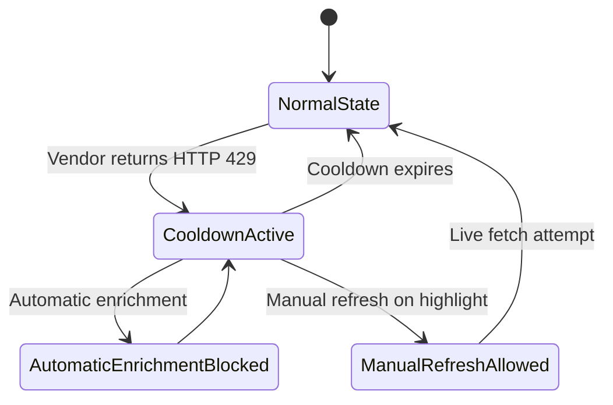

# API integrations and rate limits

Vera5 enrichment uses **bring-your-own API keys**. Requests go from the extension directly to each vendor over HTTPS; Vera5 does not proxy indicators through Vera5-operated infrastructure. For connector scope, credential storage, and parallel fetch behavior, see [architecture.md](architecture.md).

Vendor quotas change with plan tier and policy updates. Treat the tables below as orientation; confirm your effective limits in each vendor account or API usage dashboard before heavy automation.

## Per-source rate limit matrix

| Source | Live in extension | Vera5 API call (per enrichment) | Vendor quota (typical) | Quota window | HTTP 429 | Vendor reference |
|--------|-------------------|----------------------------------|------------------------|--------------|----------|------------------|
| **AbuseIPDB** | Yes (IPv4) | `GET https://api.abuseipdb.com/api/v2/check` — one check per enabled source per hover enrichment | **1,000** checks/day (free); higher tiers: 3,000–50,000/day depending on subscription | Resets **00:00 UTC** (API v2 daily limit) | Yes; includes `Retry-After`, `X-RateLimit-Limit`, `X-RateLimit-Remaining`, `X-RateLimit-Reset` | [AbuseIPDB API v2 — daily rate limits](https://docs.abuseipdb.com/) |
| **AlienVault OTX** | Yes (IPv4, domain, URL, hashes, CVE) | `GET https://otx.alienvault.com/api/v1/indicators/{type}/{value}` — one indicator lookup per enabled source per hover enrichment | **10,000** requests/hour with API key; **1,000** requests/hour without a key | Hourly (vendor-documented); contact vendor for sustained higher volume | Yes (documented); may also see timeouts on heavy endpoints | [OTX API overview](https://otx.alienvault.com/api) |
| **URLScan.io** | Yes (domain, URL) | `GET https://urlscan.io/api/v1/search/?q=…&size=5` — one search query per enabled source per hover enrichment (domain or URL indicator in `q`) | Per-action limits: separate **minute**, **hour**, and **day** quotas; values vary by account — use `GET https://urlscan.io/api/v1/quotas` | Fixed windows; day resets **midnight UTC** | Yes; `X-Rate-Limit-*` headers per action | [urlscan.io API rate limits](https://docs.urlscan.io/pages/api-rate-limits) |
| **GreyNoise (community)** | Yes (IPv4) | `GET https://api.greynoise.io/v3/community/{ip}` — one community lookup per enabled source per hover enrichment | **50** lookups/week (free community account, combined with Visualizer); unauthenticated lookups more restricted (e.g. **10**/day cited in API errors) | Weekly / daily depending on authentication tier | Yes; JSON error body describes plan and limit; may include `Retry-After` | [GreyNoise Community API](https://docs.greynoise.io/docs/using-the-greynoise-community-api) |

### Quota impact of multi-source enrichment

When multiple live sources are enabled for an indicator type, Vera5 issues **one vendor request per enabled source in parallel** (for example, domain hover enrichment with OTX and URLScan.io enabled consumes **one OTX indicator request** and **one URLScan.io search** per enrichment; IPv4 with AbuseIPDB, OTX, and GreyNoise enabled consumes **one AbuseIPDB check**, **one OTX indicator request**, and **one GreyNoise community lookup**). Rapid repeated hovers on the same value can trigger multiple calls; there is no shared Vera5-side request pool.

Manual-only enrichment (default) reduces accidental quota use by requiring an explicit enrich action on each indicator.

### GreyNoise Community tier limits

Vera5 live enrichment uses the **GreyNoise Community API** only (`GET /v3/community/{ipv4}`). Enterprise and paid GreyNoise API products are not integrated in Vera5 live connectors; pivot links may still open GreyNoise Visualizer or other vendor pages in your browser.

| Topic | Community tier (typical) |
|-------|--------------------------|
| **Scope** | IPv4 noise, RIOT, and classification context on the community endpoint |
| **Authentication** | Vera5 sends your API key in the `key` request header from local Settings storage. Live enrichment is skipped with actionable copy when no key is saved. |
| **Free account quota** | **50** IPv4 lookups per **week** (GreyNoise counts Community API and Visualizer usage together) |
| **Unauthenticated access** | GreyNoise documents lower caps for requests without a key (for example **10** lookups per **day** in HTTP 429 JSON). Vera5 does not call the Community API without your saved key. |
| **Quota window** | Weekly for authenticated community accounts; confirm effective limits in your GreyNoise account |
| **HTTP 429** | JSON body fields such as `plan`, `rate-limit`, `message`, and `plan_url`; may include `Retry-After`. Mapped to GreyNoise rate-limit copy on the hover card and may trigger the [global enrichment cooldown](#global-enrichment-cooldown) |
| **HTTP 401 / 403** | Invalid or rejected API key — “GreyNoise rejected the API key.” |
| **HTTP 404** | When the response includes a vendor `message` (for example IP not observed), Vera5 treats it as successful enrichment with a not-observed summary |
| **Timeout** | Aborts after 15 seconds; surfaces as “GreyNoise request timed out.” |

**Planning IPv4 enrichment**

- Create a free community account and API key via [GreyNoise pricing / sign-up](https://greynoise.io/pricing), then save the key under GreyNoise in Vera5 Settings.
- Monitor combined Community API + Visualizer usage in GreyNoise **Search — Usage Monitoring** (see [Community API documentation](https://docs.greynoise.io/docs/using-the-greynoise-community-api)).
- With AbuseIPDB, OTX, and GreyNoise all enabled, each IPv4 enrichment consumes **three** vendor requests in parallel — use manual-only enrichment (default) to avoid accidental quota burn on routine page hovers.

## Declared enrichment API hosts

Live connector `fetch()` calls are limited to HTTPS GET on hosts listed in `DECLARED_ENRICHMENT_API_HOSTS` (`extension/src/lib/iocRequestBoundaries.ts`). The extension manifest requests `https://*/*` host permission so analyst pages and declared vendor APIs are reachable; runtime `enrichmentFetch` blocks any host not on the allowlist before network I/O.

| Host | Source | Live endpoint (GET, IOC in query) |
|------|--------|-----------------------------------|
| `api.abuseipdb.com` | AbuseIPDB | `/api/v2/check?ipAddress=…` |
| `otx.alienvault.com` | AlienVault OTX | `/api/v1/indicators/{type}/{value}` |
| `urlscan.io` | URLScan.io | `/api/v1/search/?q=…&size=5` |
| `api.greynoise.io` | GreyNoise (community) | `/v3/community/{ip}` |

Pivot links may open other vendor origins in a normal browser tab; those navigations are not extension `fetch()` calls and are not subject to this allowlist.

## Vera5 extension behavior

### Request timeout

Live connectors abort outbound requests after **15 seconds** (`DEFAULT_ABUSEIPDB_REQUEST_TIMEOUT_MS`, `DEFAULT_OTX_REQUEST_TIMEOUT_MS`, `DEFAULT_URLSCAN_REQUEST_TIMEOUT_MS`, and `DEFAULT_GREYNOISE_REQUEST_TIMEOUT_MS`). Aborts surface as a timeout error on the hover card for that source.

### Rate-limit handling (HTTP 429)

When a vendor returns **429 Too Many Requests**, Vera5 maps the response to a rate-limited enrichment error for that source only. Other sources in the same parallel batch can still succeed (partial success UI).

The extension reads these response headers when present:

| Header | Used for |
|--------|----------|
| `Retry-After` | Seconds until retry (shown as “Retry after N seconds.”) |
| `X-RateLimit-Limit` | Parsed for diagnostics; not shown in UI |
| `X-RateLimit-Remaining` | Parsed; if zero with no `Retry-After`, hint may say quota exhausted |
| `X-RateLimit-Reset` | Unix epoch; converted to “Limit resets at …” when no `Retry-After` |

If no usable headers are present, the hover card shows a source-attributed backoff message (for example, “AbuseIPDB rate limit reached. Back off before retrying.”) and “Try again later.”

### Global enrichment cooldown

After any live connector receives **HTTP 429**, Vera5 also starts a **global** cooldown that blocks further **automatic** enrichment until the window expires. This is separate from the per-source error row shown for the request that triggered the limit.

**Automatic enrichment gating after HTTP 429**

| Behavior | Detail |
|----------|--------|
| **Trigger** | HTTP 429 from AbuseIPDB, OTX, URLScan.io, or GreyNoise during a live fetch |
| **Duration** | `Retry-After` seconds when the vendor sends it; otherwise **60 seconds** default |
| **Maximum** | Cooldown capped at **3600 seconds** (one hour) |
| **Multiple 429s** | Cooldown extends to the **longest** active retry window |
| **While active** | Automatic enrichment returns a shared message (“Threat intelligence rate limit reached. Back off before retrying.”) with **Retry after N seconds.** instead of calling vendors |
| **Manual refresh** | **›** on a highlight (`bypassCache`) **bypasses** the global cooldown gate and still issues live vendor requests (the vendor may still return 429) |
| **Partial success** | In a parallel multi-source batch, sources that did not return 429 can still succeed on the same enrichment; the global cooldown applies to subsequent automatic requests |

Debounced auto enrichment (~400 ms when manual-only is off) and manual-only mode (default on) reduce accidental quota use; see [analyst-workflows.md](analyst-workflows.md).

URLScan.io uses a different `X-Rate-Limit-*` shape (scope, action, window). The URLScan.io connector maps those headers using the same user-facing backoff pattern as other live sources.

GreyNoise Community API rate limits are described in JSON error bodies (`plan`, `rate-limit`, `message`) rather than standard `X-RateLimit-*` headers. The GreyNoise connector applies `Retry-After` when present and the same user-facing backoff pattern as other live sources.

### Other HTTP outcomes

| Status | Typical Vera5 mapping |
|--------|------------------------|
| 401 / 403 | Unauthorized — invalid or rejected API key |
| 408 | Timeout (vendor-reported) |
| Other 4xx/5xx | Vendor error with source attribution |

### IOC-only requests

Connectors send only the sanitized indicator value required by the vendor endpoint (for example, `ipAddress` query parameter for AbuseIPDB check; `q` search parameter for URLScan.io domain or URL queries; IPv4 in the path for GreyNoise community lookup). API keys travel in request headers (`Key`, `X-OTX-API-KEY`, `API-Key`, `key`) from local extension storage, never in page content or Vera5-hosted relays.

## Monitoring and verification

- **AbuseIPDB:** Account → API Usage tab on [abuseipdb.com](https://www.abuseipdb.com/).
- **OTX:** API key from [OTX settings](https://otx.alienvault.com/); monitor usage through your key issuance workflow and vendor communications for high volume.
- **URLScan.io:** `GET https://urlscan.io/api/v1/quotas` with your API key when URLScan.io is enabled.
- **GreyNoise:** [Community API usage limits](https://docs.greynoise.io/docs/using-the-greynoise-community-api); **Search — Usage Monitoring** in your GreyNoise account; see [GreyNoise Community tier limits](#greynoise-community-tier-limits) above.

To validate Vera5 backoff messaging locally, enable a source, trigger enrichment until the vendor returns 429, and confirm the hover card shows the rate-limit message and retry hint for that source without affecting unrelated pivot links or disabled sources. Confirm subsequent automatic enrichment shows the global cooldown message until the countdown expires; **›** manual refresh should still attempt a live fetch.

## Vendor terms, privacy, and acceptable use

Vera5 does not operate threat-intelligence vendors. When you enable a source, save an API key, trigger live enrichment, or click a **Recommended next pivots** link, you interact with that vendor under **your** account and **their** policies—not Vera5’s. Review terms, privacy notices, data retention, subprocessors, export controls, and organizational approval requirements **before** sending production or classified indicators.

| Source | Live HTTPS enrichment in Vera5 | How you may interact | Terms of service / acceptable use | Privacy / data policy |
|--------|-------------------------------|----------------------|-----------------------------------|------------------------|
| **AbuseIPDB** | Yes (IPv4) | Live API from the extension service worker; pivot links open in your browser | [AbuseIPDB Terms of Use](https://www.abuseipdb.com/legal) | [AbuseIPDB Privacy Policy](https://www.abuseipdb.com/privacy) |
| **AlienVault OTX** | Yes (IPv4, domain, URL, hashes, CVE) | Live API; pivot links | [OTX End-User Agreement (LevelBlue)](https://www.levelblue.com/legal/otx-eula-terms) | [LevelBlue Privacy Policy](https://www.levelblue.com/legal/privacy-policy) |
| **VirusTotal** | No (registry shell; pivots only today) | Pivot links; future live API would use your API key per vendor rules | [VirusTotal Terms of Service](https://support.virustotal.com/hc/en-us/articles/360016879500-Terms-of-Service) | [VirusTotal Privacy Policy](https://support.virustotal.com/hc/en-us/articles/360016879480-Privacy-Policy) |
| **URLScan.io** | Yes (domain, URL) | Live API from the extension service worker (`GET /api/v1/search/`); pivot links open in your browser | [urlscan.io Terms of Service](https://urlscan.io/about/terms/) | [urlscan.io Privacy Policy](https://urlscan.io/about/privacy/) |
| **GreyNoise** | Yes (IPv4) | Live API from the extension service worker (`GET /v3/community/{ip}`); pivot links open in your browser | [GreyNoise Terms of Use](https://www.greynoise.io/company/legal) | [GreyNoise Privacy Policy](https://www.greynoise.io/company/legal/privacy-policy) |
| **Shodan** | No (registry shell; pivots only today) | Pivot links | [Shodan Terms of Service](https://account.shodan.io/terms) | [Shodan Privacy Policy](https://account.shodan.io/privacy) |
| **Google Safe Browsing** | No (registry shell; no live API shipped) | Future live API would use Google Cloud credentials under Google API terms | [Google Safe Browsing API Terms](https://developers.google.com/safe-browsing/v4/terms) · [Google APIs Terms of Service](https://developers.google.com/terms) | [Google Privacy Policy](https://policies.google.com/privacy) |
| **Pulsedive** | No (registry shell; pivots only today) | Pivot links | [Pulsedive Terms of Use](https://pulsedive.com/terms_of_use) | [Pulsedive Privacy Policy](https://pulsedive.com/privacy) |
| **MalwareBazaar** | No (registry shell; pivots only today) | Pivot links to abuse.ch | [MalwareBazaar Terms of Service](https://bazaar.abuse.ch/faq/#tos) (abuse.ch project) | [MalwareBazaar FAQ](https://bazaar.abuse.ch/faq/) (CC0 dataset terms) |
| **Censys** | No (registry shell; pivots only today) | Pivot links; API ID + secret fields in Settings for future live use | [Censys Terms of Service](https://censys.io/terms-of-service) | [Censys Privacy Policy](https://censys.io/privacy-policy) |
| **ThreatFox** | No (registry shell; pivots only today) | Pivot links to abuse.ch | [ThreatFox API Terms of Use](https://threatfox.abuse.ch/api/) (includes abuse.ch fair-use terms) | [ThreatFox FAQ](https://threatfox.abuse.ch/faq/) |
| **URLHaus** | No (registry shell; pivots only today) | Pivot links to abuse.ch | [URLhaus API Terms of Use](https://urlhaus.abuse.ch/api/) (includes abuse.ch fair-use terms) | [URLhaus About](https://urlhaus.abuse.ch/about/) |

**Live enrichment today:** **AbuseIPDB**, **OTX**, **URLScan.io**, and **GreyNoise (community)** perform HTTPS API calls from the extension when enabled with your keys. Other rows apply to pivot navigation, saved keys that are not sent until live connectors ship, and organizational review before you enable future integrations.

**Pivot links:** opening a vendor URL sends the indicator in the query string or path under normal browser navigation. Vera5 does not proxy pivot traffic; vendor sites apply their own cookies, logging, and terms.

**Organizational use:** employers and clients may restrict which vendors may receive IOCs. Domain policy, internal asset lists, manual-only enrichment, and pre-query disclosure in Vera5 reduce accidental queries but do not replace vendor contract review. See [SECURITY.md](../SECURITY.md#third-party-apis) and [security-model.md](security-model.md).

Vendor URLs and policies change without notice. If a link breaks, search the vendor’s legal or documentation site and update this table in the same change set when you confirm the new URL.

## Related documentation

- [architecture.md](architecture.md) — MVP connector order, BYOK, parallel fetch, deferred sources
- [local-mode.md](local-mode.md) — local-first enrichment and quota expectations
- [security-model.md](security-model.md) — credential handling and user responsibilities
