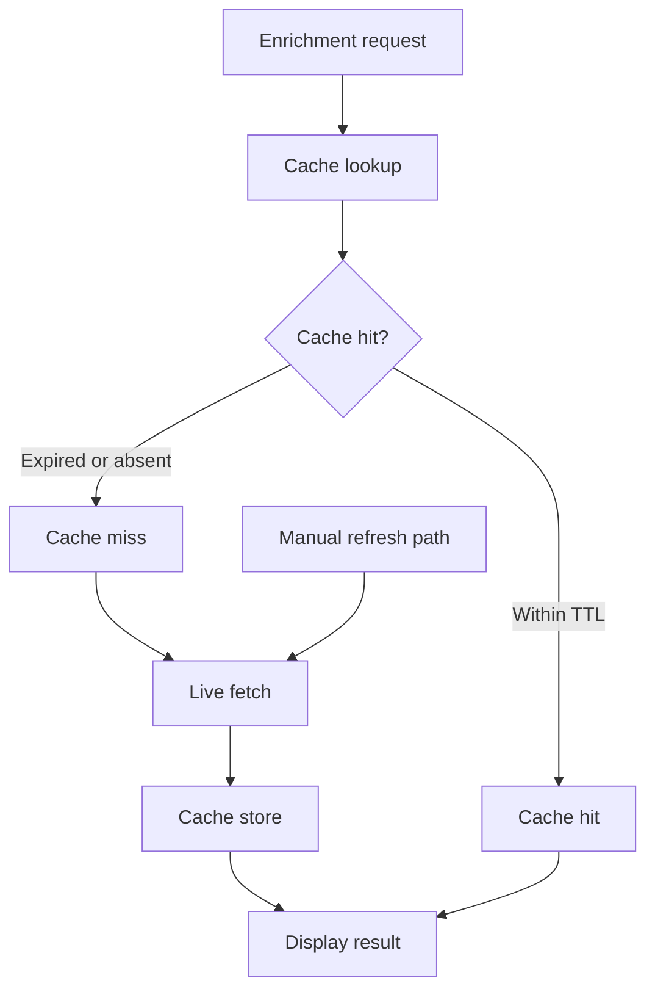

# Cache and rate limits

## Enrichment cache

**Per-indicator cache and refresh**

**Module:** `extension/src/lib/cache.ts`

- Keys combine **indicator value + source id**.
- Successful responses are stored in `chrome.storage.local` with a TTL (default about one hour; configurable on Options as a global seconds value with optional per-source overrides).
- Error and skipped outcomes from live enrichment are also stored so popup tray rows can show the last known status without re-fetching.
- Repeat enrichment reuses cache until expiry; UI shows **Cached** vs **Live**.

**Clear cache** on the Options page wipes stored responses without removing keys or toggles.

## Manual refresh

**›** on a highlight (content script) bypasses cache for that indicator: cached entries for that value are removed before fetch, and the global rate-limit cooldown gate is bypassed (vendors may still return HTTP 429).

## HTTP 429 and global cooldown

**Module:** `extension/src/lib/enrichmentCooldown.ts`

When a vendor returns **429 Too Many Requests**:

- That source shows a rate-limit error on the card.
- Vera5 may start a **global cooldown** blocking further **automatic** enrichment until the window passes.
- Manual **›** refresh can retry despite cooldown (vendor may still 429).

For automatic enrichment gating during cooldown (visual summary), see [Global enrichment cooldown](../api-integrations.md#global-enrichment-cooldown) in [docs/api-integrations.md](../api-integrations.md).

User-oriented explanation: [docs/analyst-workflows.md](../analyst-workflows.md) and [docs/api-integrations.md](../api-integrations.md).

## Debounced auto enrichment

With manual-only off, rapid hover opens coalesce (~400 ms) to the last indicator via `enrichmentAutoFetch.ts` to reduce accidental quota use.

## Timeouts

Connectors use a 15-second abort window (`DEFAULT_*_REQUEST_TIMEOUT_MS` in each live connector module, including AbuseIPDB, OTX, URLScan.io, GreyNoise, Shodan, Censys, and VirusTotal).

## Tests

- `cache.test.ts`
- `enrichmentCooldown.test.ts`
- `enrichmentPipeline.regression.test.ts` (scan → enrich → cache → refresh paths)
