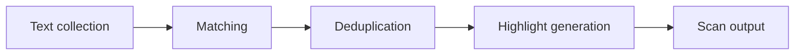

# Detection engine

Vera5 detects indicators in **visible text nodes** on HTTP/HTTPS pages when the analyst runs **Scan page** (popup, workspace sidebar, or keyboard shortcut), **Scan selection** (popup or workspace sidebar on highlighted text), **Enrich selection** (popup or workspace sidebar when selected text resolves to an indicator), or when **auto-scan** is enabled in settings.

## Pipeline

**Detection pipeline**

For operator scan and triage context, see [docs/analyst-workflows.md](../analyst-workflows.md).

1. **Text collection** — `extension/src/content/textWalker.ts` walks eligible DOM text nodes (skips `script`, `style`, `textarea`, and metadata subtrees by default).
2. **Matching** — `extension/src/lib/iocRegex.ts` applies conservative regex per IOC type.
3. **Dedup and overlap** — `extension/src/content/detector.ts` resolves overlapping spans (URL beats domain, longest hash wins, etc.) and drops matches whose type is disabled in `iocTypeEnabled` storage.
4. **Highlighting** — `extension/src/content/highlighter.ts` underlines matches when highlighting is enabled and assigns stable `data-vera5-anchor-id` values for tray navigation.
5. **Scan snapshot** — after each scan, `extension/src/content/scanPage.ts` publishes a versioned per-tab snapshot (IOC type, value, anchor linkage) to `chrome.storage.session` via the service worker (`extension/src/lib/tabScanSnapshotStorage.ts`).
6. **Scan summary** — popup and content consumers read a stable `TabScanSummary` view model through `GET_TAB_SCAN_SUMMARY` (`extension/src/lib/tabScanSummaryClient.ts`, `extension/src/content/tabScanSummaryContent.ts`).

Scan entry: `extension/src/content/scanPage.ts`, invoked from the service worker on `scan-page` messages and from popup/workspace controls on `SCAN_SELECTION` for range-limited scans on dense dashboards. Selection enrich entry: `extension/src/content/enrichSelection.ts` on `ENRICH_SELECTION`, resolving a single indicator from the active selection (including scanned highlights) and opening the hover card or workspace detail with a manual enrichment fetch.

## Supported types (MVP)

IPv4, domain, URL, MD5, SHA1, SHA256, CVE. Frozen list and out-of-scope types are in [docs/architecture.md](../architecture.md).

## False-positive controls

Rules live in `iocRegex.ts` and `detector.ts`. Public reference tables (decoys, suppressions, limitations) are maintained in [docs/architecture.md](../architecture.md#known-false-positives-and-suppressions).

Notable behaviors:

- Filename-style domains with denylisted TLDs (`chart.png`, `splunkd.log`) are rejected.
- Semver-like prefixes and `from X to Y` upgrade ranges can suppress dotted quads mistaken for IPv4.
- Private-space IPv4 is omitted when `includePrivateIpv4` is false in storage (default).
- Disabled IOC types (`iocTypeEnabled`) are omitted after deduplication; Options exposes one checkbox per MVP type.
- Scan stops after a text-node cap (performance guardrail) per `textWalker.ts` (`DEFAULT_MAX_TEXT_NODES_PER_SCAN`, default 2500 eligible text nodes). Page scans return a `profile` object on the scan response: `textNodesScanned`, `textNodeCap`, `capReached`, and `durationMs`. When `capReached` is true, additional visible text on the page was not scanned—use **Scan selection** on the region you need.
- **Scan selection** walks only text nodes intersecting the active browser selection (`scanTextNodesForIocsInRange` in `detector.ts`), so analysts can triage one table row or log block on heavy SOC exports without hitting the full-page text-node cap.

## Auto-scan

`extension/src/content/autoScan.ts` and `mutationRescan.ts` register a debounced `MutationObserver` when `autoScanEnabled` is true (default **false**). Mutations do not rescan unless the analyst opts in via Options.

## Tests

- `detector.test.ts`, `iocRegex.test.ts`, `textWalker.test.ts`
- `fixtureTuning.test.ts` against `examples/sample-alert.html`, `examples/sample-blog.html`, `examples/sample-splunk-export.html`, and `examples/sample-security-onion-alert.html` (see [docs/soc-validation-fixtures.md](../soc-validation-fixtures.md))

When changing regex or walker defaults, update golden/fixture expectations and the architecture FP tables if behavior shifts.
