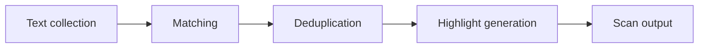

# Detection engine

Vera5 detects indicators in **visible text nodes** on HTTP/HTTPS pages when the analyst runs **Scan page** (popup or keyboard shortcut) or when **auto-scan** is enabled in settings.

## Pipeline

**Detection pipeline**

For operator scan and triage context, see [docs/analyst-workflows.md](../analyst-workflows.md).

1. **Text collection** — `extension/src/content/textWalker.ts` walks eligible DOM text nodes (skips `script`, `style`, `textarea`, and metadata subtrees by default).
2. **Matching** — `extension/src/lib/iocRegex.ts` applies conservative regex per IOC type.
3. **Dedup and overlap** — `extension/src/content/detector.ts` resolves overlapping spans (URL beats domain, longest hash wins, etc.).
4. **Highlighting** — `extension/src/content/highlighter.ts` underlines matches when highlighting is enabled.

Scan entry: `extension/src/content/scanPage.ts`, invoked from the service worker on `scan-page` messages.

## Supported types (MVP)

IPv4, domain, URL, MD5, SHA1, SHA256, CVE. Frozen list and out-of-scope types are in [docs/architecture.md](../architecture.md).

## False-positive controls

Rules live in `iocRegex.ts` and `detector.ts`. Public reference tables (decoys, suppressions, limitations) are maintained in [docs/architecture.md](../architecture.md#known-false-positives-and-suppressions).

Notable behaviors:

- Filename-style domains with denylisted TLDs (`chart.png`) are rejected.
- Semver-like prefixes can suppress dotted quads mistaken for IPv4.
- Private-space IPv4 is omitted when `includePrivateIpv4` is false in storage (default).
- Scan stops after a text-node cap (performance guardrail) per `scanPage.ts`.

## Auto-scan

`extension/src/content/autoScan.ts` and `mutationRescan.ts` register a debounced `MutationObserver` when `autoScanEnabled` is true (default **false**). Mutations do not rescan unless the analyst opts in via Options.

## Tests

- `detector.test.ts`, `iocRegex.test.ts`, `textWalker.test.ts`
- `fixtureTuning.test.ts` against `examples/sample-alert.html` and `examples/sample-blog.html`

When changing regex or walker defaults, update golden/fixture expectations and the architecture FP tables if behavior shifts.
