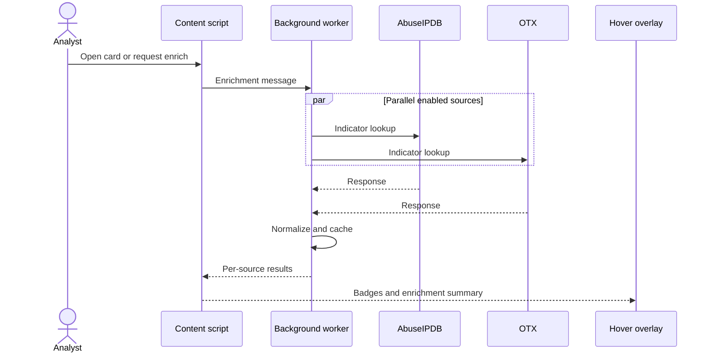

# Enrichment connectors

Live enrichment uses **bring-your-own API keys**. The background worker calls vendors over HTTPS; Vera5 does not proxy indicators through maintainer infrastructure.

## Shipped live connectors

| Order | Source | Module | Indicator types (current) |
|------:|--------|--------|---------------------------|
| 1 | AbuseIPDB | `abuseipdbConnector.ts` | IPv4 |
| 2 | AlienVault OTX | `otxConnector.ts` | IPv4, domain, URL, MD5, SHA1, SHA256, CVE |

Orchestration: `extension/src/background/enrichmentHandler.ts` with policy in `enrichmentPolicy.ts` and request wiring in `enrichmentRequest.ts`.

## Parallel multi-source fetch

When multiple sources are enabled for an indicator:

- Requests run **in parallel** per source.
- Partial success is normal: one vendor may error while another returns OK.
- The hover UI shows per-source badges (**Live**, **Cached**, **Error**, **Skipped**).

Selection and skip rules: `enrichmentSourceSelection.ts`.

## Enrichment request flow

## IOC-only requests

`sanitizeEnrichmentIoc` and `iocRequestBoundaries.ts` enforce that outbound payloads contain indicator values required by the vendor API, not full page HTML. Security regression: `verify:security` and `iocRequestBoundaries.test.ts`.

## Normalization

Vendor JSON is normalized for display and scoring in `enrichmentVendorNormalize.ts`. Raw JSON can be shown in the overlay with redaction via `enrichmentRawResponse.ts`.

## Pivot-only sources

URLScan.io and GreyNoise have settings slots and static pivots (`pivots.ts`) but **no live API** in the current release. Do not document them as live connectors until implemented.

## User-facing limits

Vendor quotas and 429 behavior: [docs/api-integrations.md](../api-integrations.md).

## Adding a connector (maintainer notes)

1. Implement client under `extension/src/lib/`.
2. Register in enrichment handler and source selection.
3. Add storage key + Options UI field (masked).
4. Extend normalization and scoring parsers if summaries feed composite score.
5. Add unit tests and update [docs/architecture.md](../architecture.md) frozen connector table only after product scope approval.
