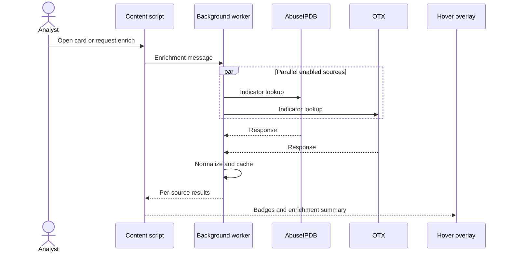

# Enrichment connectors

Live enrichment uses **bring-your-own API keys**. The background worker calls vendors over HTTPS; Vera5 does not proxy indicators through maintainer infrastructure.

## Shipped live connectors

| Order | Source | Module | Indicator types (current) |
|------:|--------|--------|---------------------------|
| 1 | AbuseIPDB | `abuseipdbConnector.ts` | IPv4 |
| 2 | AlienVault OTX | `otxConnector.ts` | IPv4, domain, URL, MD5, SHA1, SHA256, CVE |

Orchestration: `extension/src/background/enrichmentHandler.ts` with policy in `enrichmentPolicy.ts` and request wiring in `enrichmentRequest.ts`.

## Parallel multi-source fetch

When multiple sources are enabled for an indicator:

- Requests run **in parallel** per source.
- Partial success is normal: one vendor may error while another returns OK.
- The hover UI shows per-source badges (**Live**, **Cached**, **Error**, **Skipped**).

Selection and skip rules: `enrichmentSourceSelection.ts`.

## Enrichment request flow

```mermaid
sequenceDiagram
  actor Analyst
  participant Content as Content script
  participant BG as Background worker
  participant AbuseIPDB as AbuseIPDB
  participant OTX as OTX
  participant UI as Hover overlay

  Analyst->>Content: Open card or request enrich
  Content->>BG: Enrichment message
  par Parallel enabled sources
    BG->>AbuseIPDB: Indicator lookup
    BG->>OTX: Indicator lookup
  end
  AbuseIPDB-->>BG: Response
  OTX-->>BG: Response
  BG->>BG: Normalize and cache
  BG-->>Content: Per-source results
  Content-->>UI: Badges and enrichment summary
```

## IOC-only requests

`sanitizeEnrichmentIoc`, `enrichmentFetch`, and `DECLARED_ENRICHMENT_API_HOSTS` in `iocRequestBoundaries.ts` enforce IOC-only vendor payloads and block live HTTP calls to hosts outside the declared connector APIs. Security regression: `verify:security` and `iocRequestBoundaries.test.ts`.

## Normalization

Vendor JSON is normalized for display and scoring in `enrichmentVendorNormalize.ts`. Raw JSON can be shown in the overlay with redaction via `enrichmentRawResponse.ts`.

## Pivot-only sources

URLScan.io and GreyNoise have settings slots and static pivots (`pivots.ts`) but **no live API** in the current release. Do not document them as live connectors until implemented.

## Connector confidence metadata — reliability tier

Per-source informational metadata on hover card source rows includes `freshnessPolicy`, `reliabilityTier`, and `sourceClass`. Schema lives in `extension/src/lib/connectorDefinition.ts` and is exposed through `getConnectorConfidenceMetadata()` in `connectorRegistry.ts`.

**Reliability tier** (`reliabilityTier`) is an enum with three documented values. It is informational only—it does not alter the composite risk score or the per-source live row.

| Value | Label | Meaning |
|-------|-------|---------|
| `community` | Community | Community-sourced or crowd-fed intelligence. Shared pulses and user submissions may lag official vendor research. |
| `authoritative` | Authoritative | Vendor-operated or registry-grade feed with a defined API contract. Typical commercial threat intelligence and registration data sources. |
| `pivot_only` | Pivot only | No live enrichment connector in Vera5 for this source. Static pivot links only; metadata describes navigation affordance, not a live API response. |

Lookup helpers: `getConnectorReliabilityTierDefinition()`, `getConnectorReliabilityTierLabel()`, `listConnectorReliabilityTierDefinitions()`. Canonical copy: `CONNECTOR_RELIABILITY_TIER_DEFINITIONS`.

Legacy capability metadata still exposes `authorityTier` (`authoritative`, `community`, `unknown`) for connector profiles. `reliabilityTier` adds `pivot_only` for pivot-only registry entries and is the field hover-card chips will read.

## User-facing limits

Vendor quotas and 429 behavior: [docs/api-integrations.md](../api-integrations.md).

Vendor terms of service, privacy policies, and acceptable use (all registered sources): [docs/api-integrations.md — Vendor terms, privacy, and acceptable use](../api-integrations.md#vendor-terms-privacy-and-acceptable-use).

## Adding a connector (maintainer notes)

1. Implement client under `extension/src/lib/`.
2. Register in enrichment handler and source selection.
3. Add storage key + Options UI field (masked).
4. Extend normalization and scoring parsers if summaries feed composite score.
5. Add unit tests and update [docs/architecture.md](../architecture.md) frozen connector table only after product scope approval.
