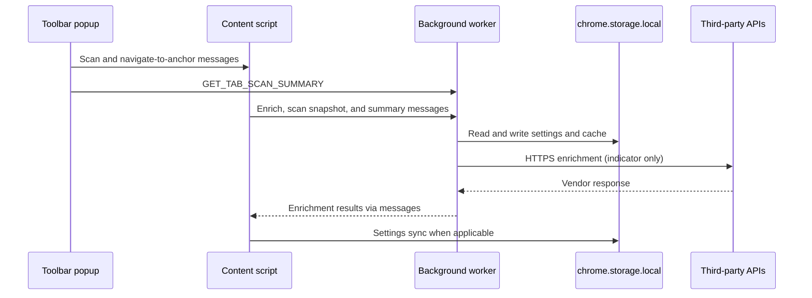

# Extension architecture

Vera5 ships as a Manifest V3 Chromium extension under `extension/`. TypeScript, React, and Vite compile to `extension/dist/`, which you load unpacked in Chrome.

## Runtime surfaces

| Surface | Path | Context |
|---------|------|---------|
| Service worker | `extension/src/background/` | No DOM. Routes messages, runs enrichment, cache, cooldown. |
| Content scripts | `extension/src/content/` | Page DOM. Detection, highlights, **production hover overlay** (`hoverCardOverlay.ts`). |
| Popup | `extension/src/popup/` | Toolbar UI: enable, highlights, scan, IOC tray with type filters, count summary, copy-all/copy-filtered actions, Markdown/JSON subset export, ticket template export, source-attributed non-blocking per-row enrichment hints from stored cache, empty/post-scan states, row navigation to page highlights, and stale-highlight feedback when the page DOM changed. |
| Options | `extension/src/options/` | Settings page: keys, toggles, cache clear, export/import. |
| React components | `extension/src/components/` | Hover card and risk score for **unit tests and dev shell only** — not injected into live tabs. |

Analyst-facing behavior on real pages uses the **content-script overlay**, not the React hover card. See [hover-overlay-architecture.md](hover-overlay-architecture.md).

## Shared library

`extension/src/lib/` holds non-UI logic used by background and content:

- `iocRegex.ts`, detector helpers — indicator matching
- `storage.ts` — settings schema and defaults
- `cache.ts` — enrichment response cache
- `enrichment*.ts`, `abuseipdbConnector.ts`, `otxConnector.ts` — vendor calls and normalization
- `scoring.ts`, `hoverCardEnrichment.ts` — composite score and card view-model
- `enrichmentExport.ts`, `exportTemplates.ts` — normalized enrichment records; markdown and JSON export; tray subset export; pluggable ticket templates
- `aiSummaryPrompt.ts`, `aiSummaryService.ts` — versioned enrichment-summary prompt template and localhost-only (`127.0.0.1`) LLM summary requests with typed timeout, connection, HTTP, and malformed-response failures
- `tabScanSnapshot.ts`, `tabScanSummary.ts`, `tabScanSummaryClient.ts` — per-tab scan snapshot storage, summary consumers, and tray subset export record builders
- `pivots.ts`, `settingsExport.ts`, `vera5UiStyles.ts` — pivots, export, shared styles

## Message flow (simplified)

Content scripts request enrichment through the background worker so API keys and fetch logic stay out of the page JavaScript context exposed to hostile pages.

## Build and verify

From `extension/`:

| Command | Purpose |
|---------|---------|
| `npm run build` | Emit `dist/`, run `verify:dist` and `verify:security` |
| `npm run check` | ESLint + Vitest |
| `npm run build:watch` | Rebuild popup/options/background; full `build` after content changes |

Manifest: `extension/public/manifest.json`. Built manifest and bundles land under `extension/dist/`.

## Repository neighbors

- `examples/` — HTML fixtures for manual scan checks
- `docs/architecture.md` — frozen IOC types and connector order
- `scripts/check.ps1` — root helper to run extension checks on Windows
