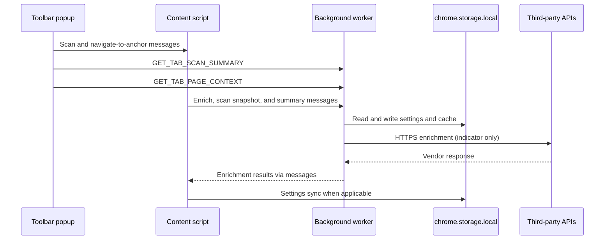

# Extension architecture

Vera5 ships as a Manifest V3 Chromium extension under `extension/`. TypeScript, React, and Vite compile to `extension/dist/`, which you load unpacked in Chrome.

## Runtime surfaces

| Surface | Path | Context |
|---------|------|---------|
| Service worker | `extension/src/background/` | No DOM. Routes messages, runs enrichment, cache, cooldown. Registers selection context menus (**Enrich selection with Vera5**, **Run macro on selection** parent with per-macro children for `triggers.context`) and sends `RUN_OPERATOR_MACRO` / `ENRICH_SELECTION` to the active tab. |
| Content scripts | `extension/src/content/` | Page DOM. Detection, highlights, **production hover overlay** (`hoverCardOverlay.ts`), command palette (`commandPalette.ts` / `commandPaletteCommands.ts`). Palette-trigger operator macros register into the shared `commandRegistry` (ids `operator-macro:<macroId>`) and run through the same execute path as core commands. Tray-trigger runs arrive via `RUN_OPERATOR_MACRO` (`selection` or `filtered` seed) and share `runOperatorMacro` with palette execution. Macro enrich steps await the enrich pipeline and abort the run with hover-card (and tray) messaging when domain policy, quiet mode, or declined pre-query disclosure blocks the call. A per-run live-enrich budget (`MAX_OPERATOR_MACRO_LIVE_ENRICH_CALLS_PER_RUN`) caps `enrich` and `queueRelatedIocs` fan-out and surfaces a quota warning when truncated. |
| Popup | `extension/src/popup/` | Toolbar UI: enable, highlights, scan, IOC tray with type filters, count summary, copy-all/copy-filtered actions, Markdown/JSON subset export, ticket template export, **Run macro…** / **Run macro on filtered…** (sends `RUN_OPERATOR_MACRO` to the active tab), source-attributed non-blocking per-row enrichment hints from stored cache, empty/post-scan states, row navigation to page highlights, stale-highlight feedback when the page DOM changed, investigation session timeline, and **investigation replay** step-through (previous / next / jump-to-step; when a step includes an indicator key, scrolls the on-page highlight without live re-enrich; shows current-step detail for action, truncated indicator, attribution, and export template when present; empty state when the session has no replayable segments; **Copy transcript** / **Download transcript** with Markdown report, Obsidian note, or Analyst update transcript templates, plus an optional IOC & enrichment appendix from local session memory). |
| Options | `extension/src/options/` | Settings page: keys, toggles, cache clear, export/import. |
| React components | `extension/src/components/` | Hover card and risk score for **unit tests and dev shell only** — not injected into live tabs. |

Analyst-facing behavior on real pages uses the **content-script overlay**, not the React hover card. See [hover-overlay-architecture.md](hover-overlay-architecture.md).

## Shared library

`extension/src/lib/` holds non-UI logic used by background and content:

- `iocRegex.ts`, detector helpers — indicator matching
- `storage.ts` — settings schema and defaults
- `cache.ts` — enrichment response cache
- `enrichment*.ts`, `abuseipdbConnector.ts`, `otxConnector.ts` — vendor calls and normalization
- `scoring.ts`, `hoverCardEnrichment.ts` — composite score and card view-model
- `replaySegment.ts` — investigation replay segment projection from session timeline events, secret redaction, previous/next/jump step-index helpers, navigable-indicator checks for highlight-only playback, an explicit forbid catalog for screen/video capture APIs (`getDisplayMedia`, `desktopCapture`, `tabCapture`, `captureStream`), a local-storage-only persistence contract (`chrome.storage.local` investigation sessions; no upload endpoint), and clipboard-only user-initiated transcript copy/share (no Web Share API)
- `enrichmentExport.ts`, `exportTemplates.ts` — normalized enrichment records; markdown and JSON export; tray subset export; pluggable ticket templates
- `aiSummaryPrompt.ts`, `aiSummaryService.ts` — versioned enrichment-summary prompt template and localhost-only (`127.0.0.1`) LLM summary requests with typed timeout, connection, HTTP, and malformed-response failures
- `tabScanSnapshot.ts`, `tabScanSummary.ts`, `tabScanSummaryClient.ts` — per-tab scan snapshot storage, summary consumers, and tray subset export record builders
- `pageContext.ts` — versioned `PageContextType` enum, bounded DOM probe (`probePageContextDomSignalsFromDocument`), local page-context classifier, static IOC type priority hints, and UI layout profiles (tray sort default, hover card field emphasis, pivot recipe ordering) per page context
- `pageContextStorage.ts` — session-local last classified page context per tab (`chrome.storage.session`); cleared on tab close
- `pageContextClient.ts` — popup and tray consumers fetch tab page context via `GET_TAB_PAGE_CONTEXT`
- `analystModeStorage.ts` — content-script cache for profile export defaults, pivot emphasis, and effective export template id (`resolveEffectiveDefaultExportTemplateId` + tab page context)
- Generic page context is a neutral fallback: tray sort stays `all`, IOC priority and layout profiles preserve baseline ordering, and detection, enrich, and export are never gated by page type
- On page-context type change, `pageContextStorage.ts` applies the matching analyst workflow preset (SOC, CTI, or DFIR) unless the page origin has a stored mode override in `pageContextSiteModeOverrides`
- `PAGE_CONTEXT_DEFAULT_EXPORT_TEMPLATE_BY_TYPE` in `pageContext.ts` maps each classified page type to a default export template id (`jira-comment`, `markdown-report`, `thehive-case-note`); generic pages keep the profile default
- `PAGE_CONTEXT_DEFAULT_OPERATOR_MACRO_BY_TYPE` in `pageContext.ts` maps CTI/malware-blog and sandbox page types to built-in operator macro ids (`cti-deep-check`, `dfir-triage`); `resolvePageContextDefaultOperatorMacroSuggestion` returns that id only when no per-site page-context override is stored for the origin (suggestion only—never auto-runs macros)
- Page context layout profiles (`cardFieldEmphasis`, `pivotRecipeOrder`) are static ordering hints only—composite score and explain-this-IOC reasoning lines remain in `scoring.ts` / `hoverCardEnrichment.ts` (see [scoring-system.md](scoring-system.md))
- `pivots.ts`, `settingsExport.ts`, `vera5UiStyles.ts` — pivots, export, shared styles

## Message flow (simplified)

```mermaid
sequenceDiagram
  participant Popup as Toolbar popup
  participant Content as Content script
  participant SW as Background worker
  participant Store as chrome.storage.local
  participant Vendor as Third-party APIs

  Popup->>Content: Scan and navigate-to-anchor messages
  Popup->>SW: GET_TAB_SCAN_SUMMARY
  Popup->>SW: GET_TAB_PAGE_CONTEXT
  Content->>SW: Enrich, scan snapshot, and summary messages
  SW->>Store: Read and write settings and cache
  SW->>Vendor: HTTPS enrichment (indicator only)
  Vendor-->>SW: Vendor response
  SW-->>Content: Enrichment results via messages
  Content->>Store: Settings sync when applicable
```

Content scripts request enrichment through the background worker so API keys and fetch logic stay out of the page JavaScript context exposed to hostile pages.

## Build and verify

From `extension/`:

| Command | Purpose |
|---------|---------|
| `npm run build` | Emit `dist/`, run `verify:dist` and `verify:security` |
| `npm run build:firefox` | Emit `dist-firefox/` from shared sources with Firefox manifest, run `verify:firefox-manifest` (permission parity, default CSP posture, declared connector host coverage), `verify:dist`, and `verify:security:firefox` against that output |
| `npm run check` | ESLint + Vitest |
| `npm run build:watch` | Rebuild popup/options/background; full `build` after content changes |

Manifest: `extension/public/manifest.json` (Chromium service worker background). Firefox MV3 variant: `extension/public/manifest.firefox.json` (`browser_specific_settings.gecko`, `background.scripts` event background, permission and `host_permissions` parity with Chromium). Declared enrichment API hosts are centralized in `src/lib/iocRequestBoundaries.ts` and audited by `verify:firefox-manifest` and `verify:security`. Built manifests and bundles land under `extension/dist/` (Chromium) or `extension/dist-firefox/` when the dual-target build is enabled.

## Repository neighbors

- `examples/` — HTML fixtures for manual scan checks
- `docs/architecture.md` — frozen IOC types and connector order
- `scripts/check.ps1` — root helper to run extension checks on Windows
