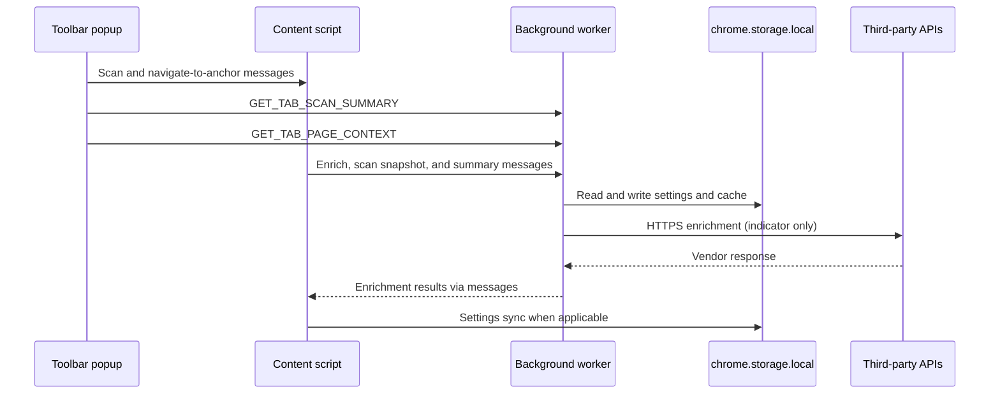

# Extension architecture

Vera5 ships as a Manifest V3 Chromium extension under `extension/`. TypeScript, React, and Vite compile to `extension/dist/`, which you load unpacked in Chrome.

## Runtime surfaces

| Surface | Path | Context |
|---------|------|---------|
| Service worker | `extension/src/background/` | No DOM. Routes messages, runs enrichment, cache, cooldown. Registers selection context menus (**Enrich selection with Vera5**, **Run macro on selection** parent with per-macro children for `triggers.context`) and sends `RUN_OPERATOR_MACRO` / `ENRICH_SELECTION` to the active tab. |
| Content scripts | `extension/src/content/` | Page DOM. Detection, highlights, **production hover overlay** (`hoverCardOverlay.ts`), command palette (`commandPalette.ts` / `commandPaletteCommands.ts`). Palette-trigger operator macros register into the shared `commandRegistry` (ids `operator-macro:<macroId>`) and run through the same execute path as core commands. Tray-trigger runs arrive via `RUN_OPERATOR_MACRO` (`selection` or `filtered` seed) and share `runOperatorMacro` with palette execution. Macro enrich steps await the enrich pipeline and abort the run with hover-card (and tray) messaging when domain policy, quiet mode, or declined pre-query disclosure blocks the call. A per-run live-enrich budget (`MAX_OPERATOR_MACRO_LIVE_ENRICH_CALLS_PER_RUN`) caps `enrich` and `queueRelatedIocs` fan-out and surfaces a quota warning when truncated. |
| Popup | `extension/src/popup/` | Toolbar UI: enable, highlights, scan, IOC tray with type filters, count summary, copy-all/copy-filtered actions, Markdown/JSON subset export, ticket template export, **Run macro…** / **Run macro on filtered…** (sends `RUN_OPERATOR_MACRO` to the active tab), source-attributed non-blocking per-row enrichment hints from stored cache, empty/post-scan states, row navigation to page highlights, stale-highlight feedback when the page DOM changed, IOC rows matching local noise rules moved into a default-collapsed **Suppressed** section (still listed; not removed from detection; collapsed summary **Why still visible?** tooltip reuses detection provenance), investigation session timeline, and **investigation replay** step-through (previous / next / jump-to-step; when a step includes an indicator key, scrolls the on-page highlight without live re-enrich; shows current-step detail for action, truncated indicator, attribution, and export template when present; empty state when the session has no replayable segments; **Copy transcript** / **Download transcript** with Markdown report, Obsidian note, or Analyst update transcript templates, plus an optional IOC & enrichment appendix from local session memory). |
| Options | `extension/src/options/` | Settings page: keys, toggles, cache clear, export/import. |
| React components | `extension/src/components/` | Hover card and risk score for **unit tests and dev shell only** — not injected into live tabs. |

Analyst-facing behavior on real pages uses the **content-script overlay**, not the React hover card. See [hover-overlay-architecture.md](hover-overlay-architecture.md).

## Shared library

`extension/src/lib/` holds non-UI logic used by background and content:

- `iocRegex.ts`, detector helpers — indicator matching
- `storage.ts` — settings schema and defaults
- `cache.ts` — enrichment response cache
- `enrichment*.ts`, `abuseipdbConnector.ts`, `otxConnector.ts` — vendor calls and normalization
- `scoring.ts`, `hoverCardEnrichment.ts` — composite score and card view-model
- `replaySegment.ts` — investigation replay segment projection from session timeline events, secret redaction, previous/next/jump step-index helpers, navigable-indicator checks for highlight-only playback, an explicit forbid catalog for screen/video capture APIs (`getDisplayMedia`, `desktopCapture`, `tabCapture`, `captureStream`), a local-storage-only persistence contract (`chrome.storage.local` investigation sessions; no upload endpoint), and clipboard-only user-initiated transcript copy/share (no Web Share API)
- `correlationCluster.ts` — local cross-session `CorrelationCluster` schema (cluster id, member IOC keys aligned with same-page co-occurrence member keys, session ids, first/last seen, co-occurrence count); builds exact-matching clusters from session scan snapshot IOC sets (co-occurrence page indexes preferred, investigation session timeline/pin fallback); optional overlap merge via Jaccard index or fixed minimum shared IOC count (configured threshold; not ML / not a verdict); excludes watchlist `internal` and `suppress-false-positive` labeled members from cluster promotion when labels are supplied; performance caps (default max 64 clusters and 64 IOCs per cluster); retention prune by configurable day window (default 90 days on `lastSeenAt`); tray panel view helpers for **Appeared across sessions** list rows with session drill-down (title, truncated page URL, date, cluster IOC count); empty state when no other sessions share a clustered set; when viewing the current tab scan, links to the existing **Appeared alongside** same-page panel (does not duplicate that list); in-product disclaimer constants (**Correlation ≠ causation**; co-occurrence / clusters are not a detection verdict) shared with pack exports and same-page tray copy; list-only UI layout contract with forbid catalog for force-directed graphs, canvas graphs, and global TI maps; not a graph engine and not a detection verdict
- `correlationClusterExport.ts` — local correlation pack markdown and JSON appendix builders (cluster summary, member IOC table/rows, session references); JSON envelope uses top-level `schemaVersion` + `exportedAt` + operator `disclaimer` aligned with enrichment export patterns; markdown appendix includes the same disclaimer; wired into the export template engine as an optional appendix; redacts API keys and raw vendor payload fields from pack text before export; advisory export only, not a detection verdict
- `noiseRule.ts` — local inspectable `NoiseRule` schema (`id`, `patternType` exact/regex/domain-suffix/cidr, `pattern`, `sourceAction` suppress/internal/benign, `createdAt`, `hitCount`, `enabled`); maps watchlist suppress/internal/benign labels to source actions; create/normalize helpers; human-readable summary and Options detail view (action, pattern type, pattern, hits, created, enabled, id — no opaque weights); pattern match helpers (exact / regex / domain-suffix / CIDR; disabled rules do not match); search filter for Options; tray partition into active vs suppressed rows; scan filter helper with hide-suppressed default off; offline Options preview of matches against the fixed `examples/sample-alert.html` indicator corpus (no live page open/mutate); single-step undo slot for the last watchlist-learned rule; display and optional scan-filter only—does not override domain policy enrich or auto-scan gates (domain deny wins); hover-card deprioritized match view + Options deep-link hash helpers; per-action opt-in learn from watchlist label apply (`createNoiseRuleFromWatchlistLabel` + confirm copy); session buffer of learned rules (remember with overwrite, forget by id)
- `noiseRuleStorage.ts` — `chrome.storage.local` persistence for noise rules (`noiseRules` key) with store `schemaVersion`, `updatedAt`, `rules[]` (cap 256); upsert/list/update/enable/delete/clear/hydrate; last-learn undo key (`noiseRuleLastLearnUndo`) written only when a watchlist learn inserts a new rule; `undoLastLearnedNoiseRule` removes that rule only; team-handoff JSON export (`schemaVersion` + `exportedAt` + `rules`, allowlisted fields including `enabled`, never API keys); JSON/CSV import with schema validation, secret rejection, duplicate detection, and merge modes (add-only vs replace-all with confirmation); optional SOC dashboard starter serialize/import (never auto-applied); Options **Noise rules** search, enable/disable, edit, delete, undo last learned, list, export/import (including starter), and clear all; content-side read for `hideSuppressedFromScan`
- `knownGood.ts` — local inspectable `KnownGoodEntry` schema (`id`, `category` cdn/saas/corp_vpn/vuln_scanner/internal, `matchType` domain/ip/cidr/asn/hash-prefix, `pattern`, `labelText`); recommended label copy **Known benign** / **Known internal**; create/normalize and stable id helpers; import merge modes (add-only / replace-all); optional CDN/SaaS starter specs (`KNOWN_GOOD_CDN_SAAS_STARTER_SPECS` / `buildKnownGoodCdnSaasStarterEntries`); curated list labels only—not a silent safe verdict, cloud goodware API, or hidden score override
- `knownGoodStorage.ts` — `chrome.storage.local` persistence for known-good lists (`knownGoodList` key) with store `schemaVersion`, `updatedAt`, `entries[]` (cap 512); upsert/update/delete/list/clear/replace; team-handoff JSON export (`schemaVersion` + `exportedAt` + `entries`, allowlisted fields only, never API keys); JSON import with schema validation, secret rejection, duplicate detection, and merge modes (add-only vs replace-all with confirmation); optional CDN/SaaS starter serialize/import (`examples/known-good-cdn-saas-starter.json`; never auto-applied)
- `iocLabel.ts` / `iocLabelStorage.ts` / `iocLabelSession.ts` — local IOC watchlist labels (`benign`, `internal`, `suppress-false-positive`, `case-important`); promotion-exclusion helpers for correlation clusters; `setSessionIocLabel(..., { learnNoiseRule })` creates a noise rule only when opted in and persists via `noiseRuleStorage`
- `correlationClusterStorage.ts` — `chrome.storage.local` persistence for correlation clusters (`correlationClusters` key) with store `schemaVersion`, `updatedAt`, `clusters[]`, `retentionDays`, optional `overlapMerge`; retention prune on read; `migrateCorrelationClustersStore()` migration hook applied on read; Options-facing setters for retention and overlap merge; clear-all preserves settings; tray builds via `buildStoredCorrelationClustersFromInvestigationMemory()` apply stored overlap preference
- `enrichmentExport.ts`, `exportTemplates.ts` — normalized enrichment records; markdown and JSON export; tray subset export; pluggable ticket templates; optional correlation pack appendix block on non-CSV template exports
- `aiSummaryPrompt.ts`, `aiSummaryService.ts` — versioned enrichment-summary prompt template and localhost-only (`127.0.0.1`) LLM summary requests with typed timeout, connection, HTTP, and malformed-response failures
- `tabScanSnapshot.ts`, `tabScanSummary.ts`, `tabScanSummaryClient.ts` — per-tab scan snapshot storage, summary consumers, and tray subset export record builders
- `pageContext.ts` — versioned `PageContextType` enum, bounded DOM probe (`probePageContextDomSignalsFromDocument`), local page-context classifier, static IOC type priority hints, and UI layout profiles (tray sort default, hover card field emphasis, pivot recipe ordering) per page context
- `pageContextStorage.ts` — session-local last classified page context per tab (`chrome.storage.session`); cleared on tab close
- `pageContextClient.ts` — popup and tray consumers fetch tab page context via `GET_TAB_PAGE_CONTEXT`
- `analystModeStorage.ts` — content-script cache for profile export defaults, pivot emphasis, and effective export template id (`resolveEffectiveDefaultExportTemplateId` + tab page context)
- Generic page context is a neutral fallback: tray sort stays `all`, IOC priority and layout profiles preserve baseline ordering, and detection, enrich, and export are never gated by page type
- On page-context type change, `pageContextStorage.ts` applies the matching analyst workflow preset (SOC, CTI, or DFIR) unless the page origin has a stored mode override in `pageContextSiteModeOverrides`
- `PAGE_CONTEXT_DEFAULT_EXPORT_TEMPLATE_BY_TYPE` in `pageContext.ts` maps each classified page type to a default export template id (`jira-comment`, `markdown-report`, `thehive-case-note`); generic pages keep the profile default
- `PAGE_CONTEXT_DEFAULT_OPERATOR_MACRO_BY_TYPE` in `pageContext.ts` maps CTI/malware-blog and sandbox page types to built-in operator macro ids (`cti-deep-check`, `dfir-triage`); `resolvePageContextDefaultOperatorMacroSuggestion` returns that id only when no per-site page-context override is stored for the origin (suggestion only—never auto-runs macros)
- Page context layout profiles (`cardFieldEmphasis`, `pivotRecipeOrder`) are static ordering hints only—composite score and explain-this-IOC reasoning lines remain in `scoring.ts` / `hoverCardEnrichment.ts` (see [scoring-system.md](scoring-system.md))
- `pivots.ts`, `settingsExport.ts`, `vera5UiStyles.ts` — pivots, export, shared styles

## Message flow (simplified)

```mermaid
sequenceDiagram
  participant Popup as Toolbar popup
  participant Content as Content script
  participant SW as Background worker
  participant Store as chrome.storage.local
  participant Vendor as Third-party APIs

  Popup->>Content: Scan and navigate-to-anchor messages
  Popup->>SW: GET_TAB_SCAN_SUMMARY
  Popup->>SW: GET_TAB_PAGE_CONTEXT
  Content->>SW: Enrich, scan snapshot, and summary messages
  SW->>Store: Read and write settings and cache
  SW->>Vendor: HTTPS enrichment (indicator only)
  Vendor-->>SW: Vendor response
  SW-->>Content: Enrichment results via messages
  Content->>Store: Settings sync when applicable
```

Content scripts request enrichment through the background worker so API keys and fetch logic stay out of the page JavaScript context exposed to hostile pages.

## Build and verify

From `extension/`:

| Command | Purpose |
|---------|---------|
| `npm run build` | Emit `dist/`, run `verify:dist` and `verify:security` |
| `npm run build:firefox` | Emit `dist-firefox/` from shared sources with Firefox manifest, run `verify:firefox-manifest` (permission parity, default CSP posture, declared connector host coverage), `verify:dist`, and `verify:security:firefox` against that output |
| `npm run check` | ESLint + Vitest |
| `npm run build:watch` | Rebuild popup/options/background; full `build` after content changes |

Manifest: `extension/public/manifest.json` (Chromium service worker background). Firefox MV3 variant: `extension/public/manifest.firefox.json` (`browser_specific_settings.gecko`, `background.scripts` event background, permission and `host_permissions` parity with Chromium). Declared enrichment API hosts are centralized in `src/lib/iocRequestBoundaries.ts` and audited by `verify:firefox-manifest` and `verify:security`. Built manifests and bundles land under `extension/dist/` (Chromium) or `extension/dist-firefox/` when the dual-target build is enabled.

## Repository neighbors

- `examples/` — HTML fixtures for manual scan checks
- `docs/architecture.md` — frozen IOC types and connector order
- `scripts/check.ps1` — root helper to run extension checks on Windows
