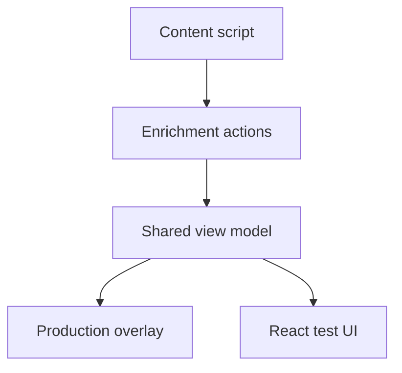

# Hover overlay architecture

Vera5 has two hover UIs that share enrichment and scoring logic but serve different runtimes.

**Production overlay vs test UI**

Enrichment actions on the page feed the shared view model; production overlay and React test UI consume the same normalized data and scoring presentation rules.

## Production overlay (content script)

**Module:** `extension/src/content/hoverCardOverlay.ts`

- Rendered in the page as DOM built by the content script (not React on live tabs).
- Opened when the analyst clicks a highlight after scan.
- Shows type, value, enrichment rows, Live/Cached/Error badges, raw JSON panel, copy, pivots, composite risk score, and reasoning chain when data allows.

This is the **primary operator surface** documented in [README.md](../../README.md) and [docs/analyst-workflows.md](../analyst-workflows.md).

## React hover card (tests and dev)

**Modules:** `extension/src/components/HoverCard.tsx`, `RiskScore.tsx`, `RiskScoreReasoningChain.tsx`

- Used by Vitest and optional Vite dev shell (`npm run dev`).
- **Not** injected into arbitrary web pages in production builds.
- May render **per-source contribution chips** that the overlay omits; scoring rules still come from `extension/src/lib/scoring.ts`.

## Shared view-model

**Module:** `extension/src/lib/hoverCardEnrichment.ts`

Centralizes:

- Normalized per-source summaries and badges
- Risk score presentation (`resolveHoverCardRiskScorePresentation`)
- Reasoning chain construction (`buildHoverCardRiskReasoningChain`)

Both overlay and React paths should call these helpers to avoid drift. Regression tests:

- `hoverCardOverlay.test.ts`
- `hoverCardEnrichment.test.ts`
- `RiskScore.test.tsx`

## Enrich trigger on page

- **›** on a highlight requests enrichment (respects manual-only mode).
- Debounced auto-fetch when manual-only is off: `extension/src/content/enrichmentAutoFetch.ts`.
- Messages to background: `extension/src/content/enrichmentMessageClient.ts` → `enrichmentHandler.ts`.

## Drift checklist for PRs

When changing card layout or score copy, update **both**:

1. `hoverCardOverlay.ts` (production)
2. Shared lib + React tests (or explicitly document intentional overlay-only differences)

Document intentional differences in the PR (for example chips only in React tests).
