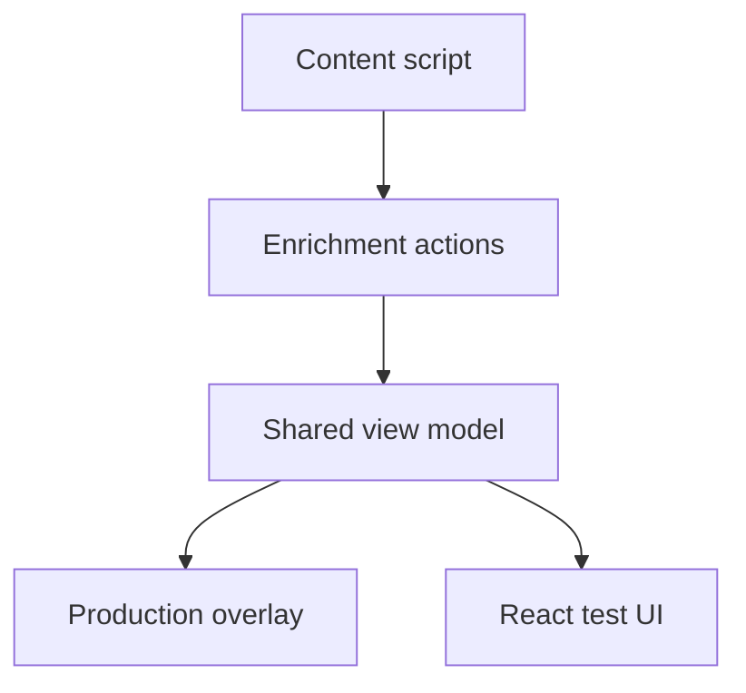

# Hover overlay architecture

Vera5 has two hover UIs that share enrichment and scoring logic but serve different runtimes.

**Production overlay vs test UI**

Enrichment actions on the page feed the shared view model; production overlay and React test UI consume the same normalized data and scoring presentation rules.

## Production overlay (content script)

**Module:** `extension/src/content/hoverCardOverlay.ts`

- Rendered in the page as DOM built by the content script (not React on live tabs).
- Opened when the analyst clicks a highlight after scan, or when a highlight has focus and the analyst presses **Enter** or **Space**.
- Keyboard opens move focus to the first card control (typically **Copy Indicator**); **Escape** closes the card and restores focus to the opening highlight when the card was opened from the keyboard.
- With a highlight focused, **ArrowDown** / **ArrowUp** move to the next or previous highlight in document order (wraps at the ends). With the page focused after scan, **ArrowDown** focuses the first highlight and **ArrowUp** focuses the last. Triage navigation closes an open hover card without opening the next indicator.
- Shows type, value, enrichment rows, Live/Cached/Error badges, raw JSON panel, copy, recommended next pivots with source-attributed links, composite risk score, reasoning chain when data allows, and a local **Analyst notes** textarea keyed per indicator (`extension/src/lib/analystNotesSession.ts` with persistence in `extension/src/lib/analystNotesStorage.ts`).
- Carries optional detection provenance on the overlay payload and panel root (`ruleId`, `sourceTextHint` as `data-vera5-rule-id` / `data-vera5-source-text-hint`), populated from highlight datasets when the card opens from a scanned match.
- Renders a **Why detected?** section when provenance is present: indicator type, rule reason (`formatDetectionRuleReason`), source text hint, and any overlapping matches dropped during dedupe (`ignoredOverlaps`). Built via `buildWhyDetectedView()` / `createWhyDetectedSection()` in the overlay panel.
- When `displayValue` differs from the refanged `value`, shows **On page** and **Refanged** indicator rows via `resolveIndicatorValuePresentation()`.
- Separate **Copy defanged** and **Copy refanged** header actions when those values differ (`resolveIndicatorCopyActions()`); otherwise a single **Copy Indicator** button copies the refanged value.
- URL indicators include an **Open live URL** action that requires analyst confirmation before opening the refanged URL in a new tab (`confirmOpenLiveUrl()` / `openLiveUrlInNewTab()`).
- When pre-query notices are enabled, live enrichment shows an inline **Before querying vendors** section on the card (`preQueryDisclosure` on the overlay payload). Copy names the enabled vendors and indicator value; **Send query** / **Cancel** gate the debounced fetch in `extension/src/content/enrichmentBackgroundFetch.ts`; **Don't show this notice again** writes `showPreQueryNotices` via `setShowPreQueryNoticesForContent()`.
- When `domainPolicyEnrichGateEnabled` is on, the same hostname allow/deny policy used for auto-scan blocks live enrichment before pre-query disclosure or service-worker fetch; the card shows a domain-policy error instead of calling vendors.
- When **Enable local AI summary** is on in Options, ready enrichment cards show a separate panel labeled **AI summary (local, unverified)** below the intel summary block (risk score and **How this score was computed** stay in **Intel Summary**). **Generate summary** posts normalized export JSON through `resolveLocalLlmSummaryRequest()` in `extension/src/lib/aiSummaryService.ts`: when **Use local backend** is on, the content script tries `http://127.0.0.1:<port>/summarize` first and falls back to the direct OpenAI-compatible endpoint on `127.0.0.1` when the backend is unreachable. Both paths render the same heading, panel disclaimer copy, loading and error states, and success markdown body. The global toggle defaults off (`localLlmSummaryEnabled` in `storage.ts`); content scripts cache it through `localLlmSummaryStorage.ts` and the backend bridge flag through `localBackendStorage.ts`.

This is the **primary operator surface** documented in [README.md](../../README.md) and [docs/analyst-workflows.md](../analyst-workflows.md).

## React hover card (tests and dev)

**Modules:** `extension/src/components/HoverCard.tsx`, `RiskScore.tsx`, `RiskScoreReasoningChain.tsx`

- Used by Vitest and optional Vite dev shell (`npm run dev`).
- **Not** injected into arbitrary web pages in production builds.
- May render **per-source contribution chips** that the overlay omits; scoring rules still come from `extension/src/lib/scoring.ts`.
- Mirrors the overlay **Analyst notes** textarea for tests and dev.
- Accepts optional `ruleId`, `sourceTextHint`, `ignoredOverlaps`, and `displayValue` props and exposes provenance on the panel root for test consumers.
- Mirrors the overlay **Why detected?** section and refanged value pair when provenance and `displayValue` are present.
- Mirrors defanged/refanged copy actions and the URL **Open live URL** confirmation flow via the shared helpers in `hoverCardEnrichment.ts`.

## Tray provenance

Popup and workspace sidebar tray rows expose snapshot entry provenance via `resolveTrayEntryMatchProvenance()` in `extension/src/lib/tabScanSummary.ts` and `data-vera5-rule-id` / `data-vera5-source-text-hint` on each tray row element.

Each tray row includes a collapsible **Why detected?** details panel (popup React UI and workspace DOM) using the same `buildWhyDetectedView()` view model as the hover card.

## Shared view-model

**Module:** `extension/src/lib/hoverCardEnrichment.ts`

Centralizes:

- Normalized per-source summaries and badges
- Risk score presentation (`resolveHoverCardRiskScorePresentation`)
- Reasoning chain construction (`buildHoverCardRiskReasoningChain`)

Pivot recipe suggestions (`extension/src/lib/pivots.ts` → `getPivotRecipes`) supply static, type-specific recommended pivots with vendor attribution in the production overlay panel. Guidance copy lives in `PIVOT_RECIPE_RULES` and describes analyst workflow steps only; it never reflects live enrichment scores, vendor ratios, cache state, or other API-derived facts.

Filtered tray subset export in the overlay **Export** / **Copy** menus and the template row call `buildTraySubsetEnrichmentRecords()` and route Markdown through `renderTraySubsetExportTemplate()` / `downloadTrayTemplateExportFile()` in `extension/src/lib/exportTemplates.ts`. JSON subset export still uses the Week 9 JSON builders in `enrichmentExport.ts`.

Both overlay and React paths should call these helpers to avoid drift. Regression tests:

- `hoverCardOverlay.test.ts`
- `hoverCardEnrichment.test.ts`
- `RiskScore.test.tsx`

## Enrich trigger on page

- **›** on a highlight requests enrichment (respects manual-only mode).
- Debounced auto-fetch when manual-only is off: `extension/src/content/enrichmentAutoFetch.ts`.
- Messages to background: `extension/src/content/enrichmentMessageClient.ts` → `enrichmentHandler.ts`.

## Drift checklist for PRs

When changing card layout or score copy, update **both**:

1. `hoverCardOverlay.ts` (production)
2. Shared lib + React tests (or explicitly document intentional overlay-only differences)

Document intentional differences in the PR (for example chips only in React tests).
