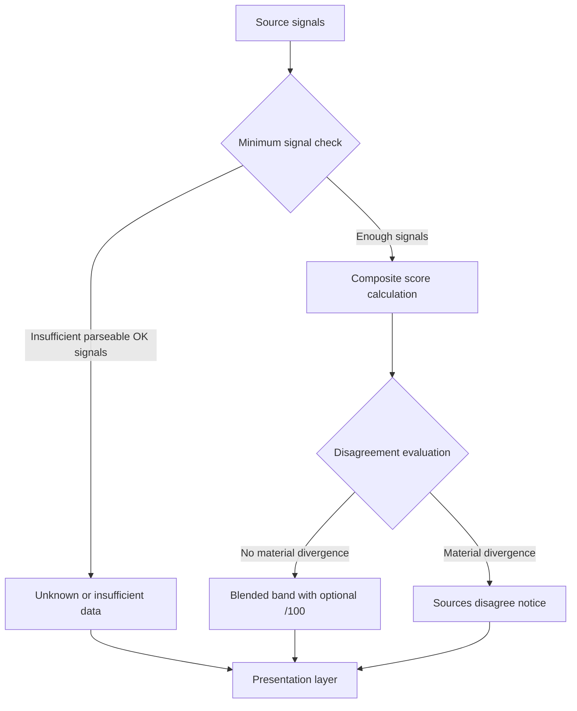

# Scoring system

Composite risk labels are computed **locally** in `extension/src/lib/scoring.ts`. Vera5 does not call an LLM or Vera5-operated scoring service.

## Bands and composite

- Bands: **Unknown**, **Low**, **Suspicious**, **High**, **Critical** (with optional **/100** when blending succeeds).
- `MIN_REQUIRED_SCORING_SIGNALS = 2` parseable OK source signals required for a blended numeric composite.
- Default weights: AbuseIPDB `1.0`, OTX `0.85` (`DEFAULT_SOURCE_SCORE_WEIGHTS`).

Signal parsing maps normalized vendor summary strings to numeric strength (`unifiedSummaryToSignalStrength`, `signalStrengthToBand`).

**Composite score decision**

## Disagreement

`computeCompositeRiskScore` sets `disagreement` when:

- Numeric spread between sources is **≥ 35**, or
- Mapped band ordinals differ by **≥ 2** steps

UI copy: `COMPOSITE_SCORE_DISAGREEMENT_NOTICE` via `hoverCardEnrichment.ts` and overlay/React presenters.

## Presentation layers

| Layer | Role |
|-------|------|
| `scoring.ts` | Core math and band rules |
| `hoverCardEnrichment.ts` | View-model: when to show score, reasoning chain, empty states |
| `hoverCardOverlay.ts` | Production DOM |
| `RiskScore.tsx`, `RiskScoreReasoningChain.tsx` | React test/dev UI |

Overlay and React share reasoning builders; overlay does not show per-source contribution chips (tests may).

## Tests

- `scoring.test.ts`
- `scoring.bands.golden.test.ts`
- `scoring.vendorFixtures.golden.test.ts`
- Overlay score sections: `hoverCardOverlay.test.ts`

When changing thresholds or weights, update golden fixtures and [docs/analyst-workflows.md](../analyst-workflows.md) interpretation tables if analyst-visible behavior changes.

## User documentation

Operators read score/disagreement guidance in [docs/analyst-workflows.md](../analyst-workflows.md), not in this file.
