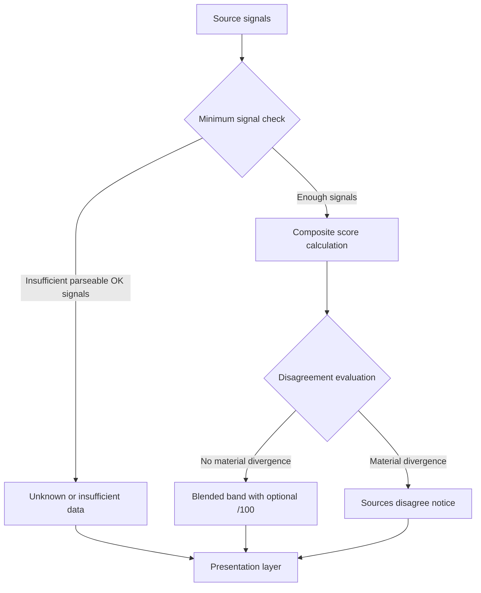

# Scoring system

Composite risk labels are computed **locally** in `extension/src/lib/scoring.ts`. Vera5 does not call an LLM or Vera5-operated scoring service.

## Bands and composite

- Bands: **Unknown**, **Low**, **Suspicious**, **High**, **Critical** (with optional **/100** when blending succeeds).
- `MIN_REQUIRED_SCORING_SIGNALS = 2` parseable OK source signals required for a blended numeric composite.
- Default weights: AbuseIPDB `1.0`, OTX `0.85` (`DEFAULT_SOURCE_SCORE_WEIGHTS`).

Signal parsing maps normalized vendor summary strings to numeric strength (`unifiedSummaryToSignalStrength`, `signalStrengthToBand`).

**Composite score decision**

## Indicator types without live enrichment signals

Extended indicator types—**email address**, **ASN**, **IPv4 CIDR**, **file path**, and **Tor v3 onion domain**—are detected and pivotable but have **no live connector** in the current release. When enrichment runs, enabled live sources return `status: skipped` with `unsupported_type` (or an equivalent skip path), not an OK summary with parseable vendor text.

**What counts as a scoring signal**

| Source row | Contributes a weighted signal? |
|------------|--------------------------------|
| `status: ok` and a summary matched by `unifiedSummaryToSignalStrength` | Yes |
| `status: skipped` (unsupported type, missing key, disabled for type, etc.) | No |
| `status: error` | No |

After enrichment on an extended-type indicator, `numericSignals.length === 0`, `compositeSignal === null`, and the band is **Unknown**. Vera5 does **not** infer severity from indicator type, pivot availability, or skipped-row copy.

**Presentation outcomes** (`resolveHoverCardRiskScorePresentation` in `scoring.ts`)

| Situation | Overlay / export |
|-----------|------------------|
| Enrichment not run yet (`sourceResults.length === 0`) | **Risk score section omitted** (`null` presentation) |
| Every enrichment source disabled in settings | **Risk score unavailable** (`score.mode: unavailable`) |
| Enrichment ran; zero parseable OK signals (typical for extended types) | **Unknown risk** + insufficient-data notice; empty reasoning chain (`score.mode: insufficient` in JSON export) |
| Two or more parseable OK signals | Blended band with optional `/100` and disagreement rules (not achievable for extended types today) |

**Export alignment:** `enrichmentExport.ts` treats `insufficient` like other scored modes for markdown sections (`Risk score: Unknown risk` plus `insufficientDetail`) rather than the explicit no-score block used for `unavailable` or absent enrichment. See [export-artifacts.md](../export-artifacts.md).

**Invariant:** No fabricated composite band when enrichment data is absent by design. Operators rely on per-source skipped rows, pivots, and vendor pages—not a local numeric blend.

## Disagreement

`computeCompositeRiskScore` sets `disagreement` when:

- Numeric spread between sources is **≥ 35**, or
- Mapped band ordinals differ by **≥ 2** steps

UI copy: `COMPOSITE_SCORE_DISAGREEMENT_NOTICE` via `hoverCardEnrichment.ts` and overlay/React presenters.

## Presentation layers

| Layer | Role |
|-------|------|
| `scoring.ts` | Core math and band rules |
| `hoverCardEnrichment.ts` | View-model: when to show score, reasoning chain, empty states |
| `hoverCardOverlay.ts` | Production DOM |
| `enrichmentExport.ts` | Markdown export: score label, reasoning chain, disagreement callout, explicit no-score when unavailable |
| `RiskScore.tsx`, `RiskScoreReasoningChain.tsx` | React test/dev UI |

Field contract and `schemaVersion`: [docs/export-artifacts.md](../export-artifacts.md).

Overlay and React share reasoning builders; overlay does not show per-source contribution chips (tests may).

## Tests

- `scoring.test.ts`
- `scoring.bands.golden.test.ts`
- `scoring.vendorFixtures.golden.test.ts`
- Overlay score sections: `hoverCardOverlay.test.ts`
- Export score sections: `enrichmentExport.test.ts`

When changing thresholds or weights, update golden fixtures and [docs/analyst-workflows.md](../analyst-workflows.md) interpretation tables if analyst-visible behavior changes.

## User documentation

Operators read score/disagreement guidance in [docs/analyst-workflows.md](../analyst-workflows.md), not in this file.
