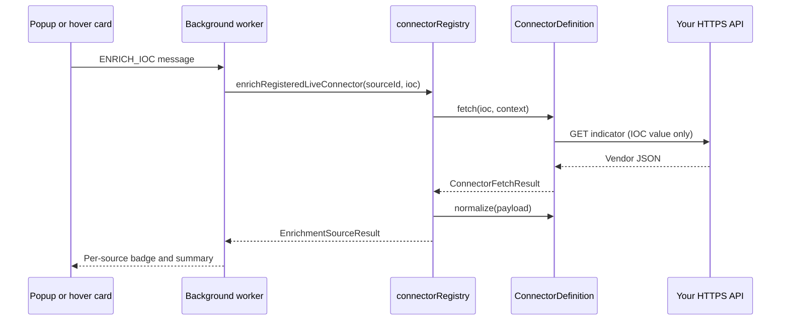

# Local connector stub (registry pattern)

This page shows how to add a **local-only** enrichment connector to a Vera5 fork or private build using the connector registry SDK. It is a reference stub—not a loadable connector in the public release.

Vera5 does not support hosted connector marketplaces or loading connector code from remote URLs. Connectors ship inside the extension bundle and register at startup through `connectorRegistry.ts`.

## Design constraints

| Rule | Why |
|------|-----|
| **Bring your own API key** | Credentials stay in extension storage on the analyst machine; Vera5 does not relay indicators through maintainer infrastructure. |
| **IOC-only requests** | `fetch()` must send only the sanitized indicator value required by the vendor endpoint—never full page HTML or browsing history. |
| **Declared API hosts** | Outbound HTTPS calls must target a host listed in `DECLARED_ENRICHMENT_API_HOSTS` (`extension/src/lib/iocRequestBoundaries.ts`). |
| **Registry dispatch** | Live enrichment routes through `enrichRegisteredLiveConnector()` in the background worker—do not call vendor clients directly from UI or content scripts. |

## Stub module

Save this pattern as `extension/src/lib/exampleLocalConnector.ts` in your fork. Replace `example_local` with your registry id after registering it in `enrichmentSourceRegistry.ts`.

```typescript
import {
  CONNECTOR_HEALTH_STATUS,
  ENRICHMENT_ERROR_CODE,
  formatMissingKeyErrorMessage,
  type ConnectorHealthCheckResult,
  type EnrichmentIoc,
} from "./enrichment";
import {
  CONNECTOR_AUTHORITY_TIER,
  type ConnectorCapabilityFlags,
  type ConnectorDefinition,
  type ConnectorFetchContext,
  type ConnectorFetchResult,
  type ConnectorRateLimitPolicy,
} from "./connectorDefinition";
import { ENRICHMENT_SOURCE_LABELS } from "./hoverCardEnrichment";
import { IOC_TYPE } from "./iocRegex";
import { sanitizeEnrichmentIoc, enrichmentFetch } from "./iocRequestBoundaries";
import { getApiKey } from "./storage";

export const EXAMPLE_LOCAL_SOURCE_ID = "example_local" as const;

export const EXAMPLE_LOCAL_API_BASE =
  "https://intel.example.local/api/v1/indicators";

export const DEFAULT_EXAMPLE_LOCAL_REQUEST_TIMEOUT_MS = 15_000;

export const EXAMPLE_LOCAL_SUPPORTED_IOC_TYPES = [IOC_TYPE.IPV4] as const;

export const DEFAULT_EXAMPLE_LOCAL_RATE_LIMIT_POLICY: ConnectorRateLimitPolicy =
  {
    requestTimeoutMs: DEFAULT_EXAMPLE_LOCAL_REQUEST_TIMEOUT_MS,
    quotaSummary:
      "Confirm request limits with your internal threat-intel service owner.",
    rateLimitHeaderHints: ["Retry-After"],
  };

export const DEFAULT_EXAMPLE_LOCAL_CAPABILITY_FLAGS: ConnectorCapabilityFlags = {
  liveEnrichment: true,
  pivotOnly: false,
  requiresApiKey: true,
  supportsHealthCheck: true,
  authorityTier: CONNECTOR_AUTHORITY_TIER.UNKNOWN,
};

function buildExampleLocalUrl(ipAddress: string): string {
  const url = new URL(`${EXAMPLE_LOCAL_API_BASE}/ipv4`);
  url.searchParams.set("ip", ipAddress.trim());
  return url.toString();
}

async function fetchExampleLocalPayload(
  ioc: EnrichmentIoc,
  context: ConnectorFetchContext = {}
): Promise<ConnectorFetchResult> {
  const resolveApiKey =
    context.getApiKey ?? (() => getApiKey(EXAMPLE_LOCAL_SOURCE_ID));
  const fetchImpl = context.fetch ?? enrichmentFetch;
  const timeoutMs =
    context.timeoutMs ?? DEFAULT_EXAMPLE_LOCAL_REQUEST_TIMEOUT_MS;
  const fetchedAt = new Date().toISOString();
  const sourceLabel = ENRICHMENT_SOURCE_LABELS[EXAMPLE_LOCAL_SOURCE_ID];

  const sanitized = sanitizeEnrichmentIoc({ value: ioc.value, type: ioc.type });
  if (!sanitized || sanitized.type !== IOC_TYPE.IPV4) {
    return {
      ok: false,
      errorCode: ENRICHMENT_ERROR_CODE.UNSUPPORTED_TYPE,
      errorMessage: `${sourceLabel} supports IPv4 addresses only.`,
      fetchedAt,
    };
  }

  const apiKey = (await resolveApiKey()).trim();
  if (!apiKey) {
    return {
      ok: false,
      errorCode: ENRICHMENT_ERROR_CODE.MISSING_KEY,
      errorMessage: formatMissingKeyErrorMessage(sourceLabel),
      fetchedAt,
    };
  }

  const controller = new AbortController();
  const timeoutId = setTimeout(() => controller.abort(), timeoutMs);
  try {
    const response = await fetchImpl(buildExampleLocalUrl(sanitized.value), {
      method: "GET",
      headers: {
        Accept: "application/json",
        Authorization: `Bearer ${apiKey}`,
      },
      signal: controller.signal,
    });

    if (!response.ok) {
      return {
        ok: false,
        errorCode: ENRICHMENT_ERROR_CODE.VENDOR,
        errorMessage: `${sourceLabel} returned HTTP ${response.status}.`,
        fetchedAt,
      };
    }

    const payload: unknown = await response.json();
    return { ok: true, payload, fetchedAt };
  } catch {
    return {
      ok: false,
      errorCode: ENRICHMENT_ERROR_CODE.NETWORK,
      errorMessage: `${sourceLabel} request failed.`,
      fetchedAt,
    };
  } finally {
    clearTimeout(timeoutId);
  }
}

export function normalizeExampleLocalResponse(
  payload: unknown
): { summary: string; tags?: readonly string[] } | null {
  if (
    typeof payload !== "object" ||
    payload === null ||
    typeof (payload as { score?: unknown }).score !== "number"
  ) {
    return null;
  }
  const score = (payload as { score: number }).score;
  return {
    summary: `Internal feed score ${score}`,
    tags: ["example-local"],
  };
}

export function createExampleLocalConnectorDefinition(input?: {
  rateLimitPolicy?: ConnectorRateLimitPolicy;
  capabilities?: ConnectorCapabilityFlags;
}): ConnectorDefinition {
  return {
    id: EXAMPLE_LOCAL_SOURCE_ID,
    supportedIocTypes: EXAMPLE_LOCAL_SUPPORTED_IOC_TYPES,
    rateLimitPolicy:
      input?.rateLimitPolicy ?? DEFAULT_EXAMPLE_LOCAL_RATE_LIMIT_POLICY,
    capabilities: input?.capabilities ?? DEFAULT_EXAMPLE_LOCAL_CAPABILITY_FLAGS,
    fetch(ioc, context) {
      return fetchExampleLocalPayload(ioc, context);
    },
    normalize(payload) {
      return normalizeExampleLocalResponse(payload);
    },
    async healthCheck(context) {
      const apiKey = (await (context?.getApiKey ?? (() => getApiKey(EXAMPLE_LOCAL_SOURCE_ID)))()).trim();
      if (!apiKey) {
        return {
          status: CONNECTOR_HEALTH_STATUS.ERROR,
          message: "Example local API key is not configured.",
        };
      }
      return { status: CONNECTOR_HEALTH_STATUS.OK };
    },
  };
}
```

## Register the connector

1. **Source registry** — Add `example_local` to `ENRICHMENT_SOURCE`, `ENRICHMENT_SOURCE_ORDER`, and `ENRICHMENT_SOURCE_DEFINITIONS` in `extension/src/lib/enrichmentSourceRegistry.ts` (display name, supported types, cache namespace, pivot URL builder if needed).

2. **Registry builder** — Import `createExampleLocalConnectorDefinition` in `extension/src/lib/connectorRegistry.ts` and add an entry to `CONNECTOR_DEFINITION_BUILDERS`:

```typescript
[ENRICHMENT_SOURCE.EXAMPLE_LOCAL]: () =>
  createExampleLocalConnectorDefinition({
    rateLimitPolicy: buildRateLimitPolicyForSource(ENRICHMENT_SOURCE.EXAMPLE_LOCAL),
    capabilities: buildCapabilityFlagsForSource(ENRICHMENT_SOURCE.EXAMPLE_LOCAL),
  }),
```

3. **Outbound allowlist** — Add `intel.example.local` (your real hostname) to `DECLARED_ENRICHMENT_API_HOSTS` and mirror it in the extension manifest host permissions if you ship a custom build.

4. **Settings and UI** — Add a masked API key field in Options, default-off enable toggle, and cache TTL handling consistent with other live sources (`storage.ts`, `connectorProfileExport.ts`).

5. **Tests** — Unit-test `fetch`, `normalize`, and registry registration; mock `fetch` and `getApiKey` the same way as `abuseipdbConnector.test.ts`.

Live enrichment is already dispatched through the registry in `extension/src/background/enrichmentHandler.ts` via `enrichRegisteredLiveConnector()`. No handler changes are required once the connector is registered.

## Runtime flow



## Reference implementations

| Connector | Pattern | Module |
|-----------|---------|--------|
| AbuseIPDB | Native `fetch` + `normalize` | `extension/src/lib/abuseipdbConnector.ts` |
| OTX | Native `fetch` + `normalize` | `extension/src/lib/otxConnector.ts` |
| URLScan.io | Legacy enrich adapter wrapped in `createLegacyConnectorDefinition` | `extension/src/lib/urlscanConnector.ts` |

For maintainer module layout and parallel fetch behavior, see [contributors/enrichment-connectors.md](contributors/enrichment-connectors.md).

## Related docs

- [architecture.md](architecture.md) — BYOK posture, IOC-only enrichment, storage migrations
- [api-integrations.md](api-integrations.md) — vendor quotas and rate-limit UX
- [security-model.md](security-model.md) — outbound host policy and credential storage
