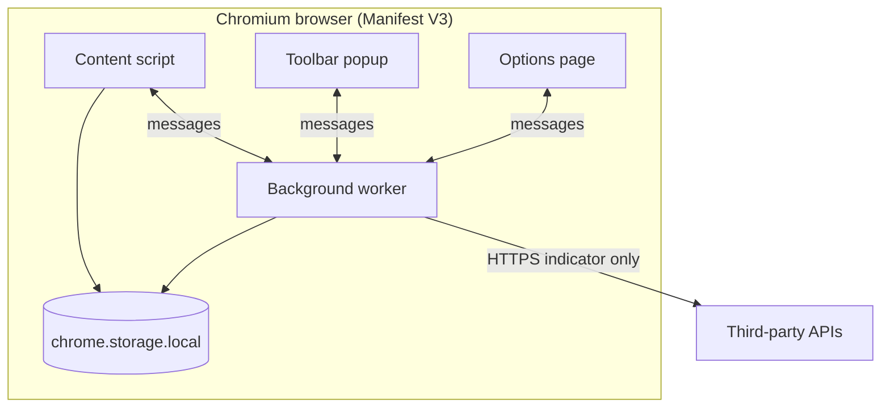
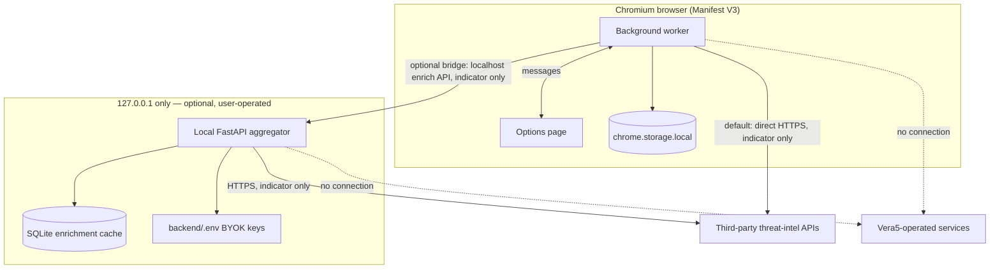

# Local mode (extension-only MVP)

Vera5’s initial release runs entirely in your browser. **Local mode** means indicator detection, settings, API keys, enrichment cache, and (when enabled) live vendor requests all execute inside the Manifest V3 extension—without a Vera5-operated backend, without cloud sync of your credentials, and without maintainer-hosted enrichment proxies.

This document describes how local mode works, what the extension includes by default, and how to optionally add a user-operated localhost enrichment backend.

## What local mode is

| Aspect | Local mode behavior |
|--------|---------------------|
| **Runtime** | Chromium extension (`extension/dist/`) loaded unpacked or from a store build. |
| **Storage** | `chrome.storage.local` on your browser profile. |
| **Enrichment path** | HTTPS requests from the extension background worker **directly** to threat-intelligence APIs you configure, using **your** API keys. |
| **Page processing** | Content scripts scan visible page text locally; only indicator values you enrich or pivot to may leave the browser. |
| **Vera5 infrastructure** | Not required. There is no default Vera5 cloud service for enrichment, settings, or telemetry. |

Local mode is the **default and only required** deployment for the MVP. You do not install a separate Vera5 server to use the extension.

## What runs where



Nothing in this diagram sends page HTML or browsing history to Vera5-maintained servers.

## Optional localhost backend (127.0.0.1 only)

Vera5 may optionally run a **user-operated** FastAPI enrichment aggregator on your machine. Traffic stays on **localhost** (`127.0.0.1`); the extension does not send indicators to Vera5-operated infrastructure. When the backend is running and the extension bridge is enabled, enrichment requests go to the local service; otherwise the background worker continues calling vendors directly as in the diagram above.



| Boundary | Behavior |
|----------|----------|
| **Listen address** | Backend binds to `127.0.0.1` only—not exposed on your LAN by default. |
| **Default path** | Extension-only direct vendor calls; no local server required. |
| **Optional path** | Extension → localhost aggregator → vendors; keys may live in `backend/.env` on your machine. |
| **Vera5 infrastructure** | Neither path contacts Vera5-operated enrichment, telemetry, or credential relay services. |
| **Data sent** | Indicator values you choose to enrich—not full pages or browsing history. |

Scaffold defaults: local health and version routes on port **8765**; SQLite cache path configurable via `VERA5_SQLITE_PATH` in `backend/.env.example`. The extension **Use local backend** toggle (off by default) connects these paths when enabled.

### Install the optional backend

**Prerequisites**

- **Python 3.11+** with `pip` (3.10 may work; match your OS Python install).
- The Vera5 extension **built and loaded** in Chromium (`extension/dist/` unpacked). See [Getting started in local mode](#getting-started-in-local-mode).
- **Bring-your-own API keys** for vendors you enable on the backend (AbuseIPDB is the first live backend connector).

**1. Install Python dependencies**

From the repository root:

```bash
cd backend
pip install fastapi uvicorn
```

**2. Create and edit `backend/.env`**

Copy the template (do not commit the populated file):

| Platform | Command |
|----------|---------|
| macOS / Linux | `cp .env.example .env` |
| Windows (PowerShell) | `Copy-Item .env.example .env` |

Edit `backend/.env` on your machine. Minimum useful fields:

| Variable | Purpose |
|----------|---------|
| `VERA5_ABUSEIPDB_API_KEY` | Your AbuseIPDB key when that source is enabled (live IPv4 enrichment on the backend today). |
| `VERA5_CORS_ORIGINS` | Comma-separated allowed extension origins, e.g. `chrome-extension://YOUR_EXTENSION_ID`. Find the ID on `chrome://extensions` (Developer mode). |
| `VERA5_SQLITE_PATH` | Optional SQLite cache file path (default `./data/vera5-enrichment.sqlite3` under `backend/`). |

Other variables in `.env.example` (cache TTL, rate-limit cooldowns, optional debug logging) are documented in that file. **Never commit** `backend/.env`, real keys, or secret values to git.

The backend reads **`VERA5_*` environment variables** at process start. After editing `.env`, load those variables into the shell you use to start the server—for example:

```bash
# macOS / Linux (bash)—run from backend/
set -a
source .env
set +a
```

```powershell
# Windows PowerShell—run from backend/
Get-Content .env |
  Where-Object { $_ -and $_ -notmatch '^\s*#' -and $_ -match '=' } |
  ForEach-Object {
    $name, $value = $_ -split '=', 2
    Set-Item -Path "env:$name" -Value $value
  }
```

**3. Start the server**

From the `backend/` directory (with environment variables loaded):

```bash
python -m app.main
```

The process binds to **`127.0.0.1:8765`** (localhost only). Leave this terminal running while you use the extension bridge.

**4. Verify the server**

In another terminal:

```bash
curl http://127.0.0.1:8765/health
curl http://127.0.0.1:8765/version
```

Expect `{"status":"ok"}` and a JSON version payload. If the connection fails, confirm the server is running, nothing else owns port **8765**, and your firewall allows loopback traffic.

**5. Enable the extension toggle**

1. Open **Vera5 Settings** (extension options page).
2. Expand **Sources**.
3. Turn on **Use local backend** (default **off**).
4. Enable the enrichment sources you configured in `backend/.env` (for example AbuseIPDB for IPv4).
5. On a page with indicators, scan and enrich as usual—the background worker POSTs indicator data to `http://127.0.0.1:8765/enrich` instead of calling vendors directly from the extension.

When the toggle is **on** but the server is **down**, Vera5 falls back to in-extension connectors and shows an honest retry hint—it does not send data to Vera5-operated infrastructure.

**CORS note:** If enrichment requests fail with a browser CORS error, add your unpacked extension origin (`chrome-extension://…`) to `VERA5_CORS_ORIGINS` in `backend/.env`, reload the environment variables, and restart the server. Localhost test origins (`http://127.0.0.1`, `http://localhost`) are also permitted for development.

**Stop the server:** Press `Ctrl+C` in the server terminal.

Security summary for the optional backend: [SECURITY.md](../SECURITY.md#optional-local-enrichment-backend).

## Capabilities in local mode

### On-page detection and UI

- Scan visible text for MVP indicator types: IPv4, domain, URL, MD5, SHA1, SHA256, and CVE identifiers.
- Highlight matches on the page when highlighting is enabled.
- Open a hover card on click with copy and static pivot links to vendor sites.
- Control extension on/off, highlighting, and explicit **Scan page** from the popup or keyboard shortcut (`Ctrl+Shift+Y` / `Cmd+Shift+Y`).
- Optional auto-scan when the DOM changes (off by default).

### Settings and privacy controls (options page)

All preferences persist in local extension storage:

| Control | Purpose |
|---------|---------|
| API keys (masked after save) | Bring-your-own credentials for each supported vendor. |
| Per-source enable | Turn individual enrichment sources on or off. |
| Manual-only enrichment | When on (default), live fetch requires explicit user action. |
| Auto-scan | Rescan page on mutations when enabled. |
| Enrichment cache | Clear locally stored vendor responses. |
| Settings export / import | Backup preferences; API keys excluded from export unless you opt in. |

See [SECURITY.md](../SECURITY.md) for IOC leakage rules and a full list of retained data.

### Enrichment and pivots

| Mechanism | Local mode behavior |
|-----------|---------------------|
| **Static pivots** | Your browser opens a vendor URL containing the indicator. No Vera5 proxy. |
| **Live enrichment** | When connectors are enabled, the extension calls vendor APIs directly with your key and the indicator value only—not full page content. |

Supported live sources for the MVP (in product order): AbuseIPDB, OTX, URLScan.io, GreyNoise (community tier). At least AbuseIPDB and OTX must work end-to-end for a complete enrichment release; see [architecture.md](architecture.md).

## Bring-your-own keys / bring-your-own API

Local mode does not include shared maintainer API keys or a Vera5 enrichment relay.

1. Create keys in each vendor’s developer portal.
2. Enter them on the Vera5 options page.
3. Enable only the sources you trust.
4. Keys stay in `chrome.storage.local` until you remove them, clear extension data, or uninstall.

Export settings to JSON for backup; keys are omitted by default so you can share preference files safely.

## What local mode excludes

These are **out of scope** for the extension-only MVP unless a future product revision documents otherwise:

| Exclusion | Implication |
|-----------|-------------|
| **Required Vera5 backend** | No maintainer-hosted enrichment service. An optional user-run FastAPI on `127.0.0.1` is separate, localhost-only, and off by default. |
| **Cloud settings sync** | Settings and keys do not sync through Vera5 servers. |
| **Maintainer telemetry** | No default usage analytics or crash reporting to Vera5. |
| **Full-page upload** | Page HTML and tickets are not bulk-uploaded anywhere. |
| **LLM summaries** | No bundled local or cloud model narrative generation in the MVP. |

An **optional localhost backend** lets teams keep vendor API keys in a local `backend/.env` while the extension sends only indicator values to `127.0.0.1`. That path is additive: direct extension enrichment remains valid without it. See [Optional localhost backend (127.0.0.1 only)](#optional-localhost-backend-127001-only).

## Data boundaries summary

| Data | Stays on your machine | May reach third parties (your choice) |
|------|----------------------|--------------------------------------|
| Page text and DOM | Processed locally for detection | No bulk upload to Vera5 |
| API keys | Extension storage | Sent only to vendors you enable, over TLS |
| Settings and toggles | Extension storage | Only if you export a file yourself |
| Enrichment cache | Extension storage until cleared or TTL expires | Derived from vendor responses you requested |
| Indicator values | Shown in UI locally | Vendor APIs or pivot URLs when you enrich or click a link |

## Getting started in local mode

1. Build the extension: `cd extension && npm install && npm run build`.
2. Load **`extension/dist/`** unpacked in Chrome (`chrome://extensions`, Developer mode).
3. Open the options page to configure sources, keys, and privacy toggles when you are ready for live enrichment.
4. Visit a page with indicators, scan from the popup, and use highlights and the hover card.
5. **Optional:** run the [localhost enrichment backend](#install-the-optional-backend) and enable **Use local backend** in Settings when you want aggregation on `127.0.0.1`.

Detailed install steps: [README.md](../README.md).

## Operational notes for analysts

- **Sensitive indicators:** Use manual-only mode and disable sources you have not approved before working with classified or internal-only IOCs.
- **Quota and audit:** Vendor APIs apply their own rate limits and retention; monitor usage in each portal.
- **Profile binding:** Uninstalling the extension or clearing its site data removes local keys, cache, and settings.
- **Updates:** Review manifest permission changes in release notes before upgrading; see [security-model.md](security-model.md).

## Related documents

- [SECURITY.md](../SECURITY.md) — IOC leakage, third-party APIs, data retained, vulnerability reporting
- [security-model.md](security-model.md) — manifest permissions and host access rationale
- [architecture.md](architecture.md) — IOC types, connector order, release exclusions
