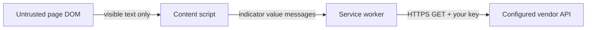

# Vera5 security model

This document explains why the Manifest V3 extension requests each permission in [`extension/public/manifest.json`](../extension/public/manifest.json). It complements [SECURITY.md](../SECURITY.md) (threat model and reporting) and [architecture.md](architecture.md) (module layout and data boundaries).

Vera5 is **local-first**: enrichment uses API keys you configure; indicator values are sent only to vendors you enable—not to Vera5-operated infrastructure.

## Current release scope

The shipped extension registers a Manifest V3 service worker, content scripts on HTTP/HTTPS pages, a toolbar popup, and an options page. On pages you open, Vera5 can scan visible text for IOCs, show on-page highlights, open a production hover overlay, and—when you configure API keys—fetch enrichment from AbuseIPDB and OTX directly from the background worker. Settings, API keys, and enrichment cache stay in local browser storage. There is no Vera5-operated enrichment backend and no default telemetry. Permission rationale below matches this behavior.

## Manifest permissions

| Permission | Required | Why Vera5 needs it |
|------------|----------|-------------------|
| `storage` | Yes | Persist analyst-controlled settings locally in the browser: extension on/off, API keys (masked at rest in UI), per-source toggles, enrichment cache entries, and related options. No Vera5 cloud sync; data stays in `chrome.storage.local` (or equivalent) on your profile. |
| `activeTab` | Yes | Operate on the tab you are viewing when you invoke the extension (toolbar action, keyboard shortcut, or future on-demand actions) without requesting blanket access to every tab’s URL up front. Supports analyst-driven, tab-scoped behavior aligned with “enrich what I’m looking at now.” |
| `scripting` | Yes | Inject or update page scripts when needed for IOC detection and UI (for example programmatic injection on demand, re-scan after navigation, or future manual-only modes). Content scripts are declared in the manifest; `scripting` covers dynamic injection paths the product may use without listing every site pattern twice. |

### What these permissions do not grant

- **`storage`** does not send data to Vera5 servers; it is local browser storage only.
- **`activeTab`** does not by itself read page content until you interact with the extension in that tab (combined with host access below for declared content scripts).
- **`scripting`** is not used to run remote code, `eval`, or maintainer-hosted scripts—all executable code ships inside the extension package reviewers install.

## Host permissions

| Pattern | Required | Why Vera5 needs it |
|---------|----------|-------------------|
| `http://*/*` | Yes | Analyst workflows include internal tools, blogs, ticketing mirrors, and lab pages served over HTTP. IOC text must be readable on those origins when you visit them. |
| `https://*/*` | Yes | Same for HTTPS sites (GitHub, vendor portals, search results, documentation). Broad match avoids maintaining an incomplete allowlist of analyst destinations. |

### How host access is used

- **Content scripts** (see manifest `content_scripts`) run at `document_idle` on matching pages, scan visible text for IOCs when you trigger a scan (or when auto-scan is enabled), and render the on-page hover overlay.
- **Page text** is processed in the browser for detection. Only **indicator values you choose to enrich** are sent in API requests to third parties you configure—not full page HTML to Vera5 infrastructure.
- **Skip rules:** ignore `script`, `style`, and `textarea` text by default; respect manual-only enrichment and per-source toggles in settings.

### Why broad host patterns

Analysts cannot predict every SOC, CTI, or DFIR site in advance. Narrow host lists would block legitimate workflows. The tradeoff is explicit: Vera5 may access pages you open on HTTP/HTTPS origins you visit; you control whether enrichment runs and which vendors receive IOC values.

## Surfaces declared in the manifest (not separate permission keys)

| Surface | Purpose |
|---------|---------|
| `background` service worker (`background.js`, ES module) | Message routing, enrichment fetch orchestration, cache, rate-limit cooldown, and connector calls. No DOM access. |
| `content_scripts` → `content.js` on `http://*/*`, `https://*/*` | IOC detection, highlights, production hover overlay, and enrich wiring. Runs only on origins covered by host permissions. |
| `action` popup (`popup.html`) | Extension on/off, highlight toggle, scan page, match count. |
| `options_page` (`options.html`) | Masked API keys, source toggles, manual-only mode, cache clear, settings export/import. |

Icons and HTML entrypoints do not add extra Chrome permission keys beyond those listed above.

## Data and trust boundaries

| Data | Stays local | May leave the browser (your choice) |
|------|-------------|-----------------------------------|
| API keys | Stored in extension storage (or optional self-hosted env you control) | Sent only to vendor APIs you enable, over TLS, as required by each connector |
| Extension enabled flag, UI settings | Yes | No |
| Detected IOC values | Processed locally for display | Sent as **indicator-only** requests to configured threat-intel APIs |
| Full page HTML, browsing history, tickets | Not uploaded to Vera5-operated services | Not sent to Vera5 by design |

For a visual summary of IOC and data boundaries, see the **IOC and data boundary** diagram in [SECURITY.md](../SECURITY.md#ioc-leakage).

**Bring-your-own keys / bring-your-own API:** You create keys in vendor portals; Vera5 does not operate a required enrichment proxy or shared maintainer keys.

**Telemetry:** No usage analytics or crash reporting to Vera5 by default.

## Domain policy and sensitive sites

Vera5 can gate **auto-scan** and **live enrichment** on the hostname of the page you are viewing. Policy is stored locally in extension settings (`domainPolicyMode`, `domainAllowlist`, `domainDenylist`). When the domain enrich gate is enabled (default), the same rules block vendor API calls before pre-query disclosure runs.

| Mode | Behavior |
|------|----------|
| Allow by default (current product default) | Auto-scan and enrichment run on all hosts **except** those on the denylist. |
| Deny by default (optional posture) | Auto-scan and enrichment run **only** on hosts in the allowlist. |

Lists are managed in **Vera5 Settings** under **Trust & consent**, or via settings export/import.

### Product default policy

Fresh installs and normalized settings use **allow by default** (`domainPolicyMode`: `allow_by_default`). The **denylist ships with sensitive webmail patterns by default** so common webmail hosts are blocked for auto-scan and live enrichment without manual setup. The allowlist starts empty. Upgrades from earlier profiles with an empty denylist receive the same webmail defaults during storage migration.

| Control | Default | What it means for sensitive sites |
|---------|---------|-----------------------------------|
| Domain policy mode | Allow by default | SOC and vendor sites stay open unless denylisted |
| Denylist | Sensitive webmail patterns | Blocks `mail.*`, `webmail.*`, and common provider webmail hosts (see below) |
| Allowlist | Empty | Not used until you switch to deny-by-default |
| Domain enrich gate | On | Denylisted hosts skip vendor calls before pre-query disclosure |
| Manual-only enrichment | On | Live fetch still requires an explicit enrich action on allowed hosts |
| Auto-scan | Off | DOM-driven rescans stay off until you enable auto-scan |
| Pre-query notices | On until first-run choice | Inline disclosure precedes vendor calls when enrichment is allowed |

**Deny by default** is an alternate mode you can set when your operating policy requires an allowlist-first model (for example only internal SOC exports and approved CTI consoles). Switching modes does not auto-fill the allowlist; you maintain list entries to match the mode you choose.

#### Default sensitive webmail denylist

Under the allow-by-default product posture, Vera5 **requires** default protection on common webmail origins. Fresh installs and qualifying upgrades include these denylist entries:

| Pattern | Covers |
|---------|--------|
| `mail.*` | Corporate and provider webmail subdomains |
| `webmail.*` | Alternate webmail prefixes |
| `outlook.office.com`, `outlook.live.com` | Microsoft webmail |
| `mail.google.com` | Gmail web |
| `mail.yahoo.com` | Yahoo Mail web |

Analysts can remove or extend denylist rows in **Trust & consent**. Banking, health, and HR patterns are **not** in the default denylist; use the **Sensitive sites denylist** preset or add entries manually.

#### Mapping sensitive-domain guidance to the default

The pattern tables below are written for the **shipped default**:

| Posture | Where to apply suggested patterns | Typical outcome |
|---------|-----------------------------------|-----------------|
| **Allow by default** (product default) | Add sensitive patterns to the **denylist** | SOC and vendor sites stay open; webmail, banking, health, and HR hosts you list are blocked for auto-scan and live enrich |
| **Deny by default** (optional) | Build an **allowlist** of approved investigation hosts first; avoid allowlisting sensitive categories unless policy requires it | Only listed origins scan or enrich; everything else is blocked |

Under allow by default, start with denylist entries such as `mail.*`, `webmail.*`, and exact hosts for banking, patient portals, and HR SaaS tenants your organization uses. Under deny by default, invert the workflow: allowlist SOC destinations explicitly, then audit whether any sensitive host truly belongs on the allowlist.

Other trust controls stack on top of domain policy: manual-only enrichment and pre-query disclosure remain the first lines of defense on allowed hosts; denylist entries add hostname-level blocks before disclosure or vendor calls.

## Internal asset lists

Separate from page-hostname domain policy, Vera5 supports **indicator-level** internal asset lists. When the internal asset enrich gate is enabled (default), live enrichment is blocked before pre-query disclosure when the **indicator value** matches a configured list—even on otherwise allowed SOC pages.

| List | Applies to | Example |
|------|------------|---------|
| Internal domains | Domain and URL indicators | `intranet.corp.example`, `*.internal` |
| Internal IPv4 CIDR ranges | IPv4 indicators | `10.0.0.0/8`, `192.168.0.0/16` |
| Vendor and SaaS labels | Domain and URL indicators (hostname match) | Label `Corporate VPN`, pattern `vpn.corp.example` |

Lists start empty. Hash and CVE indicators are not matched by these lists in the current release. Manage lists under **Trust & consent** in Vera5 Settings, or via settings export/import. Matching logic lives in `extension/src/lib/internalAssetPolicy.ts`; the content-script gate runs in `enrichmentBackgroundFetch.ts` via `internalAssetPolicyStorage.ts`.

### Shipped default-safe presets

Vera5 documents **allow by default** as the chosen product posture (not deny-by-default). To reduce accidental scan or enrich on sensitive origins without blocking SOC tooling by default, the extension ships one mergeable preset in **Trust & consent**:

| Preset | Recommended mode | What it adds |
|--------|------------------|--------------|
| **Sensitive sites denylist** | Allow by default | Merges banking (`*.bank`), patient-portal (`*.mychart.org`), and workforce SaaS patterns (`hr.*`, `people.*`, `*.workday.com`, `*.successfactors.com`, `*.ultipro.com`) into your **denylist** in addition to the default webmail entries |

Applying a preset **merges** entries; it does not remove custom allowlist or denylist rows. It sets domain policy mode to the preset’s recommended mode (allow by default for the shipped preset). See [analyst-workflows.md](analyst-workflows.md) for workflow context.

### Pattern syntax

Entries are normalized to lowercase. Supported forms match the domain policy matcher in the extension:

| Form | Example | Matches |
|------|---------|---------|
| Exact hostname | `mail.company.com` | That host only |
| Prefix wildcard | `mail.*` | `mail` and `mail.<label>` (for example `mail.google.com`, `mail.contoso.com`) |
| Suffix wildcard | `*.corp.example` | `corp.example` and `<label>.corp.example` |

Use prefix patterns for common webmail layouts (`mail.*`, `webmail.*`). Use suffix patterns for internal zones (`*.internal`, `*.corp.example`).

### Suggested sensitive-domain patterns

The tables below are **starting points** aligned with the **allow-by-default product default**: add them to your **denylist**, apply the **Sensitive sites denylist** preset in Options, or build an allowlist if you use deny-by-default (see [Product default policy](#product-default-policy)). Adjust for your organization’s DNS and SaaS tenants.

#### Webmail and personal email

Accidental enrichment on webmail can associate message-adjacent indicators (headers, URLs, addresses) with third-party threat-intel vendors.

| Suggested pattern | Notes |
|-------------------|-------|
| `mail.*` | Corporate and provider webmail hosts (`mail.contoso.com`, `mail.proton.me`) |
| `webmail.*` | Alternate webmail prefixes |
| `outlook.office.com`, `outlook.live.com` | Microsoft consumer and M365 webmail |
| `mail.google.com` | Gmail web |
| `mail.yahoo.com` | Yahoo Mail web |

#### Banking and financial services

Online banking and payment portals often sit on regulated domains where outbound indicator queries may be restricted or require explicit approval.

| Suggested pattern | Notes |
|-------------------|-------|
| Exact institution hosts | Prefer known login, wire, and treasury portals (for example `chase.com`, `wellsfargo.com`, or your regional equivalents) |
| `*.bank` | Matches hosts ending in `.bank` where your providers use that layout—verify against live DNS before relying on TLD-style rules |

Avoid overly broad prefix wildcards (for example `online.*`) on shared analyst machines; they can block legitimate SOC and vendor sites.

#### Health and patient portals

Patient charts, lab results, and telehealth sessions may contain PHI-adjacent indicators.

| Suggested pattern | Notes |
|-------------------|-------|
| Exact portal hosts | Insurer, hospital, and telehealth login domains your workforce uses |
| `*.mychart.org` | Common MyChart-style patient portal naming (validate against your providers) |
| Suffix patterns for health zones | Internal clinical or research zones (for example `*.clinical.corp.example`) when you operate split DNS |

Treat health-related origins like high-sensitivity workflow: under the product default, add them to the **denylist**; if you use deny-by-default, allowlist only approved SOC destinations and omit patient-portal hosts unless policy explicitly requires them.

#### Internal HR and workforce systems

HR portals, performance tools, and payroll sites expose employee identifiers, compensation context, and internal routing data.

| Suggested pattern | Notes |
|-------------------|-------|
| Exact internal hosts | `hr.company.com`, `people.company.internal`, VPN-only HR zones |
| `hr.*`, `people.*` | Common internal naming—tune to your corporate DNS |
| `*.workday.com`, `*.successfactors.com`, `*.ultipro.com` | Common SaaS HR platforms; prefer exact tenant subdomains when known |
| `*.internal`, `*.corp.example` | Broad intranet suffix patterns to block passive scan and enrich on internal browsing |

### Applying patterns safely

- **Pre-query disclosure** still applies when enrichment is allowed; domain policy is an additional gate, not a replacement for analyst consent.
- **Manual-only enrichment** (default on) reduces accidental live queries; combine with denylist entries on sensitive hosts.
- **Auto-scan** (default off) respects the same lists; enabling auto-scan on webmail increases passive indicator handling in page text even when vendor calls stay blocked.
- Review patterns after DNS or SaaS migrations; stale denylist entries are harmless, missing entries are not.

For workflow context, see [analyst-workflows.md](analyst-workflows.md) (manual-only enrichment and sensitive cases).

## Permission changes

Any new permission or host pattern requires an update to this document, [SECURITY.md](../SECURITY.md), the manifest, and the Chrome Web Store listing so analysts can review the change before upgrading.

## Executable code and content security policy

Extension pages are HTML documents loaded as `chrome-extension://…` origins (toolbar popup and options). They must not load remote scripts or weaken Chromium’s Manifest V3 CSP.

### Extension pages inventory

| Page | Manifest key | Built artifact | CSP |
|------|--------------|----------------|-----|
| Options | `options_page`: `options.html` | `extension/dist/options.html` | Default MV3 (`script-src 'self'`; no manifest override) |
| Toolbar popup | `action.default_popup`: `popup.html` | `extension/dist/popup.html` | Default MV3 (same as options) |

Both pages load only packaged `/assets/…` JavaScript and CSS. There are no inline `<script>` blocks, no CSP `<meta>` tags, and no `https://` script or stylesheet URLs in built HTML.

The Vite dev shell (`extension/index.html`) is for local development only and is not copied to `dist/` or referenced from the manifest.

### Manifest CSP

[`extension/public/manifest.json`](../extension/public/manifest.json) does **not** set `content_security_policy`. Chromium applies the default Manifest V3 extension-pages policy:

- `script-src 'self' 'wasm-unsafe-eval'`
- `object-src 'self'`

Vera5 does not add `unsafe-eval`, `unsafe-inline`, or remote `https://` entries to `script-src`.

### Remote origins matrix

| Origin / pattern | Mechanism | Purpose | Sends IOC to Vera5? |
|------------------|-----------|---------|---------------------|
| `https://api.abuseipdb.com/…` | `fetch()` GET (connector) | AbuseIPDB enrichment when enabled and keyed | No — BYOK to vendor |
| `https://otx.alienvault.com/…` | `fetch()` GET (connector) | OTX enrichment when enabled and keyed | No — BYOK to vendor |
| `https://…` pivot URLs | `chrome.tabs.create` / user navigation | Analyst opens vendor search pages from pivot actions | No live API call from extension |
| `https://www.vera5.io/` | `chrome.tabs.create` | Product website link from workspace sidebar | No enrichment |
| `chrome://settings/…` | `chrome.tabs.create` | Site-permissions helper | Internal browser UI |
| Page under scan (`http(s)://*/*`) | Content scripts (`host_permissions`) | DOM read for IOC detection only | No upload to Vera5 infrastructure |

Live `fetch()` calls exist only in [`abuseipdbConnector.ts`](../extension/src/lib/abuseipdbConnector.ts) and [`otxConnector.ts`](../extension/src/lib/otxConnector.ts). Connectors default to `enrichmentFetch` in [`iocRequestBoundaries.ts`](../extension/src/lib/iocRequestBoundaries.ts), which throws before any network I/O when the target host is not listed in `DECLARED_ENRICHMENT_API_HOSTS` or when the request uses a non-HTTPS URL or includes a body. Connectors use GET without a request body; indicator values are passed in the URL or query string per vendor API requirements.

There is no `importScripts()` or dynamic `import()` from network URLs in production bundles.

### Automated regression checks

| Check | Status |
|-------|--------|
| `eval()` / `new Function()` | Not used in `extension/src/` or production bundles under `extension/dist/`. |
| Remote scripts in extension pages | Popup and options HTML reference only relative `/assets/…` paths. |
| Manifest CSP override | No custom CSP with `unsafe-eval`, `unsafe-inline`, or remote `script-src`. |
| Live fetch allowlist | Only connector modules may call `fetch()`; declared HTTPS hosts are `api.abuseipdb.com` and `otx.alienvault.com`. Runtime `enrichmentFetch` blocks undeclared hosts before network I/O. |
| Remote code at runtime | No dynamic import or `importScripts()` from `https://` URLs in `dist/`. |

After each production build:

```bash
cd extension
npm run verify:security
```

(`postbuild` runs this together with `verify:dist`.)

## Production logging hygiene

Vera5 does not write API keys, bulk IOC lists, scan snapshots, or vendor raw JSON to the browser console in production builds.

| Surface | Policy |
|---------|--------|
| Content-script scan diagnostics | `devLog.ts` logs numeric scan metrics only when `import.meta.env.DEV` is true; production bundles omit `console.debug` output. |
| Unexpected runtime errors | `logUnlessBenignExtensionError` in `extensionContext.ts` logs a truncated `name: message` string only; raw error objects, storage payloads, and bulk indicator data are never passed to `console.error`. |
| Live connectors | No `console` usage; vendor responses stay in memory/cache unless the analyst opens raw JSON in the overlay. |
| Regression | `npm run verify:security` rejects new production `console` calls outside the allowlisted modules, blocks sensitive payload patterns in log statements, and fails if shipped bundles contain `console.debug` or raw-object `console.error`. |

## Test fixture hygiene

Automated tests use placeholder credentials from `extension/src/lib/fixtureSecrets.ts` (`test-fixture-*` prefix). Committed vendor JSON under `extension/src/lib/fixtures/` must not embed live API key values; sensitive vendor field names must use `[redacted]` or the shared test placeholders. `verify:security` rejects legacy inline secret strings in `*.test.ts` files.

## Malicious page DOM confusion

Hostile or misleading page content can try to confuse IOC triage: decoy indicators in visible text, overlapping tokens, fake overlay chrome, or values that look like indicators but are not exact matches. Vera5 treats the page DOM as untrusted input for **detection display** while keeping **credentials, enrichment fetch, and vendor calls** in extension-controlled contexts.

### Threat scenarios

| Scenario | Goal of the page | What Vera5 must prevent |
|----------|------------------|-------------------------|
| Decoy or bait IOCs | Trigger false positives or wasted enrichments | Surfacing only regex-valid, deduplicated spans with transparent match provenance |
| Hidden or metadata IOCs | Smuggle values via attributes or non-visible subtrees | Scanning visible text nodes only; skipping script, style, textarea, and metadata subtrees by default |
| Selection / clipboard confusion | Enrich a value the analyst did not intend | Re-validating selection text as an exact IOC match before enrich; opening cards from verified highlights or validated matches only |
| Fake extension UI | Mimic enrich buttons or disclosure prompts | Building overlay UI only from the content script; never executing page-supplied HTML as extension chrome |
| Forced outbound queries | Exfiltrate data via unexpected hosts | Routing live `fetch()` through the service worker with `enrichmentFetch` host allowlisting; analyst consent gates before vendor calls |
| Markup in indicator values | Break UI or smuggle HTML into outbound requests | Binding overlay text with `textContent`; rejecting values containing markup or newlines in `extractExactIocValue` |

### Detection surface controls

IOC detection walks **text nodes** under the scan root (`textWalker.ts`). Default production behavior:

- Skips `<script>`, `<style>`, `<textarea>`, and metadata subtrees (`head`, `meta`, `link`, `noscript`, `template`, `title`).
- Does **not** scan element attributes (`href`, `src`, `data-*`, event handlers, etc.); only visible text content is considered.
- Caps scans at **2,500 text nodes** per pass to limit work on pathological DOMs.
- Applies conservative regex rules, overlap deduplication, and documented suppressions (see [Known false positives and suppressions](architecture.md#known-false-positives-and-suppressions)).

The hover overlay shows **Why detected?** with rule id, source context, on-page vs refanged values, and ignored overlaps so analysts can reconcile page text with the matched span.

### Overlay and workspace UI

Production on-page UI (hover card, workspace sidebar, command palette) is assembled by the content script using `document.createElement` and **`textContent`** for analyst-visible strings and vendor-derived summaries. Vendor raw JSON is redacted and length-capped before display (`enrichmentRawResponse.ts`).

| Control | Purpose |
|---------|---------|
| Dedicated host elements (`vera5-hover-card-host`, `vera5-workspace-host`, `vera5-command-palette-host`) | Keeps extension UI in nodes the content script owns |
| High `z-index` and scoped `pointer-events` | Reduces accidental interaction with page layers beneath real extension panels |
| `stopPropagation` on overlay controls | Prevents page handlers from intercepting enrich, disclosure, or copy actions on Vera5 buttons |
| `confirmOpenLiveUrl` | Requires analyst confirmation before navigating to a refanged live URL from the overlay |

**Limitation:** A hostile page can still inject DOM that **looks** like Vera5. The real extension UI appears only after you invoke Vera5 (toolbar, workspace, keyboard shortcut, context menu, or highlight). Treat unexpected enrich prompts that did not follow your action as suspicious; legitimate live enrichment shows the pre-query disclosure naming **your** enabled vendors when notices are on.

### Enrichment and credential isolation

Page JavaScript cannot read `chrome.storage.local` or call vendor APIs with stored keys. Enrichment follows this boundary:



| Gate | Behavior |
|------|----------|
| Manual-only enrichment (default) | Auto-fetch on hover stays off until you disable manual-only mode |
| Domain policy | Blocks live enrich on denylisted hostnames before pre-query disclosure |
| Internal asset lists | Blocks outbound enrich when the indicator matches configured internal ranges |
| Pre-query disclosure | Inline notice names enabled vendors and the indicator before the first vendor fetch |
| `extractExactIocValue` / `sanitizeEnrichmentIoc` | Rejects multi-line, oversized, or markup-bearing values before messages reach the service worker |
| `enrichmentFetch` allowlist | Throws before network I/O when the target host is not a declared connector API |

Pivot recipe links are navigation-only (no live `fetch` from the page context). See [Remote origins matrix](#remote-origins-matrix) for declared hosts.

### Residual risk and analyst practice

- Decoy IOCs in **visible** page text may still match valid grammar; suppressions reduce noise but cannot eliminate judgment calls on ambiguous prose.
- Auto-scan (when enabled) re-reads DOM mutations on allowed hosts; use domain denylist and manual-only mode on sensitive origins.
- Validate enrichment intent on high-risk pages: confirm **Why detected?**, read the pre-query disclosure, and use **Trust & consent** presets for webmail and internal tools.

For operator checks on trust gates and disclosure, use the [Trust and query checklist](../SECURITY.md#trust-and-query-checklist). For regression fixtures that exercise decoy suppressions, see [soc-validation-fixtures.md](soc-validation-fixtures.md).

## Security hardening review checklist

Pen-test style review for the shipped extension: supply chain, executable surface, outbound network boundaries, logging, secrets hygiene, and trust gates. Use this checklist before release branches or major permission changes.

### Automated verification

Run from repository root unless noted. Re-run after dependency bumps, manifest permission changes, or connector additions.

| # | Control | Verification | Status |
|---|---------|--------------|--------|
| 1 | Production dependency audit | `cd extension && npm run audit:prod` (CI: **Extension quality** workflow, blocking) | **Verified** — 0 vulnerabilities |
| 2 | Extension build integrity | `cd extension && npm run build` → `verify:dist` + `verify:security` in postbuild | **Verified** |
| 3 | Unit and lint regression | `cd extension && npm run check` | **Verified** — 1018 tests (79 files) |
| 4 | Secret scan (Gitleaks) | `gitleaks detect --source . --config .github/gitleaks.toml`; CI: `.github/workflows/secret-scan.yml` on pull requests and `main` pushes | **Verified** — no leaks |
| 5 | `.env.example` credential placeholders | Root `.env.example`; `verify:security` rejects non-empty credential values | **Verified** |
| 6 | Extension-page CSP | Default MV3 CSP; no remote assets in popup/options HTML (`verify:security`) | **Verified** |
| 7 | Live fetch allowlist | `enrichmentFetch` + `DECLARED_ENRICHMENT_API_HOSTS`; only AbuseIPDB and OTX connector modules | **Verified** |
| 8 | Enrichment GET without body | Connector modules; `verify:security` | **Verified** |
| 9 | Production logging hygiene | No sensitive `console` in shipped bundles; redacted error strings only | **Verified** |
| 10 | Test fixture redaction | `fixtureSecrets.ts` placeholders; no legacy inline secret strings in tests | **Verified** |
| 11 | No `eval` / remote dynamic import | `verify:security` on `extension/src` and `extension/dist` | **Verified** |
| 12 | Manifest permissions match documentation | Compare [Manifest permissions](#manifest-permissions) and [Host permissions](#host-permissions) to [`extension/public/manifest.json`](../extension/public/manifest.json) | **Verified** |

### Operator confirmation (browser)

Automated checks do not replace unpacked Chrome validation. Confirm trust, consent, and hostname gates using the [Trust and query checklist](../SECURITY.md#trust-and-query-checklist) in [SECURITY.md](../SECURITY.md):

- Manual-only enrichment and **Trust & consent** settings match your workflow.
- Denylisted hosts block live enrich without vendor calls.
- Pre-query disclosure appears before the first vendor fetch on allowed hosts when notices are enabled.
- Only authorized live sources and API keys are enabled.

Serve `examples/` over HTTP and use SOC fixtures per [soc-validation-fixtures.md](soc-validation-fixtures.md). Record operator pass/fail in your internal release notes; do not paste API keys or full page content into issues.

### Checklist maintenance

When adding permissions, connectors, or CI steps, update this checklist, [SECURITY.md](../SECURITY.md), [`CONTRIBUTING.md`](../CONTRIBUTING.md), and the manifest together so reviewers can assess upgrades before install.

## Related documents

- [SECURITY.md](../SECURITY.md) — vulnerability reporting and high-level threat model
- [architecture.md](architecture.md) — codebase layout, MVP IOC types, connector order
- [analyst-workflows.md](analyst-workflows.md) — analyst-facing workflow guidance
- [README.md](../README.md) — install and development workflow
