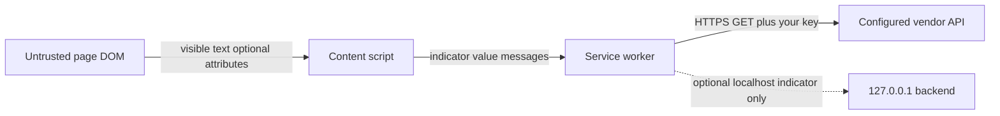

# Vera5 security model

This document explains why the Manifest V3 extension requests each permission in [`extension/public/manifest.json`](../extension/public/manifest.json). It complements [SECURITY.md](../SECURITY.md) (threat model and reporting) and [architecture.md](architecture.md) (module layout and data boundaries).

Vera5 is **local-first**: enrichment uses API keys you configure; indicator values are sent only to vendors you enable—not to Vera5-operated infrastructure.

## Product scope

The Vera5 extension registers a Manifest V3 service worker, content scripts on HTTP/HTTPS pages, a toolbar popup, an options page, keyboard commands, and a context-menu enrich action. Builds target **Chrome/Chromium** and **Firefox** with shared sources and permission parity.

On pages you open, Vera5 can:

- scan visible text (and, when explicitly enabled, allowlisted link attributes) for IOCs
- show on-page highlights and a production workspace overlay
- enrich indicators when you configure API keys and take an explicit enrich action
- manage investigation sessions, collections, history, timelines, notebook fragments, and local correlation memory

Settings, API keys, enrichment cache, trust policy, and investigation data stay in local browser storage. There is no Vera5-operated enrichment backend and no default telemetry.

An optional **localhost-only** FastAPI backend and **localhost-only** LLM summary endpoint are user-operated add-ons; they are default-off and never required.

Permission rationale below matches this behavior.

## Manifest permissions

| Permission | Required | Why Vera5 needs it |
|------------|----------|-------------------|
| `storage` | Yes | Persist analyst-controlled settings locally: extension on/off, API keys (masked at rest in UI), per-source toggles, enrichment cache, domain policy, sessions, collections, macros, notebook fragments, correlation data, and related options. No Vera5 cloud sync; data stays in `chrome.storage.local` (or equivalent) on your profile. |
| `activeTab` | Yes | Operate on the tab you are viewing when you invoke the extension (toolbar action, keyboard shortcut, context menu, or palette) without requesting blanket access to every tab’s URL up front. Supports analyst-driven, tab-scoped behavior aligned with “enrich what I’m looking at now.” |
| `scripting` | Yes | Inject or update page scripts when needed for IOC detection and UI (programmatic injection on demand, re-scan after navigation, workspace overlay updates). Content scripts are declared in the manifest; `scripting` covers dynamic injection paths without listing every site pattern twice. |
| `contextMenus` | Yes | Register **Enrich selection with Vera5** on text selection so analysts can enrich a highlighted indicator through the same trust-gated pipeline as palette and hover enrich—without a separate permission model. |

### What these permissions do not grant

- **`storage`** does not send data to Vera5 servers; it is local browser storage only.
- **`activeTab`** does not by itself read page content until you interact with the extension in that tab (combined with host access below for declared content scripts).
- **`scripting`** is not used to run remote code, `eval`, or maintainer-hosted scripts—all executable code ships inside the extension package reviewers install.
- **`contextMenus`** adds a selection action only; it does not bypass domain policy, quiet mode, pre-query disclosure, or manual-only defaults.

## Host permissions

| Pattern | Required | Why Vera5 needs it |
|---------|----------|-------------------|
| `http://*/*` | Yes | Analyst workflows include internal tools, blogs, ticketing mirrors, and lab pages served over HTTP. IOC text must be readable on those origins when you visit them. |
| `https://*/*` | Yes | Same for HTTPS sites (GitHub, vendor portals, search results, documentation). Broad match avoids maintaining an incomplete allowlist of analyst destinations. |
| Declared vendor API hosts (see [Remote origins matrix](#remote-origins-matrix)) | Yes | Live enrichment uses HTTPS GET to configured threat-intel APIs from the background worker. Manifest entries align with `DECLARED_ENRICHMENT_API_HOSTS`; runtime `enrichmentFetch` blocks undeclared hosts before network I/O. |

### How host access is used

- **Content scripts** run at `document_idle` on matching pages, scan visible text for IOCs when you trigger a scan (or when auto-scan is enabled), and render the on-page workspace overlay.
- **Page text** is processed in the browser for detection. Only **indicator values you choose to enrich** are sent in API requests to third parties you configure—not full page HTML to Vera5 infrastructure.
- **Opt-in attribute/href extraction** (default **off**): when enabled, a conservative allowlisted attribute scan merges with visible-text detection. A first-enable consent dialog explains data accessed; password fields and hidden nodes are excluded.
- **Skip rules:** ignore `script`, `style`, and `textarea` text by default; respect manual-only enrichment, quiet mode, per-source toggles, domain policy, and internal asset lists.

### Why broad host patterns

Analysts cannot predict every SOC, CTI, or DFIR site in advance. Narrow host lists would block legitimate workflows. The tradeoff is explicit: Vera5 may access pages you open on HTTP/HTTPS origins you visit; you control whether enrichment runs and which vendors receive IOC values.

## Surfaces declared in the manifest

| Surface | Purpose |
|---------|---------|
| `background` service worker | Message routing, enrichment fetch orchestration, cache, rate-limit cooldown, connector calls, context-menu registration. No DOM access. |
| `content_scripts` → `content.js` on `http://*/*`, `https://*/*` | IOC detection, highlights, workspace overlay, palette, enrich wiring, replay highlight sync. Runs only on origins covered by host permissions. |
| `action` popup | Extension on/off, IOC tray, investigation session, source operations, history, quick actions. |
| `options_page` | Masked API keys, source toggles, trust policy, manual-only mode, quiet mode, domain policy, internal assets, macros, threat profiles, cache clear, settings export/import. |
| `commands` | Keyboard shortcuts for scan page and command palette. |
| `contextMenus` | **Enrich selection with Vera5** on text selection. |

Icons, fonts, and HTML entrypoints do not add extra Chrome permission keys beyond those listed above.

## Data and trust boundaries

| Data | Stays local | May leave the browser (your choice) |
|------|-------------|-------------------------------------|
| API keys | Stored in extension storage or optional self-hosted `backend/.env` you control | Sent only to vendor APIs you enable, over TLS, as required by each connector |
| Extension settings, sessions, collections, notebook, correlation | Yes | No |
| Detected IOC values | Processed locally for display | Sent as **indicator-only** requests to configured threat-intel APIs |
| Normalized enrichment JSON for AI summary | Built locally from card fields | Sent only to **your** `http://127.0.0.1` LLM endpoint when summary is explicitly requested and toggle is on |
| Full page HTML, browsing history, tickets | Not uploaded to Vera5-operated services | Not sent to Vera5 by design |
| Investigation replay segments | Stored locally; read-only playback | No upload; markdown export is user-initiated clipboard/download only |
| Portable threat profiles and settings packs | Imported/exported as JSON without keys | No Vera5-hosted profile store |

For a visual summary of IOC and data boundaries, see the **IOC and data boundary** diagram in [SECURITY.md](../SECURITY.md#ioc-leakage).

**Bring-your-own keys / bring-your-own API:** You create keys in vendor portals; Vera5 does not operate a required enrichment proxy or shared maintainer keys.

**Telemetry:** No usage analytics or crash reporting to Vera5 by default.

## Trust gates (stacked)

Live outbound enrichment passes through layered gates before vendor calls:

| Gate | Behavior |
|------|----------|
| **Manual-only enrichment** (default) | Auto-fetch on hover stays off until you disable manual-only mode |
| **Quiet mode** (default off) | Blocks all live vendor `fetch()` calls; pivots, cached enrich display, and local detection remain available |
| **Domain policy** | Blocks live enrich on denylisted hostnames (and allowlist mode when configured) before pre-query disclosure |
| **Internal asset lists** | Blocks outbound enrich when the **indicator value** matches configured internal domains, IPv4 CIDR ranges, or vendor/SaaS hostname patterns |
| **Known-good policy** (optional) | When enabled, may skip vendor enrich for curated benign/internal matches; does not bypass domain deny or quiet mode |
| **Pre-query disclosure** | Inline notice names enabled vendors and the indicator before the first vendor fetch when notices are on |
| **Context-menu / selection enrich** | Re-validates selection as an exact IOC match; same page and indicator gates as hover enrich |
| **`extractExactIocValue` / `sanitizeEnrichmentIoc`** | Rejects multi-line, oversized, or markup-bearing values before messages reach the service worker |
| **`enrichmentFetch` allowlist** | Throws before network I/O when the target host is not a declared connector API |

Pivot recipe links are navigation-only (no live `fetch` from the page context).

## Domain policy and sensitive sites

Vera5 gates **auto-scan** and **live enrichment** on the hostname of the page you are viewing. Policy is stored locally (`domainPolicyMode`, `domainAllowlist`, `domainDenylist`). When the domain enrich gate is enabled (default), the same rules block vendor API calls before pre-query disclosure runs.

| Mode | Behavior |
|------|----------|
| Allow by default (product default) | Auto-scan and enrichment run on all hosts **except** those on the denylist. |
| Deny by default (optional posture) | Auto-scan and enrichment run **only** on hosts in the allowlist. |

Lists are managed in **Vera5 Settings** under **Trust & consent**, or via settings export/import.

### Product default policy

Fresh installs and normalized settings use **allow by default**. The **denylist ships with sensitive webmail patterns by default** so common webmail hosts are blocked for auto-scan and live enrichment without manual setup.

| Control | Default | What it means for sensitive sites |
|---------|---------|-----------------------------------|
| Domain policy mode | Allow by default | SOC and vendor sites stay open unless denylisted |
| Denylist | Sensitive webmail patterns | Blocks `mail.*`, `webmail.*`, and common provider webmail hosts |
| Allowlist | Empty | Not used until you switch to deny-by-default |
| Domain enrich gate | On | Denylisted hosts skip vendor calls before pre-query disclosure |
| Manual-only enrichment | On | Live fetch requires an explicit enrich action on allowed hosts |
| Auto-scan | Off | DOM-driven rescans stay off until you enable auto-scan |
| Pre-query notices | On until first-run choice | Inline disclosure precedes vendor calls when enrichment is allowed |
| Quiet mode | Off | When on, blocks outbound vendor calls regardless of other enrich toggles |

**Deny by default** is an alternate mode for allowlist-first operating policy. Switching modes does not auto-fill the allowlist.

#### Default sensitive webmail denylist

| Pattern | Covers |
|---------|--------|
| `mail.*` | Corporate and provider webmail subdomains |
| `webmail.*` | Alternate webmail prefixes |
| `outlook.office.com`, `outlook.live.com` | Microsoft webmail |
| `mail.google.com` | Gmail web |
| `mail.yahoo.com` | Yahoo Mail web |

Analysts can remove or extend denylist rows in **Trust & consent**. The **Sensitive sites denylist** preset merges banking, patient-portal, and workforce SaaS patterns into the denylist without removing custom entries.

#### Pattern syntax

| Form | Example | Matches |
|------|---------|---------|
| Exact hostname | `mail.company.com` | That host only |
| Prefix wildcard | `mail.*` | `mail` and `mail.<label>` |
| Suffix wildcard | `*.corp.example` | `corp.example` and `<label>.corp.example` |

For workflow context, see [analyst-workflows.md](analyst-workflows.md).

## Internal asset lists

Separate from page-hostname domain policy, Vera5 supports **indicator-level** internal asset lists. When the internal asset enrich gate is enabled (default), live enrichment is blocked before pre-query disclosure when the **indicator value** matches a configured list—even on otherwise allowed SOC pages.

| List | Applies to | Example |
|------|------------|---------|
| Internal domains | Domain and URL indicators | `intranet.corp.example`, `*.internal` |
| Internal IPv4 CIDR ranges | IPv4 indicators | `10.0.0.0/8`, `192.168.0.0/16` |
| Vendor and SaaS labels | Domain and URL indicators (hostname match) | Label `Corporate VPN`, pattern `vpn.corp.example` |

Hash and CVE indicators are not matched by these lists. Manage lists under **Trust & consent** in Vera5 Settings, or via settings export/import.

## Opt-in attribute and href extraction

**Default: off.** Vera5 does not scan link attributes unless you explicitly enable attribute/href extraction in Settings and confirm the first-enable consent dialog.

| Control | Behavior |
|---------|----------|
| Default on fresh install | **Off** — visible-text detection only |
| Allowlisted attributes | Conservative set (for example `href`, `src`, `data-url`); excludes password inputs and hidden subtrees |
| Provenance | IOCs found via attribute path are labeled separately from visible-text matches |
| Performance | Capped attribute-node scan per page; large DOMs may skip attribute pass |
| Trust interaction | Same domain policy, quiet mode, and enrich gates apply to attribute-sourced IOCs |

Enabling this feature increases passive indicator handling in page markup; combine with domain denylist entries on sensitive hosts.

## Quiet mode

Quiet mode is a global setting (default **off**) that blocks **outbound vendor enrichment calls** while preserving:

- local IOC detection and highlighting
- attributed pivot links (user-initiated navigation)
- cached enrichment display with cached vs live labels
- export, sessions, collections, and notebook workflows

Bulk enrich queue and macro enrich steps abort with clear messaging when quiet mode is active. Quiet mode does not bypass domain deny when you later disable it—it is an additional outbound gate.

Analyst mode presets and portable threat profiles may suggest quiet mode defaults; applying a profile never injects API keys.

## Optional local backend (127.0.0.1)

When enabled, the extension may send indicator-only enrich requests to a user-operated FastAPI service on localhost instead of calling vendors directly from the background worker.

| Boundary | Behavior |
|----------|----------|
| Listen address | `127.0.0.1` only—not exposed on LAN by default |
| Default | Off; extension direct BYOK vendor calls remain the primary path |
| Credentials | May live in `backend/.env` on your machine; never committed to git |
| Fallback | Extension falls back to in-browser connectors with honest UI when backend is unreachable |
| CORS | Restricted to extension origin and localhost |
| Logging | Backend request logs redact API keys and bulk IOC payloads |
| Vera5 cloud | Backend does not relay indicators or keys to Vera5-operated infrastructure |

See [local-mode.md](local-mode.md) for setup.

## Local AI summary (127.0.0.1)

The optional AI summary feature is **default-off**. When enabled, it sends **normalized enrichment JSON only** to a user-configured `http://127.0.0.1` endpoint.

Forbidden inputs: API keys, full DOM, browsing history, raw vendor HTTP bodies, credentials.

Summary output is labeled **AI summary (local, unverified)** and does not replace composite score or per-source attribution. Guardrail tests reject claims not present in input JSON.

See [ai-summary.md](ai-summary.md).

## Investigation replay and local memory

Investigation replay, timelines, correlation clusters, relationship edges, and notebook fragments are **local-only**:

- stored in extension local storage
- no screen or video capture APIs
- no upload endpoint to Vera5
- replay step-through does **not** re-issue live vendor API calls
- export/copy actions are user-initiated

Clear-all controls for correlation or relationship memory do not delete investigation sessions unless you explicitly choose combined wipe (documented in Settings).

## Portable profiles, settings packs, and third-party JSON

Threat profiles and settings packs import connector toggles, TTL, domain policy, analyst mode, export templates, and optional noise-list references—**never API keys or tokens**.

| Control | Behavior |
|---------|----------|
| Schema validation | Rejects files containing `apiKey`, `token`, or similar secret fields |
| Pre-import warning | UI explains profiles change modes and connectors—not stored keys |
| Merge preview | Diff before apply for settings packs and profiles |
| Trust | Verify source before import; Vera5 does not host a profile marketplace |

Profiles cannot bypass pre-query disclosure, domain deny, quiet mode, or internal asset gates.

## Local noise rules and known-good lists

Noise reduction and known-good intelligence use **inspectable local rules** only:

- created from explicit analyst actions (suppress, internal, benign labels)
- stored and exported as human-readable JSON
- no telemetry, cloud training, or opaque ML weight vectors
- importable pattern lists for team handoff without secrets

Known-good labels are informational; optional skip-enrich policy does not bypass domain deny or quiet mode.

## Permission changes

Any new permission or host pattern requires an update to this document, [SECURITY.md](../SECURITY.md), the manifest, store listings (Chrome and Firefox), and release notes so analysts can review the change before upgrading.

## Executable code and content security policy

Extension pages are HTML documents loaded as `chrome-extension://…` origins (toolbar popup and options). They must not load remote scripts or weaken Chromium’s Manifest V3 CSP.

### Extension pages inventory

| Page | Manifest key | Built artifact | CSP |
|------|--------------|----------------|-----|
| Options | `options_page`: `options.html` | `extension/dist/options.html` | Default MV3 (`script-src 'self'`; no manifest override) |
| Toolbar popup | `action.default_popup`: `popup.html` | `extension/dist/popup.html` | Default MV3 (same as options) |

Both pages load only packaged `/assets/…` JavaScript and CSS. There are no inline `<script>` blocks, no CSP `<meta>` tags, and no `https://` script or stylesheet URLs in built HTML.

The Vite dev shell (`extension/index.html`) is for local development only and is not copied to `dist/` or referenced from the manifest.

### Manifest CSP

[`extension/public/manifest.json`](../extension/public/manifest.json) does **not** set `content_security_policy`. Chromium applies the default Manifest V3 extension-pages policy:

- `script-src 'self' 'wasm-unsafe-eval'`
- `object-src 'self'`

Vera5 does not add `unsafe-eval`, `unsafe-inline`, or remote `https://` entries to `script-src`.

### Remote origins matrix

| Origin / pattern | Mechanism | Purpose | Sends IOC to Vera5? |
|------------------|-----------|---------|---------------------|
| `https://api.abuseipdb.com/…` | `fetch()` GET (connector) | AbuseIPDB enrichment when enabled and keyed | No — BYOK to vendor |
| `https://otx.alienvault.com/…` | `fetch()` GET (connector) | OTX enrichment when enabled and keyed | No — BYOK to vendor |
| `https://urlscan.io/…` | `fetch()` GET (connector) | URLScan.io search when enabled and keyed | No — BYOK to vendor |
| `https://api.greynoise.io/…` | `fetch()` GET (connector) | GreyNoise community lookup when enabled and keyed | No — BYOK to vendor |
| `https://www.virustotal.com/…` | `fetch()` GET (connector) | VirusTotal v3 object lookup when enabled and keyed | No — BYOK to vendor |
| `https://api.shodan.io/…` | `fetch()` GET (connector) | Shodan host/DNS lookup when enabled and keyed | No — BYOK to vendor |
| `https://search.censys.io/…` | `fetch()` GET (connector) | Censys host lookup when enabled and credentialed | No — BYOK to vendor |
| RDAP/WHOIS endpoints (declared per connector) | `fetch()` GET | Domain registration context when RDAP connector enabled | No — to public RDAP or configured resolver |
| `http://127.0.0.1:<port>/…` | `fetch()` (optional bridge) | Local backend enrich or summarize when toggled on | No — localhost only |
| `http://127.0.0.1:<llm-port>/…` | `fetch()` (opt-in summary) | Local LLM summary when explicitly requested | No — normalized JSON only |
| `https://…` pivot URLs | `chrome.tabs.create` / user navigation | Analyst opens vendor search pages from pivot actions | No live API call from extension |
| `https://www.vera5.io/` | `chrome.tabs.create` | Product website link from workspace sidebar | No enrichment |
| `chrome://settings/…` | `chrome.tabs.create` | Site-permissions helper | Internal browser UI |
| Page under scan (`http(s)://*/*`) | Content scripts | DOM read for IOC detection only | No upload to Vera5 infrastructure |

Live `fetch()` calls for enrichment are limited to connector modules registered in the enrichment source registry. Connectors use `enrichmentFetch` in [`iocRequestBoundaries.ts`](../extension/src/lib/iocRequestBoundaries.ts), which throws before any network I/O when the target host is not listed in `DECLARED_ENRICHMENT_API_HOSTS`, when the request uses a non-HTTPS URL (except documented localhost bridges), or when a request body is present. Connectors use GET without a request body; indicator values are passed in the URL or query string per vendor API requirements.

There is no `importScripts()` or dynamic `import()` from network URLs in production bundles.

### Automated regression checks

| Check | Status |
|-------|--------|
| `eval()` / `new Function()` | Not used in `extension/src/` or production bundles under `extension/dist/`. |
| Remote scripts in extension pages | Popup and options HTML reference only relative `/assets/…` paths. |
| Manifest CSP override | No custom CSP with `unsafe-eval`, `unsafe-inline`, or remote `script-src`. |
| Live fetch allowlist | Only connector modules may call enrichment `fetch()`; hosts must appear in `DECLARED_ENRICHMENT_API_HOSTS`. Runtime guard blocks undeclared hosts before network I/O. |
| Remote code at runtime | No dynamic import or `importScripts()` from `https://` URLs in `dist/`. |
| Quiet mode / domain gates | Tests assert outbound enrich blocked on denylisted hosts and under quiet mode before vendor calls. |

After each production build:

```bash
cd extension
npm run verify:security
```

(`postbuild` runs this together with `verify:dist`.)

## Production logging hygiene

Vera5 does not write API keys, bulk IOC lists, scan snapshots, or vendor raw JSON to the browser console in production builds.

| Surface | Policy |
|---------|--------|
| Content-script scan diagnostics | `devLog.ts` logs numeric scan metrics only when `import.meta.env.DEV` is true; production bundles omit `console.debug` output. |
| Unexpected runtime errors | `logUnlessBenignExtensionError` logs a truncated `name: message` string only; raw error objects, storage payloads, and bulk indicator data are never passed to `console.error`. |
| Live connectors | No `console` usage; vendor responses stay in memory/cache unless the analyst opens raw JSON in the overlay. |
| Regression | `npm run verify:security` rejects new production `console` calls outside allowlisted modules, blocks sensitive payload patterns in log statements, and fails if shipped bundles contain `console.debug` or raw-object `console.error`. |

## Test fixture hygiene

Automated tests use placeholder credentials from `extension/src/lib/fixtureSecrets.ts` (`test-fixture-*` prefix). Committed vendor JSON under `extension/src/lib/fixtures/` must not embed live API key values; sensitive vendor field names must use `[redacted]` or the shared test placeholders. `verify:security` rejects legacy inline secret strings in `*.test.ts` files.

## Malicious page DOM confusion

Hostile or misleading page content can try to confuse IOC triage: decoy indicators in visible text, overlapping tokens, fake overlay chrome, or values that look like indicators but are not exact matches. Vera5 treats the page DOM as untrusted input for **detection display** while keeping **credentials, enrichment fetch, and vendor calls** in extension-controlled contexts.

### Threat scenarios

| Scenario | Goal of the page | What Vera5 must prevent |
|----------|------------------|-------------------------|
| Decoy or bait IOCs | Trigger false positives or wasted enrichments | Surfacing only regex-valid, deduplicated spans with transparent match provenance |
| Hidden or metadata IOCs | Smuggle values via attributes or non-visible subtrees | Visible-text scan by default; attribute scan opt-in only |
| Selection / clipboard confusion | Enrich a value the analyst did not intend | Re-validating selection text as an exact IOC match before enrich |
| Fake extension UI | Mimic enrich buttons or disclosure prompts | Building overlay UI only from the content script; never executing page-supplied HTML as extension chrome |
| Forced outbound queries | Exfiltrate data via unexpected hosts | Routing live `fetch()` through the service worker with `enrichmentFetch` host allowlisting; trust gates before vendor calls |
| Markup in indicator values | Break UI or smuggle HTML into outbound requests | Binding overlay text with `textContent`; rejecting values containing markup or newlines in `extractExactIocValue` |

### Detection surface controls

IOC detection walks **text nodes** under the scan root. Default production behavior:

- Skips `<script>`, `<style>`, `<textarea>`, and metadata subtrees.
- Does **not** scan element attributes unless attribute/href extraction is explicitly enabled.
- Caps scans at **2,500 text nodes** per pass (and separate caps for attribute scans when enabled).
- Applies conservative regex rules, overlap deduplication, and documented suppressions (see [Known false positives and suppressions](architecture.md#known-false-positives-and-suppressions)).

The workspace overlay shows **Why detected?** with rule id, source context, on-page vs refanged values, and ignored overlaps.

### Overlay and workspace UI

Production on-page UI is assembled by the content script using `document.createElement` and **`textContent`** for analyst-visible strings and vendor-derived summaries. Vendor raw JSON is redacted and length-capped before display.

| Control | Purpose |
|---------|---------|
| Dedicated host elements (`vera5-hover-card-host`, `vera5-workspace-host`, `vera5-command-palette-host`) | Keeps extension UI in nodes the content script owns |
| High `z-index` and scoped `pointer-events` | Reduces accidental interaction with page layers beneath real extension panels |
| `stopPropagation` on overlay controls | Prevents page handlers from intercepting enrich, disclosure, or copy actions |
| `confirmOpenLiveUrl` | Requires analyst confirmation before navigating to a refanged live URL |

**Limitation:** A hostile page can still inject DOM that **looks** like Vera5. The real extension UI appears only after you invoke Vera5 (toolbar, workspace, keyboard shortcut, context menu, or highlight). Treat unexpected enrich prompts that did not follow your action as suspicious.

### Enrichment and credential isolation

Page JavaScript cannot read `chrome.storage.local` or call vendor APIs with stored keys. Enrichment follows this boundary:



### Residual risk and analyst practice

- Decoy IOCs in **visible** page text may still match valid grammar; suppressions reduce noise but cannot eliminate judgment calls.
- Auto-scan (when enabled) re-reads DOM mutations on allowed hosts; use domain denylist, quiet mode, and manual-only mode on sensitive origins.
- Attribute extraction (when enabled) increases exposure to markup-embedded strings; keep it off unless policy requires it.
- Validate enrichment intent on high-risk pages: confirm **Why detected?**, read pre-query disclosure, and use **Trust & consent** presets for webmail and internal tools.

For operator checks on trust gates and disclosure, use the [Trust and query checklist](../SECURITY.md#trust-and-query-checklist). For regression fixtures that exercise decoy suppressions, see [soc-validation-fixtures.md](soc-validation-fixtures.md).

## Security hardening review checklist

Pen-test style review for the shipped extension: supply chain, executable surface, outbound network boundaries, logging, secrets hygiene, and trust gates. Use this checklist before release branches or major permission changes.

### Automated verification

Run from repository root unless noted. Re-run after dependency bumps, manifest permission changes, or connector additions.

| # | Control | Verification |
|---|---------|--------------|
| 1 | Production dependency audit | `cd extension && npm run audit:prod` (CI: **Extension quality** workflow) |
| 2 | Extension build integrity | `cd extension && npm run build` → `verify:dist` + `verify:security` in postbuild |
| 3 | Unit, lint, and E2E regression | `cd extension && npm run check` and `npm run test:e2e:critical` |
| 4 | Secret scan (Gitleaks) | CI: `.github/workflows/secret-scan.yml` on pull requests and main pushes |
| 5 | `.env.example` credential placeholders | Root and `backend/.env.example`; `verify:security` rejects non-empty credential values |
| 6 | Extension-page CSP | Default MV3 CSP; no remote assets in popup/options HTML |
| 7 | Live fetch allowlist | `enrichmentFetch` + `DECLARED_ENRICHMENT_API_HOSTS`; registry connector modules only |
| 8 | Enrichment GET without body | Connector modules; `verify:security` |
| 9 | Production logging hygiene | No sensitive `console` in shipped bundles |
| 10 | Test fixture redaction | `fixtureSecrets.ts` placeholders; no legacy inline secret strings in tests |
| 11 | No `eval` / remote dynamic import | `verify:security` on `extension/src` and `extension/dist` |
| 12 | Manifest permissions match documentation | Compare this document to [`extension/public/manifest.json`](../extension/public/manifest.json) |
| 13 | Firefox build parity | Dual-target build; permission and CSP review per [browser-support.md](browser-support.md) |
| 14 | Trust gate regression | Tests for domain deny, quiet mode, internal assets, context-menu enrich gates |

### Operator confirmation (browser)

Automated checks do not replace unpacked browser validation. Confirm trust, consent, and hostname gates using the [Trust and query checklist](../SECURITY.md#trust-and-query-checklist):

- Manual-only enrichment and **Trust & consent** settings match your workflow.
- Denylisted hosts block live enrich without vendor calls (including context-menu enrich).
- Quiet mode blocks outbound enrich while pivots and cache display work.
- Pre-query disclosure appears before the first vendor fetch on allowed hosts when notices are enabled.
- Only authorized live sources and API keys are enabled.
- Optional localhost backend and LLM endpoints bind to `127.0.0.1` only.

Serve `examples/` over HTTP and use SOC fixtures per [soc-validation-fixtures.md](soc-validation-fixtures.md). Record operator pass/fail in your internal release notes; do not paste API keys or full page content into issues.

### Checklist maintenance

When adding permissions, connectors, localhost bridges, or CI steps, update this checklist, [SECURITY.md](../SECURITY.md), [`CONTRIBUTING.md`](../CONTRIBUTING.md), and the manifest together so reviewers can assess upgrades before install.

## Related documents

- [SECURITY.md](../SECURITY.md) — vulnerability reporting and high-level threat model
- [architecture.md](architecture.md) — codebase layout, IOC types, connector order
- [analyst-workflows.md](analyst-workflows.md) — analyst-facing workflow guidance
- [local-mode.md](local-mode.md) — extension-only and optional localhost backend
- [ai-summary.md](ai-summary.md) — local LLM summary input contract and safety
- [browser-support.md](browser-support.md) — Chrome and Firefox install paths
- [api-integrations.md](api-integrations.md) — vendor quotas and connector behavior
- [README.md](../README.md) — install and development workflow
